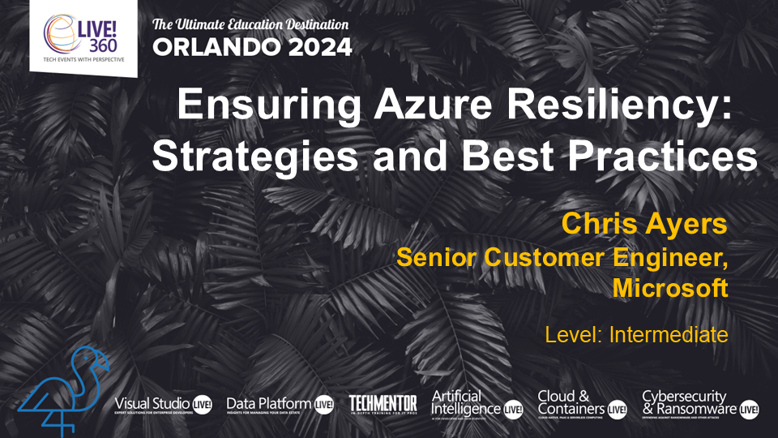
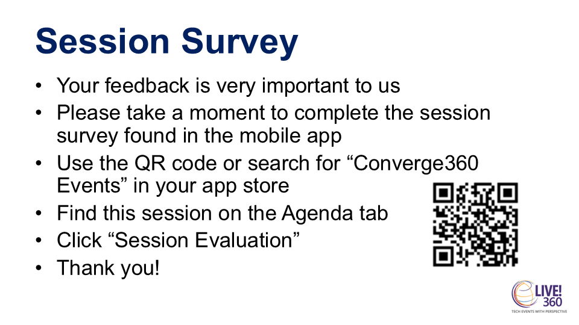

---

---

## Chris Ayers

### Senior Risk SRE Azure CXP AzRel Microsoft

<i class="fa-brands fa-twitter"></i> Twitter: @Chris\_L\_Ayers
<i class="fa-brands fa-mastodon"></i> Mastodon: [@Chrisayers@hachyderm.io](https://hachyderm.io/@Chrisayers)
<i class="fa-brands fa-linkedin"></i> LinkedIn: - [chris\-l\-ayers](https://linkedin.com/in/chris-l-ayers/)
<i class="fa fa-window-maximize"></i> Blog: [https://chris-ayers\.com/](https://chris-ayers.com/)
<i class="fa-brands fa-github"></i> GitHub: [Codebytes](https://github.com/codebytes)

---
<!-- 
# Ensuring Azure Resiliency:
## Strategies and Best Practices
Chris Ayers

--- -->

# Agenda Items

- Why Reliability Matters in Azure
- Design Principles for Reliable Workloads
- Tradeoffs with Other Azure Pillars
- Failure Mode Analysis (FMA)
- Azure Availability Zones

- Architecting for Reliability
- Azure Landing Zones
- Reference Architectures for Compute, AKS, Storage, and Databases
- Resources

---

# Reliability

---

# Understanding Reliability and Resiliency

- Failures are ***inevitable*** in distributed systems.
- Workloads must **detect**, **withstand**, and **recover** from failures within ***acceptable*** timeframes.
- Ensuring availability for users to access workloads as promised.
- Failutes have an impact on ***revenue***, ***reputation***, and ***customer trust***.

---

## Financial Impact of Downtime

- **Revenue Loss**: Downtime can cost businesses over $1 million per hour, especially for e-commerce and online services.
- **Increased Expenses**: Includes emergency maintenance, staff overtime, and potential penalties for SLA breaches.
- **Legal Liabilities**: Potential lawsuits from customers or clients affected by downtime, leading to legal fees and settlements.
- **Insurance Challenges**: Downtime can affect insurance coverage and premiums, especially if it leads to data breaches or other significant issues.
- **Operational Costs**: Additional costs for restoring systems, data recovery, and implementing preventive measures to avoid future downtime.

---

# Reliability

| Level       | Monthly Downtime  | Annual Downtime | Cost  |
| ----------- | ----------------- | --------------- | ----- |
| **99.9%**   | 43.8 minutes      | 8.75 hours      | $     |
| **99.95%**  | 21.9 minutes      | 4.375 hours     | $$    |
| **99.99%**  | 4.38 minutes      | 52.6 minutes    | $$$   |
| **99.995%** | 2.19 minutes      | 26.3 minutes    | $$$$  |
| **99.999%** | 26 seconds        | 5.25 minutes    | $$$$$ |

>[https://uptime.is/five-nines](https://uptime.is/five-nines)

---

# Service Level Objectives

| SLI | SLO | SLA |
|---|---|---|
| Service Level Indicator | Service Level Objective | Service Level Agreement |
| Metrics for service quality, e.g., error rate. | Targets, e.g., 99.9% uptime/month. | Contracts with set metrics and penalties. |
| Assess service quality. | Define service quality goals. | Formalize commitments and consequences. |

---

---

# Understanding RPOs and RTOs

- **Recovery Time Objectives (RTOs)**: RTOs specify the maximum acceptable downtime for restoring services after a disruption.

- **Recovery Point Objectives (RPOs)**: RPOs define the amount of data that can be lost during a disruption.

---

# Azure-Customer Shared Responsibility Model

---

# Azure Well-Architected Framework

- Provides best practices and guidance for building high-quality Azure solutions.
- Ensure workloads are reliable, secure, efficient, and cost-effective.

---

## Microsoft Azure Well-Architected Framework Pillars

| Reliability                        | Security                            | Cost Optimization                  | Operational Excellence                  | Performance Efficiency                  |
|------------------------------------|-------------------------------------|------------------------------------|-----------------------------------------|-----------------------------------------|
| Resiliency, availability, recovery | Protect data, detect threats, mitigate risks | Budgeting, reducing waste, efficiency | Observability, DevOps practices, safe deployments | Scalability, load testing, performance monitoring |

---

# Design Principles for Reliable Workloads

---

# Design for Business Requirements

- Gather business requirements focusing on the workload's intended utility.
- Cover user experience, data, workflows, and unique characteristics.
- Clearly state expectations and ensure goals are achievable and documented.

---

# Design for Business Requirements

| Approach | Description |
| --- | --- |
| Quantify Success | Set targets for components, flows, and the system. |
| Compliance | Ensure predictable outcomes for sensitive flows. |
| Platform Commitments | Understand SLAs, limits, and regional constraints. |
| Dependencies | Track dependencies and implement resilient design patterns. |

---

# Design for Resilience

- The workload must continue to operate with full or reduced functionality.
- Expect component malfunctions, platform outages, performance degradations, limited resource availability, and other faults.
- Build resiliency to ensure fault tolerance and graceful degradation.

---

# Design for Resilience

| Approach | Description |
| --- | --- |
| Distinguish critical components from those that can degrade. | Design according to criticality, avoiding overengineering. |
| Identify potential failure points and their effects. | Analyze failure cases to influence error handling design. |
| Build self-preservation capabilities. | Isolate faults and mitigate failures. |
| Add scalability for critical components. | Handle capacity spikes and regional issues. |
| Build redundancy in layers and tiers. | Minimize single points of failure. |

---

# Design for Recovery

- The workload must be able to anticipate and recover from most failures, of all magnitudes, with minimal disruption to the user experience and business objectives.
- Even highly resilient systems need disaster preparedness approaches, in both architecture design and workload operations.
- On the data layer, you should have strategies that can repair workload state in case of corruption.

---

# Design for Recovery

| Approach | Description |
| --- | --- |
| Structured recovery plans | Cover all components and the system as a whole. Regular drills test recovery processes. |
| Data repair for stateful components | Use backups to restore to a trusted recovery point. Ensure data integrity with immutable, consistent backups. |
| Automated self-healing | Reduce risks and shorten the break-fix cycle. |
| Immutable ephemeral units | Spin up and destroy on demand for consistency. Use side-by-side deployment to minimize disruptions. |

---

# Design for Operations

- Shift left in operations to anticipate failure conditions.
- Test failures early and often in the development lifecycle.
- Ensure shared visibility across teams for dependency status and ongoing failures.
- Use insights, diagnostics, and alerts from observable systems for effective incident management and continuous improvement.

---

# Design for Operations

| Approach | Description |
| --- | --- |
| Build observable systems that can correlate telemetry. | Monitoring and diagnostics are crucial. Aggregated observability provides a holistic view of health status. |
| Predict potential malfunctions and anomalous behavior. | Use prioritized and actionable alerts for active reliability failures. |
| Invest in reliable processes and infrastructure. | Enable quicker triage and proactive mitigation of potential failures. |

---

# Design for Operations

| Approach | Description |
| --- | --- |
| Simulate failures and run tests. | Set realistic recovery expectations and test metrics. |
| Automate components. | Minimize human error and ensure consistency. |
| Scrutinize routine operations. | Ensure system stability. |
| Learn from production incidents. | Drive improvements based on real incidents. |

---

# Keep It Simple

- Avoid overengineering the architecture design, application code, and operations.
- Simplicity reduces inefficiencies and potential misconfigurations.
- Maintain a balanced approach to avoid single points of failure.

---

# Keep It Simple

| Approach | Benefit |
| --- | --- |
| Add components only if necessary. | Keep the critical path lean. |
| Establish and document standards. | Minimize errors and maintain quality. |
| Evaluate pragmatic design. | Avoid unnecessary interdependence. |
| Develop just enough code. | Ensure code resilience and efficiency. |
| Use platform features and prebuilt assets. | Save time and use tested practices. |

---

# Tradeoffs with Other Azure WAF Pillars

---

# Reliability Tradeoffs with Security

## Tradeoff: Increased Workload Surface Area

- **Security**: Prioritizes a reduced and contained surface area to minimize attack vectors.
- **Reliability**: Often obtained through replication, which increases the surface area.
- **Disaster Recovery**: Solutions like backups increase surface area and require additional security controls.
- **Additional Components**: Needed for reliability, increasing complexity and surface area.

---

# Reliability Tradeoffs with Security

## Tradeoff: Security Control Bypass

- **Security**: All controls should remain active in both normal and stressed systems.
- **Reliability Events**: Urgency might pressure teams to bypass security controls.
- **Troubleshooting**: Disabling security protocols can expose the system to risks.
- **Granular Controls**: Increase configuration complexity and risk of misconfiguration.

---

# Reliability Tradeoffs with Security

## Tradeoff: Old Software Versions

- **Security**: Encourages "get current, stay current" for security patches.
- **Reliability**: Patching can disrupt components, causing unavailability.
- **Delaying Patches**: Avoids reliability risks but leaves the system unprotected.
- **Old Code**: Using outdated libraries and base images exposes the application to security risks.

---

# Reliability Tradeoffs with Cost Optimization

## Tradeoff: Increased Implementation Redundancy or Waste

- **Cost Optimization**: Minimize underutilized resources and avoid over-provisioning.
- **Reliability**: Requires replication to handle node failures, leading to increased costs.
- **Over-Provisioning**: Absorbs unexpected load but can be wasteful.
- **Disaster Recovery**: Excessive solutions increase costs.
- **Deployment Strategies**: Techniques like blue/green increase costs during deployment periods.

---

# Reliability Tradeoffs with Cost Optimization

## Tradeoff: Increased Investment in Operations

- **Cost Optimization**: Evaluate the value provided by deployed solutions.
- **Observability**: Increased monitoring capabilities lead to higher data transfer and collection costs.
- **Testing and Drills**: Designing and running tests incur costs.
- **On-Call Rotation**: Rapid response processes increase personnel and tooling costs.
- **Support Contracts**: Over-provisioned support contracts incur waste.

---

# Reliability Tradeoffs with Operational Excellence

## Tradeoff: Increased Operational Complexity

- **Operational Excellence**: Prioritizes simplicity.
- **Reliability**: Increases workload complexity.
- **Monitoring**: More components lead to more data sources and complexity in distributed tracing and observability.
- **Multi-Region Management**: Increases complexity in operational management and data replication.

---

# Reliability Tradeoffs with Operational Excellence

## Tradeoff: Increased Effort to Generate Team Knowledge and Awareness

- **Documentation**: More reliability components require extensive documentation.
- **Training**: Increased components lead to more complex training and onboarding.
- **Knowledge Maintenance**: More time needed to track product roadmaps and service-level guidance.

---

# Reliability Tradeoffs with Performance Efficiency

## Tradeoff: Increased Latency

- **Performance Efficiency**: Achieve performance targets for user and data flows.
- **Reliability**: Data replication introduces latency for write operations.
- **Resource Balancing**: Balancing load to healthy replicas affects performance.
- **Geographical Distribution**: Network latency in communication across boundaries.
- **Monitoring**: Extensive health observation can decrease performance.

---

# Reliability Tradeoffs with Performance Efficiency

## Tradeoff: Increased Over-Provisioning

- **Performance Efficiency**: Use just enough resources to satisfy demand.
- **Reliability**: Over-provisioning handles sudden demand spikes.
- **Automatic Scaling**: Lag between demand signal and supply creation requires over-provisioning.
- **Worst Case Scenarios**: Using large instances for unpredictable demand leads to waste.

---

# Failure Mode Analysis (FMA)

---

# Identifying and Mitigating Failures

## Proactive Failure Identification

Proactive identification of potential failures is crucial for maintaining system reliability and preventing costly downtime.

## Mitigating Strategies

Implementing effective strategies to mitigate failures can enhance system performance and minimize operational risks.

---

# Prioritizing Risks and Impacts

## Risk Prioritization

Prioritizing risks is essential for effective reliability management. Identify high-impact risks and allocate resources efficiently to mitigate them.

## Impact Mitigation

Understanding and mitigating the potential impacts of risks is crucial for maintaining operational reliability. Implement strategies to minimize the consequences of identified risks.

---

# Failure Examples

[Failure Examples](https://learn.microsoft.com/en-us/azure/well-architected/reliability/failure-mode-analysis#example)

---

# Azure Availability Zones

---

# Azure Availability Zones

- Availability zones are separated groups of datacenters within a region.
- They have low-latency connections (<2ms) and are connected by a high-performance network.
- Zones are far enough apart to reduce the likelihood of simultaneous local outages.

---

## Azure Availability Zones Infrastructure

- Independent power, cooling, and networking.
- Designed to support regional services, capacity, and high availability even if one zone experiences an outage.
- Help keep data synchronized and accessible during failures.

---

# Zonal and Zone-Redundant Services

- Deploy into an Azure region with availability zones.
- Use multiple availability zones to keep separate copies of your application and data.
- [Region Support](https://learn.microsoft.com/en-us/azure/reliability/availability-zones-region-support)

## Service Support

- PaaS services typically support zone-redundant deployments.
- IaaS services typically support zonal deployments.
- [Services Support](https://learn.microsoft.com/en-us/azure/reliability/availability-zones-service-support)

---

# Zonal Resources

- Pinned to a specific availability zone.
- Combine multiple zonal deployments for high reliability.

---

# Zonal Resources

Customer Responsibilities:

- Deploy and manage resources in each availability zone.
- Configure and manage data replication between zones.
- Distribute requests using a load balancer
- Choose between active-passive or active-active models.
- Handle failover during an availability zone outage.

---

# Zone-Redundant Resources

- Spread across multiple availability zones.
- Microsoft manages request distribution and data replication.
- Automatic failover during an outage.

---

# Availability Zones and Azure Updates

## Update Deployment

- Microsoft deploys updates to a single availability zone at a time.
- Reduces impact on active workloads.
- Run workloads across multiple zones to benefit from this approach.

---

# Paired and Unpaired Regions

## Overview

- Many regions have a paired region for multi-region deployment.
- Newer regions with multiple availability zones may not have a paired region.
- Multi-region solutions can still be deployed with different approaches.

---

# Multi-Region Deployments

## Active-Active and Active-Passive

- Active-Active: Multiple instances process requests simultaneously.
- Active-Passive: Primary instance processes traffic, secondary instances serve as failover.

## Data Replication

- Asynchronous: Data written to one location, replicated later.
- Synchronous: Data written and committed to multiple locations simultaneously.

---

# Example Scenarios

## Line-of-Business Application

- **Requirements**: High reliability, minimal downtime, high performance, cost efficiency.
- **Approach**: Zone-redundant deployment with backup across regions.

## Internal Application

- **Requirements**: Cost efficiency, acceptable risk of downtime.
- **Approach**: Locally redundant deployment with backups across regions or zone-redundant deployment.

---

# Example Scenarios

## Legacy Application Migration

- **Requirements**: High performance, resiliency.
- **Approach**: Zone-redundant deployment or zonal (pinned) deployment with passive deployments.

## Healthcare Application

- **Requirements**: Data residency, regulatory compliance.
- **Approach**: Multi-zone multi-region deployment or zone-redundant deployment.

---

# Example Scenarios

## Banking System

- **Requirements**: Mission-critical, highest reliability.
- **Approach**: Multi-zone multi-region deployment.

## Software as a Service (SaaS)

- **Requirements**: Geographically distributed user base, data residency.
- **Approach**: Multi-zone multi-region deployment or single-region zone-redundant deployment with global traffic acceleration.

---

# Enhancing Resiliency with Fault Isolation

## Fault Isolation Importance

Fault isolation is crucial for maintaining resiliency in Azure workloads as it helps prevent cascading failures and ensures high availability of services.

## Azure Availability Zones

Azure Availability Zones provide geographic fault isolation within an Azure region, ensuring resiliency by distributing workloads across multiple data centers.

---

# Deploying Across Zones for Higher Availability

## Azure Availability Zones

Deploying across Azure Availability Zones can enhance availability and provide protection against failures by distributing workloads across multiple geographically isolated locations.

## Increased Availability

Deploying workloads across zones results in increased availability, ensuring that your services remain accessible even in the event of failures or outages in a single zone.

---

# Best Practices

## Leveraging Azure Availability Zones

Learning from best practices and real-world case studies can provide valuable insights into leveraging Azure Availability Zones effectively, ensuring high availability and fault tolerance for workloads.

## Deploying Workloads Across Zones

Explore best practices and case studies for deploying workloads across availability zones, optimizing performance and resiliency in cloud environments.

---

# Architecting for Reliability

---

# Azure Landing Zones

## Secure Structure

Azure Landing Zones offer a secure foundation for organizing your Azure environment, ensuring robust security measures are in place to protect your data and resources.

## Reliable Implementation

Implementing Azure Landing Zones effectively provides a reliable structure for your Azure environment, enabling smooth operations and better resource management.

---

# Reference Architectures for Compute, AKS, Storage, and Databases

## Streamlining Workload Design

Utilizing reference architectures can streamline the design and deployment of reliable workloads, ensuring efficiency and scalability in cloud computing environments.

## Compute Architecture

Explore reference architectures for compute in Azure to optimize performance and resource allocation for computational tasks in cloud environments.

## AKS Architecture

Discover reference architectures for Azure Kubernetes Service (AKS) to effectively manage containerized applications and microservices in the cloud.

## Storage and Databases Design

Learn about reference architectures for storage and databases in Azure to ensure data reliability, scalability, and performance in cloud-based applications.

---

# Mission-Critical Workloads

Learn about designing and implementing mission-critical applications on Azure. This guide provides best practices for achieving high reliability, availability, and performance for your applications.

[Mission-Critical Workloads](https://learn.microsoft.com/en-us/azure/well-architected/mission-critical/mission-critical-overview)

---

# Azure Verified Modules

Explore Azure Verified Modules to find pre-built, tested, and verified modules that can help accelerate your development process. These modules ensure compliance with Azure's best practices and standards.

[Azure Verified Modules](https://azure.github.io/Azure-Verified-Modules/)

---

# APRL: Azure Platform Resiliency Library

[APRL: Azure Platform Resiliency Library](https://github.com/Azure/Azure-Proactive-Resiliency-Library-v2)

---

# Azure Review Checklists

Use the Azure Review Checklists to ensure your architecture meets best practices and standards. These checklists cover various aspects of Azure services and can help identify potential issues before they become critical.

[Azure Review Checklists](https://github.com/Azure/review-checklists)

---

# Load Testing

---

# Introduction to Load Testing

- Load testing assesses system performance under expected user loads.
- It helps identify bottlenecks and determine system behavior during peak usage.
- Load testing ensures systems can handle high traffic without degradation.

---

# Benefits of Load Testing

- Improves application reliability and user experience.
- Helps in determining scalability for future growth.
- Identifies issues that could lead to system failures.

---

# Load Testing Strategies

- Determine key performance indicators (KPIs) for testing.
- Use real-world scenarios to simulate user behavior.
- Analyze results to optimize application performance.

---

# Types of Load Tests

- Soak test
- Spike test
- Stress test
- Load test

---

# Tools for Load Testing

- Popular tools include JMeter, LoadRunner, Locust, and Gatling.
- Azure Load Testing Service uses Jmeter and Locust.
- These tools help simulate heavy loads and analyze performance.
- Choose a tool based on specific project needs and budget.

---

# Chaos Engineering

---

# Introduction to Chaos Engineering

- Chaos Engineering is the practice of experimenting on a system to build confidence.
- It helps identify weaknesses by introducing failures in a controlled environment.
- The goal is to improve system resilience and reliability.

---

# Principles of Chaos Engineering

- Start small and gradually increase the scope of experiments.
- Limit the blast radius to minimize impact on users.
- Run experiments in production to gain true insights.

---

# Benefits of Chaos Engineering

- Increases system resilience and reduces downtime.
- Enhances team collaboration and fosters a culture of experimentation.
- Encourages proactive identification of weaknesses.

---

# Tools for Chaos Engineering

- Popular tools include Gremlin, Chaos Monkey, and LitmusChaos.
- These tools help automate chaos experiments and monitor system behavior.
- Choose tools based on the specific needs of your organization.

---

# Challenges in Chaos Engineering

- Cultural resistance to introducing failures.
- Difficulty in measuring the impact of experiments.
- Ensuring safety and minimizing user disruption.

---

# Conclusion

## Strategic Approach for Reliability

Achieving reliability in Azure workloads necessitates a strategic approach that aligns with best practices to ensure consistency and dependability.

---

