# Ensuring Azure Resiliency

## Chris Ayers

---

## Chris Ayers

_Senior Site Reliability Engineer_  
_Azure CXP AzRel_  
_Microsoft_

<i class="fa-brands fa-bluesky"></i> BlueSky: [@chris-ayers.com](https://bsky.app/profile/chris-ayers.com)
<i class="fa-brands fa-linkedin"></i> LinkedIn: - [chris\-l\-ayers](https://linkedin.com/in/chris-l-ayers/)
<i class="fa fa-window-maximize"></i> Blog: [https://chris-ayers\.com/](https://chris-ayers.com/)
<i class="fa-brands fa-github"></i> GitHub: [Codebytes](https://github.com/codebytes)
<i class="fa-brands fa-mastodon"></i> Mastodon: [@Chrisayers@hachyderm.io](https://hachyderm.io/@Chrisayers)
~~<i class="fa-brands fa-twitter"></i> Twitter: @Chris_L_Ayers~~

---

# Agenda Items

- **Introduction & Why Reliability Matters**
- **Reliability Fundamentals**  
  (Downtime costs, SLA, SLO, RPO, RTO)
- **Design Principles**  
  (Business Requirements, Resilience, Recovery, Operations, Simplicity)
- **Trade-Offs with Other Azure Pillars**  
  (Security, Cost, Operational Excellence, Performance)

- **Failure Mode Analysis (FMA)**  
  & Single Points of Failure
- **Azure Regions & Availability Zones**  
  (Region pairs, active-active vs. active-passive)
- **Load Testing & Chaos Engineering**
- **Reference Architectures & Next Steps**  
  (Azure Landing Zones, APRL, review checklists)

---

# Reliability

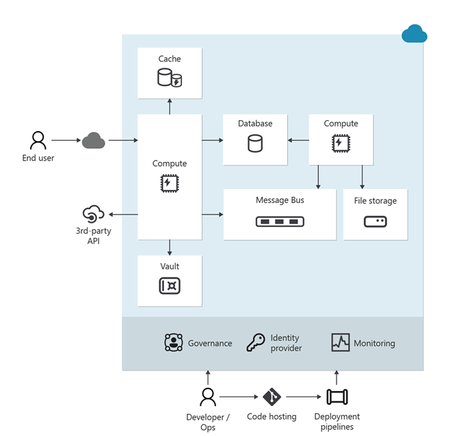

---

# Why Reliability Matters

> A system is considered "reliable" if it can consistently serve users under normal or abnormal conditions.

- Reliability in distributed systems involves:
  - **Consistent performance** despite failures.
  - **Graceful degradation** when certain components become unavailable.
  - **Rapid recovery** within acceptable time limits.

---

# Understanding Reliability and Resiliency

- Failures are **inevitable** in distributed systems.
- Workloads must **detect**, **withstand**, and **recover** from failures within _**acceptable**_ timeframes.
- Ensuring availability for users to access workloads as promised.
- Failures have an impact on _**revenue**_, _**reputation**_, and _**customer trust**_.

---

# <!-- fit --> FAILURE IS ALWAYS AN OPTION

---

## Financial Impact of Downtime

- **Revenue Loss**: Downtime can cost businesses over $1 million per hour, especially for e-commerce and online services.
- **Increased Expenses**: Includes emergency maintenance, staff overtime, and potential penalties for SLA breaches.
- **Legal Liabilities**: Potential lawsuits from customers or clients affected by downtime.
- **Insurance Challenges**: Downtime can affect insurance coverage and premiums.
- **Operational Costs**: Additional costs for restoring systems, data recovery, and preventive measures to avoid future downtime.

---

# Reliability Levels

| Level       | Monthly Downtime  | Annual Downtime | Cost  |
| ----------- | ----------------- | --------------- | ----- |
| **99.9%**   | 43.8 minutes      | 8.75 hours      | $     |
| **99.95%**  | 21.9 minutes      | 4.375 hours     | $$    |
| **99.99%**  | 4.38 minutes      | 52.6 minutes    | $$$   |
| **99.995%** | 2.19 minutes      | 26.3 minutes    | $$$$  |
| **99.999%** | 26 seconds        | 5.25 minutes    | $$$$$ |

>[https://uptime.is/five-nines](https://uptime.is/five-nines)

---

# Service Level Objectives

| SLI | SLO | SLA |
|---|---|---|
| Service Level Indicator | Service Level Objective | Service Level Agreement |
| Metrics for service quality, e.g., error rate. | Targets, e.g., 99.9% uptime/month. | Contracts with set metrics and penalties. |
| Assess service quality. | Define service quality goals. | Formalize commitments and consequences. |

---

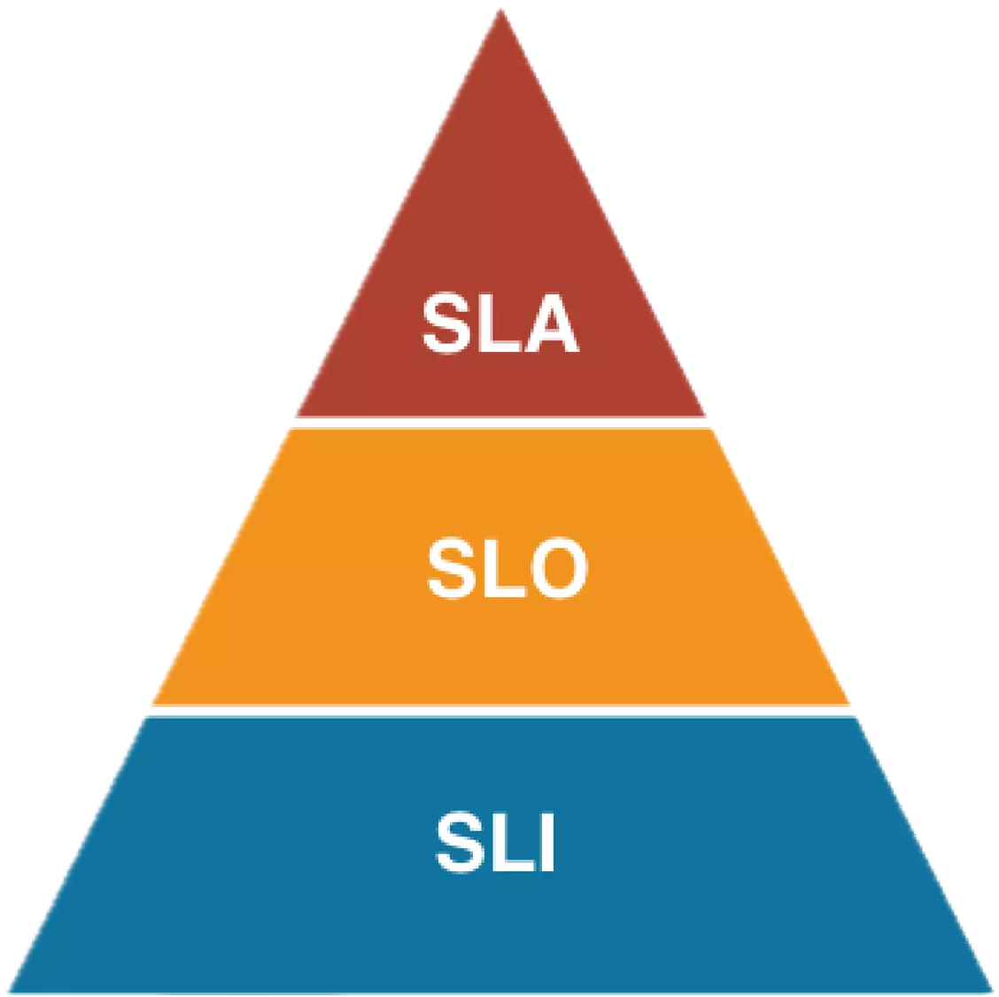

---

# Understanding RPOs and RTOs

- **Recovery Time Objectives (RTOs)**: The maximum acceptable downtime before services must be restored.
- **Recovery Point Objectives (RPOs)**: The amount of data that can be lost during a disruption.

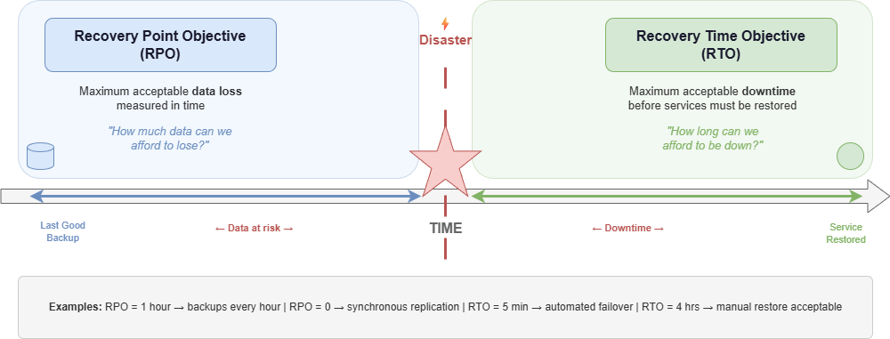

---

# Azure Cloud Architecture

## Implementing Reliability

---

# Azure-Customer Shared Responsibility Model

---

# Azure Well-Architected Framework

- Provides best practices and guidance for building high-quality Azure solutions.
- Ensures workloads are reliable, secure, efficient, and cost-effective.

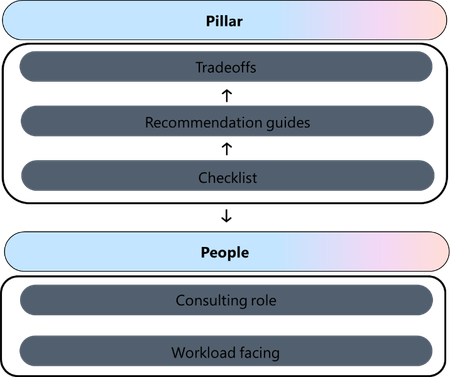

---

## Microsoft Azure Well-Architected Framework Pillars

| Reliability                        | Security                            | Cost Optimization                  | Operational Excellence                  | Performance Efficiency                  |
|------------------------------------|-------------------------------------|------------------------------------|-----------------------------------------|-----------------------------------------|
| Resiliency, availability, recovery | Protect data, detect threats, mitigate risks | Budgeting, reducing waste, efficiency | Observability, DevOps practices, safe deployments | Scalability, load testing, performance monitoring |

---

# Design Principles for Reliable Workloads

---

# Design for Business Requirements

- Gather business requirements focusing on the workload's intended utility.
- Cover user experience, data, workflows, and unique constraints or sensitivities.
- Clearly state expectations and confirm goals are feasible and documented.

---

# Design for Business Requirements

| Approach           | Description                                                     |
|--------------------|-----------------------------------------------------------------|
| Quantify Success   | Set targets for components, flows, and the system.             |
| Compliance         | Ensure predictable outcomes for sensitive flows.               |
| Platform Commitments | Understand SLAs, limits, and regional constraints.           |
| Dependencies       | Track dependencies and implement resilient design patterns.    |

---

# Design for Resilience

- The workload must continue to operate (fully or partially) despite failures.
- Expect platform outages, resource shortages, and other faults.
- Build resiliency to ensure fault tolerance and graceful degradation.

---

# Design for Resilience

| Approach                                                  | Description                                                   |
|-----------------------------------------------------------|---------------------------------------------------------------|
| Distinguish critical vs. degradable components            | Design according to criticality, avoiding overengineering.    |
| Identify potential failure points                          | Analyze failure cases to influence error handling design.     |
| Build self-preservation capabilities                      | Isolate faults and mitigate failures.                         |
| Add scalability for critical components                   | Handle capacity spikes and regional issues.                   |
| Build redundancy in layers and tiers                      | Minimize single points of failure.                            |

---

# Design for Recovery

- The workload must recover gracefully from failures of any magnitude.
- Even highly resilient systems need disaster preparedness.
- On the data layer, plan to repair or restore state if corruption occurs.

---

# Design for Recovery

| Approach                   | Description                                                                                      |
|----------------------------|--------------------------------------------------------------------------------------------------|
| Structured recovery plans  | Cover all components. Regular drills test recovery processes.                                    |
| Data repair for stateful components | Use backups to restore to a trusted recovery point. Ensure data integrity with immutable backups. |
| Automated self-healing     | Reduce risks and shorten break-fix cycles.                                                      |
| Immutable ephemeral units  | Spin up/destroy on demand. Use side-by-side deployments to minimize disruptions.                |

---

# Design for Operations

- Shift left in operations to anticipate failures early.
- Test failures frequently in development.
- Ensure shared visibility across teams for dependency status.
- Use diagnostics and alerts from observable systems for rapid incident management.

---

# Design for Operations

| Approach                                                | Description                                                                                |
|---------------------------------------------------------|--------------------------------------------------------------------------------------------|
| Build observable systems                                | Aggregated telemetry provides a holistic view of health status.                            |
| Predict malfunctions and anomalies                      | Use prioritized, actionable alerts for active reliability failures.                        |
| Invest in reliable processes and infrastructure         | Enable quicker triage and proactive mitigation of potential failures.                      |

---

# Design for Operations

| Approach                                 | Description                                         |
|------------------------------------------|-----------------------------------------------------|
| Simulate failures and run tests          | Validate real recovery expectations and metrics.    |
| Automate components                      | Minimize human error and ensure consistency.        |
| Scrutinize routine operations            | Spot hidden risks, maintain system stability.       |
| Learn from production incidents          | Incorporate improvements from real incident data.   |

---

# Keep It Simple

- Avoid overengineering architecture, code, and ops.
- Simplicity reduces inefficiencies and misconfigurations.
- Maintain a balanced approach to avoid single points of failure.

---

# Trade-Offs

---

# Trade-Offs in Applying the Framework

- Align trade-offs with business priorities
- Use scenario planning to assess impacts
- Continuously iterate and monitor performance

---

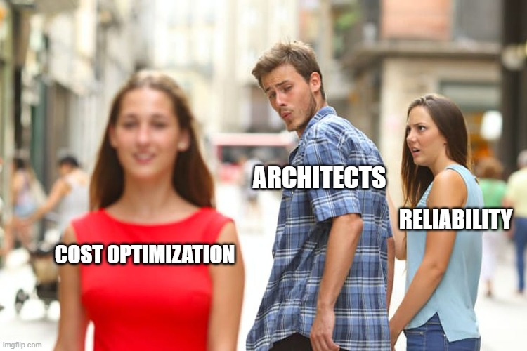

---

# Trade-Off: Reliability vs. Cost Optimization

## Prioritizing Reliability

- **Implementation Redundancy** (multi-region, failover environments)  
- **Extensive Monitoring & Drills** (increased ops investment)  
- **Over-Provisioning** for handling unexpected spikes

## Prioritizing Cost Optimization

- **Single-Region/Environment** setups with minimal redundancy  
- **Reduced Operational Costs** (less frequent drills, simpler monitoring)  
- **Right-Sizing** or under-provisioning to save on resource expenses

---

# Trade-Off: Reliability vs. Security

## Prioritizing Reliability

- **Replication & Backups** expand the footprint  
- **Faster Recovery** may involve temporarily bypassing certain security controls  
- **Delaying Patches** can reduce downtime risks for mission-critical systems

## Prioritizing Security

- **Minimized Attack Surface** with fewer components and less replication  
- **Strict Controls** always remain active, even under stress or incident response  
- **Frequent Patching** to fix vulnerabilities, even if it causes short disruptions

---

# Trade-Off: Reliability vs. Operational Excellence

## Prioritizing Reliability

- **Complex Architectures** (multi-region, multiple layers of failover)  
- **Extensive Documentation & Training** for DR processes  
- **Continuous Testing** adds operational overhead

## Prioritizing Operational Excellence

- **Simplicity in Architecture** to reduce confusion and manual effort  
- **Streamlined Knowledge Base** with fewer moving parts  
- **Less Overhead** in day-to-day operations and maintenance

---

# Trade-Off: Reliability vs. Performance Efficiency

## Prioritizing Reliability

- **Redundant Writes & Replication** can add latency overhead  
- **Failover Logic** and health checks can slow requests slightly  
- **Over-Provisioning** handles sudden spikes but may reduce performance tuning

## Prioritizing Performance Efficiency

- **Lean Deployments** to maximize throughput and minimize latency  
- **On-Demand Scaling** with minimal buffer capacity  
- **Focus on Speed** over robust recovery measures

---

# Failure Mode Analysis (FMA)

> We've explored design principles and tradeoffs. Next, let's discuss a crucial activity: proactively identifying and mitigating possible failure modes.

---

# Identifying and Mitigating Failures

## Proactive Failure Identification

- Recognize potential weaknesses before they cause outages.
- Tools like checklists, incident post-mortems, and dependency mapping can help.

## Mitigating Strategies

- Architect for graceful degradation, fallback strategies, and clear failover mechanisms.
- Enhance observability to detect issues quickly.

---

# Prioritizing Risks and Impacts

## Risk Prioritization

- Identify high-impact risks and allocate resources efficiently.
- Distinguish between low-probability/high-impact events and daily minor failures.

## Impact Mitigation

- Implement strategies to minimize consequences (e.g., immediate failover, data replication).
- Document potential risks to guide quick resolution.

---

# Single Points of Failure (SPOFs)

- An SPOF is a system part that, if it fails, disrupts the entire workload.
- Identifying SPOFs is critical for improving reliability and availability.

## Mitigating SPOFs

- **Redundancy**: Duplicate components or services.
- **Failover Mechanisms**: Seamlessly switch to backups.
- **Load Balancing**: Distribute traffic across multiple instances.

---

# Failure Examples

[Failure Examples](https://learn.microsoft.com/en-us/azure/well-architected/reliability/failure-mode-analysis#example)

---

# Azure Regions and Availability Zones

- Azure has 60+ regions worldwide, each in a specific geography with defined data residency boundaries.  
- Regions are groups of datacenters connected by low-latency, high-capacity networks.  
- Some regions are sovereign clouds with limited feature availability (e.g., Azure Government).  
- [Region Map](https://datacenters.microsoft.com/globe/explore/)

---

# Azure Region Pairs and Nonpaired Regions

## Region Pairs

- Some Azure regions are paired for built-in geo-redundancy (e.g., East US <=> West US).  
- Certain services (like geo-redundant storage) rely on these pairs to replicate data.  
- Region pairs help with **sequential updates**, **prioritized recovery**, and **physical isolation**.  
- However, you still must design your own disaster recovery; pairing alone doesn't guarantee automatic failover.

---

# Nonpaired Regions

- Many newer regions don't have a paired counterpart.  
- Often, they rely on **availability zones** for redundancy.  
- Azure services can still replicate data across any region combination.  
- **Choose any set of regions** to meet your business, latency, and compliance needs.

---

# Active-Active vs. Active-Passive

**Active-Active**: Multiple instances process requests simultaneously.
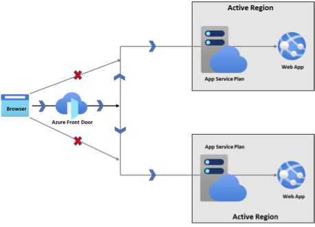

**Active-Passive**: Primary instance processes traffic; secondary is on standby.
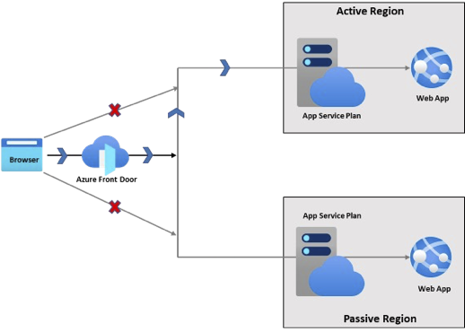

---

# Azure Availability Zones

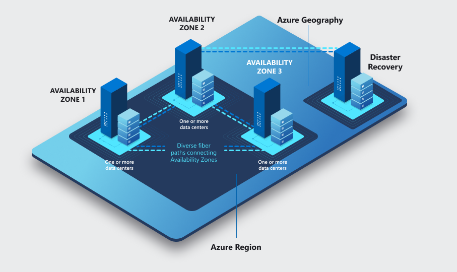

---

# Azure Availability Zones Infrastructure

- AZs are physically separate datacenters within an Azure region.
- Each zone has its own power, cooling, and networking.
- Low-latency (<2ms) connections link them, reducing local outage impact.
- Not all regions have AZs; check availability.
- [Region Support](https://learn.microsoft.com/en-us/azure/reliability/availability-zones-region-support)  

---

# Types of Availability Zone Support

- **Zone-Redundant**
- **Zonal**
- **Zone-Resilient**
- **Non-Zonal (Regional)**
- [Services Support](https://learn.microsoft.com/en-us/azure/reliability/availability-zones-service-support)

---

# Zonal Resources

- Pinned to a specific availability zone.
- Combine multiple zonal deployments for high reliability.

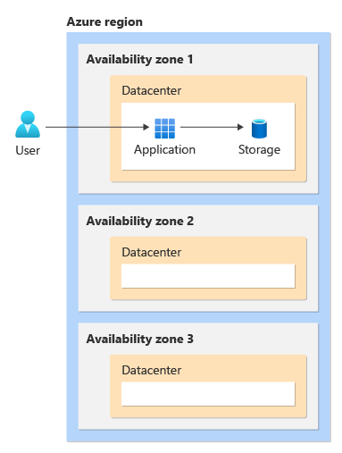

---

# Zonal Resources

**Customer Responsibilities**:

- Deploy and manage resources in each availability zone.
- Configure and manage data replication.
- Use a load balancer to distribute requests.
- Choose active-passive or active-active models.
- Handle failover when an AZ is unavailable.

---

# Zone-Redundant Resources

- Spread automatically across multiple availability zones.
- Microsoft manages request distribution and data replication.
- Automatic failover if a zone goes down.

---

# Zone-Resilient vs. Non-Zonal (Regional)

## Zone-Resilient

- Created as **zone-redundant** or deployed **zonal** across multiple zones  
- Survives a single zone outage by design  
- Minimizes downtime because data and services continue in healthy zones  

## Non-Zonal (Regional)

- Not explicitly configured for zone redundancy  
- May be placed in any zone and can be moved automatically  
- If that zone experiences an outage, these resources may go down  

---

# Availability Zones and Azure Updates

## Update Deployment

- Microsoft deploys updates to a single AZ at a time.
- Minimizes impact on active workloads.
- Running across multiple zones allows continuous service during updates.

---

# Data Replication: Storage Options

---

# Example Scenarios

## Line-of-Business Application

- **Requirements**: High reliability, minimal downtime, strong performance, cost efficiency.
- **Approach**: Zone-redundant deployment with regional backups.

## Internal Application

- **Requirements**: Cost sensitivity, acceptable downtime risk.
- **Approach**: Locally redundant deployment plus cross-region backups (or zone-redundant).

---

# Example Scenarios

## Legacy Application Migration

- **Requirements**: High performance, resiliency.
- **Approach**: Zone-redundant or zonal pinned deployments, possibly with passive failover.

## Healthcare Application

- **Requirements**: Data residency, regulatory compliance.
- **Approach**: Multi-zone, multi-region with strict compliance considerations.

---

# Example Scenarios

## Banking System

- **Requirements**: Mission-critical, extremely high reliability.
- **Approach**: Multi-zone and multi-region deployment (Active-Active).

## Software as a Service (SaaS)

- **Requirements**: Geographically distributed users, data residency constraints.
- **Approach**: Multi-zone, multi-region or zone-redundant single-region with global traffic distribution.

---

# Enhancing Resiliency with Fault Isolation

- Fault isolation prevents cascading failures and maintains availability.
- Azure Availability Zones distribute workloads across multiple data centers, reducing outage risks in a single location.

---

# Deploying Across Zones for Higher Availability

- Deploying workloads across multiple AZs strengthens availability.
- Provides built-in fault isolation to handle datacenter-specific failures.

---

# Architecting for Reliability

- Beyond AZs and multi-region approaches, landing zones, reference architectures, and best practices further ensure resilient workloads in Azure.

---

# Load Testing and Chaos Engineering

---

# Load Testing

## Ensuring Performance and Scalability

- Evaluates system behavior under peak conditions.
- Identifies performance bottlenecks.
- Guides infrastructure and capacity planning.
- Ensures reliable performance under heavy workloads.

---

# Load Testing Strategies

| Strategy | Description |
| --- | --- |
| Load | Simulates typical peak usage scenarios. |
| Stress | Tests beyond limits to identify breaking points. |
| Spike | Tests system reactions to sudden traffic surges|
| Endurance | Assesses long-term system stability under sustained load. |

---

# Tools for Load Testing

- Popular choices: **JMeter**, **LoadRunner**, **Locust**, **Gatling**.
- Azure Load Testing leverages JMeter and Locust.
- Choose a tool based on your needs and budget.

---

# Chaos Engineering

> After validating performance, we can further strengthen resilience by deliberately introducing controlled failures.

- Chaos Engineering tests how systems behave under unexpected conditions.
- Identifies weak points in architecture and processes.
- Fosters a culture of experimentation and continuous improvement.

---

# Principles of Chaos Engineering

- Simulate real-world failures to validate resilience.
- Conduct controlled experiments, preferably in production with safety measures.
- Ensure minimal user impact through strict guardrails.

---

# Benefits of Chaos Engineering

- Uncovers unforeseen issues before they affect customers.
- Encourages proactive system improvements and learning.
- Strengthens organizational readiness for incident response.

---

# Tools for Chaos Engineering

- Azure Chaos Studio for Azure workloads.
- Other tools:
  - Gremlin
  - Chaos Monkey
  - LitmusChaos

---

# Integrating Testing into Operations

- Combine load testing and chaos engineering into continuous practices.

- Validate system resilience comprehensively and frequently.

---

# Reference Architectures & Resources

- Utilize established Azure reference architectures for reliability.

- Leverage available documentation and best practices for consistency and effectiveness.

---

# Azure Landing Zones

## Secure Structure

- Azure Landing Zones create a secure, organized foundation for Azure environments.
- Enforce identity, network, and governance policies at scale.

## Reliable Implementation

- A standardized environment supports consistent deployments.
- Simplifies resource management and reduces misconfigurations.

---

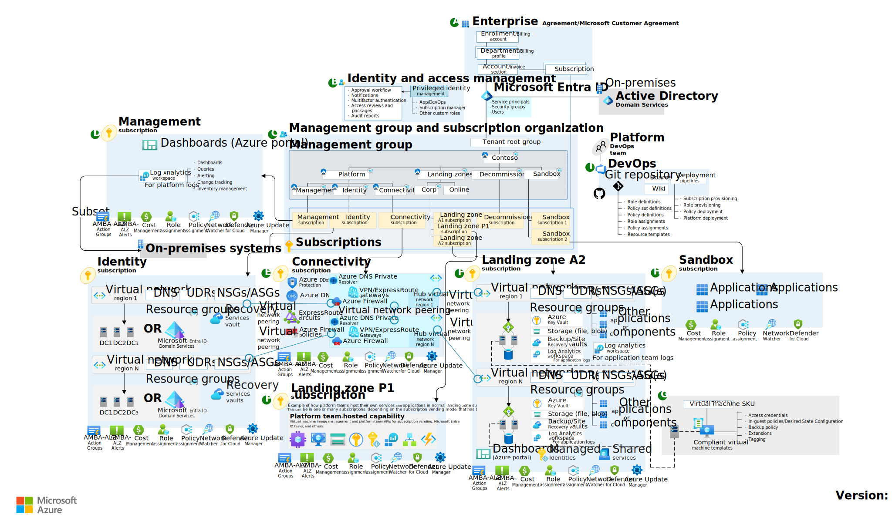

---

# Azure Architecture Center

- Centralized repository of best practices, reference architectures, and design patterns for Azure solutions.
- Provides comprehensive guidance on building reliable, scalable, and secure cloud solutions.
- Offers scenario-specific architectures, recommended practices, and templates to accelerate your workload design.

[Explore Azure Architecture Center](https://learn.microsoft.com/azure/architecture/)

---

# Well-Architected Workloads

- Align workloads with business outcomes using the Azure Well-Architected Framework  
- Balancing functional requirements and nonfunctional trade-offs  
- Integrate design fundamentals, trade-offs, and operational best practices
- [Well-Architected Workloads](https://learn.microsoft.com/en-us/azure/well-architected/workloads)

---

# Mission-Critical Workloads

Learn about designing mission-critical applications on Azure for high availability, reliability, and performance:

[Mission-Critical Workloads](https://learn.microsoft.com/en-us/azure/well-architected/mission-critical/mission-critical-overview)

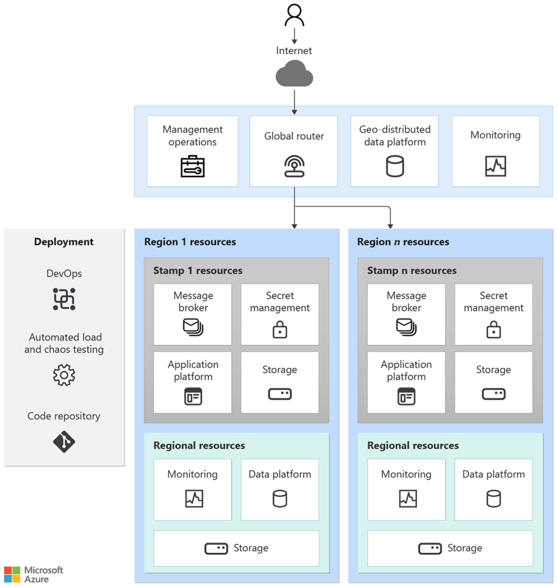

---

# Enterprise Web App Patterns

Guidance for web apps on Azure, offering prescriptive architecture, code, and configuration aligned with the Well-Architected Framework:

[Enterprise Web App Patterns](https://learn.microsoft.com/en-us/azure/architecture/web-apps/guides/enterprise-app-patterns/overview)

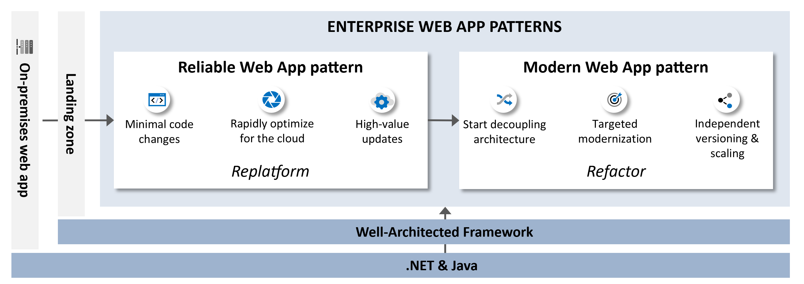

---

# Azure Verified Modules

- Pre-built, tested, and Azure-verified modules that accelerate development.
- Ensures compliance with best practices and standards.

[Azure Verified Modules](https://azure.github.io/Azure-Verified-Modules/)

---

# APRL: Azure Platform Resiliency Library

- Curated catalog of resiliency recommendations, plus Azure Resource Graph queries for identifying non-compliant resources.
- Guidance by resource type, specialized workloads, WAF best practices, and automation scripts.

[APRL: Azure Platform Resiliency Library](https://github.com/Azure/Azure-Proactive-Resiliency-Library-v2)

---

# Azure Review Checklists

- Use these to ensure your architecture aligns with best practices.
- Covers diverse Azure services to catch issues before they become critical.

[Azure Review Checklists](https://github.com/Azure/review-checklists)

---

# Conclusion

- **Design Principles**: Focus on resilience, recovery, and simplicity for robust workloads.
- **Tradeoffs**: Every decision impacts cost, security, operational excellence, and performance.
- **Proactive Reliability**: Utilize Failure Mode Analysis to anticipate and mitigate failures.
- **Continuous Improvement**: Leverage Availability Zones, multi-region deployments, chaos engineering, and load testing to enhance reliability.

---

## Next Steps

- Review your architecture with [Azure Review Checklists](https://github.com/Azure/review-checklists).
- Validate designs against Microsoft's established [Reference Architectures](https://learn.microsoft.com/en-us/azure/architecture/).  
- Implement regular chaos engineering and load testing practices.
- Stay informed on reliability best practices and continuously refine your approach.

---

# Resources

## Links

- [APRL](https://github.com/Azure/Azure-Proactive-Resiliency-Library-v2)
- [Azure Verified Modules](https://azure.github.io/Azure-Verified-Modules/)
- [Azure Review Checklists](https://github.com/Azure/review-checklists)
- [Enterprise Web Apps](https://learn.microsoft.com/en-us/azure/architecture/web-apps/guides/enterprise-app-patterns/overview)

## Chris Ayers

_Senior Site Reliability Engineer_
_Azure CXP AzRel_
_Microsoft_

<i class="fa-brands fa-bluesky"></i> BlueSky: [@chris-ayers.com](https://bsky.app/profile/chris-ayers.com)  
<i class="fa-brands fa-linkedin"></i> LinkedIn: - [chris\-l\-ayers](https://linkedin.com/in/chris-l-ayers/)  
<i class="fa fa-window-maximize"></i> Blog: [https://chris-ayers\.com/](https://chris-ayers.com/)  
<i class="fa-brands fa-github"></i> GitHub: [Codebytes](https://github.com/codebytes)  
<i class="fa-brands fa-mastodon"></i> Mastodon: [@Chrisayers@hachyderm.io](https://hachyderm.io/@Chrisayers)
~~<i class="fa-brands fa-twitter"></i> Twitter: [@Chris_L_Ayers](https://twitter.com/Chris_L_Ayers)~~  

