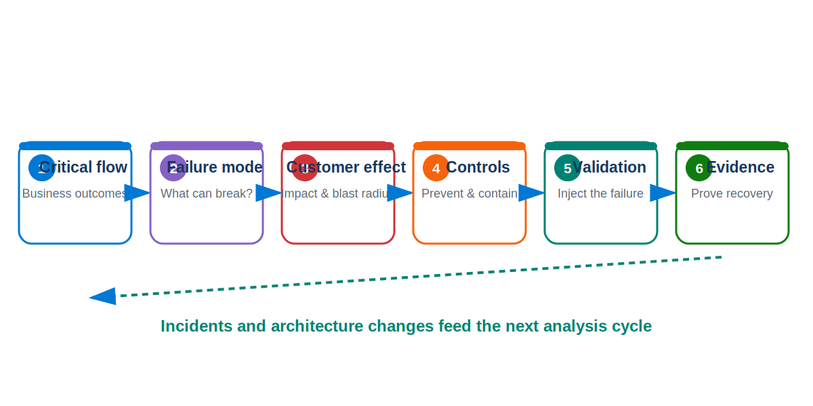
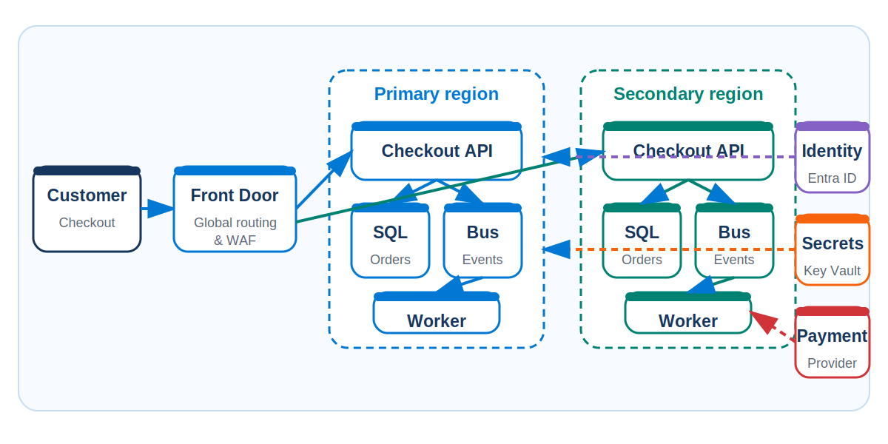
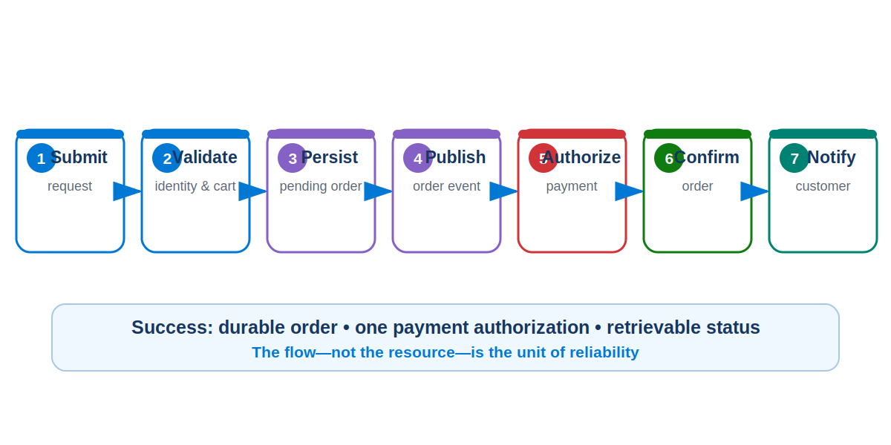
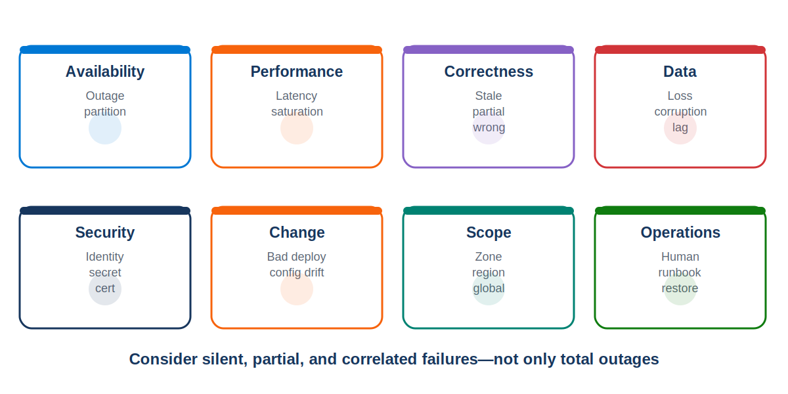
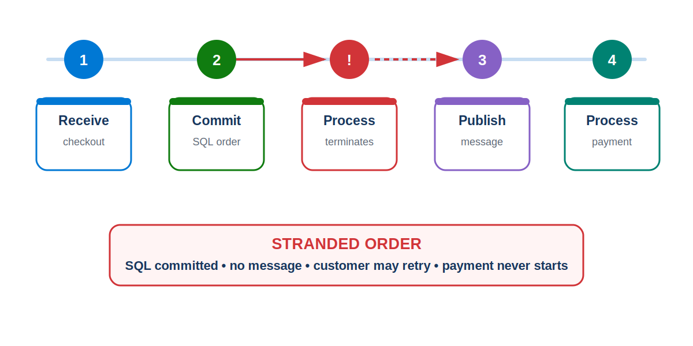
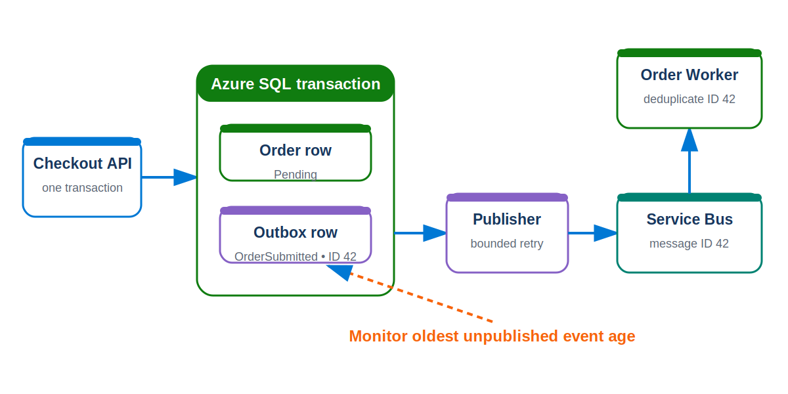
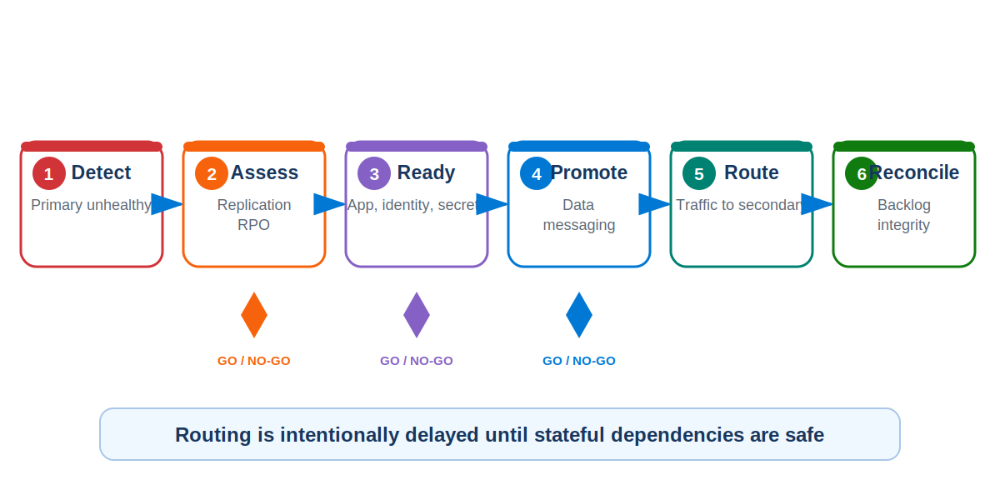
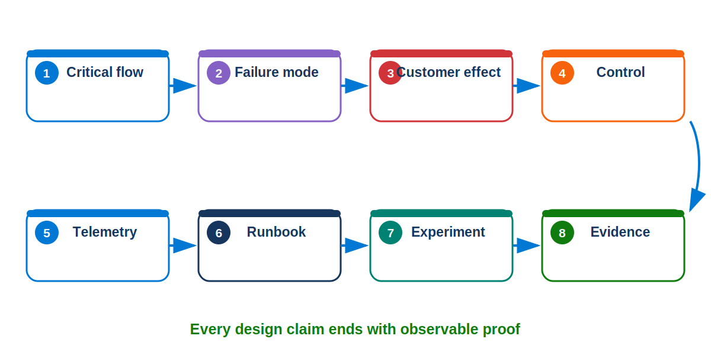

# Resilient by Design: Building Reliable Workloads on Azure

## Chris Ayers

Principal Software Engineer
Microsoft

---

## Chris Ayers

_Principal Software Engineer_  
_Azure EngOps AzRel_  
_Microsoft_

<i class="fa-brands fa-bluesky"></i> BlueSky: [@chris-ayers.com](https://bsky.app/profile/chris-ayers.com)
<i class="fa-brands fa-linkedin"></i> LinkedIn: - [chris\-l\-ayers](https://linkedin.com/in/chris-l-ayers/)
<i class="fa fa-window-maximize"></i> Blog: [https://chris-ayers\.com/](https://chris-ayers.com/)
<i class="fa-brands fa-github"></i> GitHub: [Codebytes](https://github.com/codebytes)
<i class="fa-brands fa-mastodon"></i> Mastodon: [@Chrisayers@hachyderm.io](https://hachyderm.io/@Chrisayers)
~~<i class="fa-brands fa-twitter"></i> Twitter: @Chris_L_Ayers~~

---

# Reliability

---

# Why Reliability Matters

> A system is considered "reliable" if it can consistently serve users under normal or abnormal conditions.

- Reliability in distributed systems involves:
  - **Consistent performance** despite failures.
  - **Graceful degradation** when certain components become unavailable.
  - **Rapid recovery** within acceptable time limits.

---

# Understanding Reliability and Resiliency

- Failures are **inevitable** in distributed systems
- Workloads must **detect**, **withstand**, and **recover** from failures within _**acceptable**_ timeframes
- Ensuring availability for users to access workloads as promised
- Failures impact _**revenue**_, _**reputation**_, and _**customer trust**_

---

# <!-- fit --> FAILURE IS ALWAYS AN OPTION

---

---

# Reliability Levels

| Level       | Monthly Downtime  | Annual Downtime | Cost  |
| ----------- | ----------------- | --------------- | ----- |
| **99.9%**   | 43.8 minutes      | 8.75 hours      | $     |
| **99.95%**  | 21.9 minutes      | 4.375 hours     | $$    |
| **99.99%**  | 4.38 minutes      | 52.6 minutes    | $$$   |
| **99.995%** | 2.19 minutes      | 26.3 minutes    | $$$$  |
| **99.999%** | 26 seconds        | 5.25 minutes    | $$$$$ |

>[https://uptime.is/five-nines](https://uptime.is/five-nines)

---

---

# How Do We Measure Reliability?

| | Definition | Example |
|-----|-----------|--------|
| **SLI** | Metric of user experience | API success rate per request |
| **SLO** | Reliability target over window | 99.95% successful responses (30d) |
| **Error Budget** | 1 − SLO (consumable failure) | 0.05% ≈ 21.9 min @ 99.95% |
| **SLA** | Contract with penalties | 99.9% monthly w/ credits |

---

# Understanding RPOs and RTOs

- **RTO**: Max acceptable **downtime** before services must be restored
- **RPO**: Max acceptable **data loss** measured in time

---

# Business & Non-Functional Requirements Layer

## From Intent to Quantified Reliability

Establish resilience expectations before selecting technology:
- Define critical user journeys & classify components (critical vs. degradable)
- Quantify reliability targets (SLOs, error budgets, RTO/RPO)
- Align trade-offs early (cost, performance, security, operations)

---

# Requirements: Resilience & Recovery

### Business

- Quantify success targets for flows
- Understand platform SLAs, limits, constraints

### Key Principle

> Design for **how you respond**, not just prevention

### Recovery
- Recovery plans with regular drills
- Trusted backups & immutable copies
- Automated detection & self-healing

### Resilience

- Classify **critical** vs. **degradable** components
- Design for fault isolation & graceful degradation
- Eliminate single points of failure

---

# Identify & Rate User and System Flows

## Flow Identification

- Map **critical user journeys** end-to-end
- Identify all **system flows** (background jobs, sync, integrations)
- Rate each flow on a **criticality scale** tied to business impact

## Criticality Classification

| Tier | Reliability Target |
|------|--------------------|
| **Critical** | 99.99%, RTO < 5 min |
| **Important** | 99.9%, RTO < 30 min |
| **Non-Critical** | 99.5%, RTO < 4 hours |

> Set SLOs and RTO/RPO **per flow**, not per system

---

---

---

# Operational Readiness

- Shift left to anticipate failures early
- Test failures in development
- Ensure cross-team visibility
- Use observability for rapid remediation

| Strategy | Implementation |
|----------|----------------|
| Observable Systems | Aggregate telemetry for holistic health views |
| Failure Simulation | Validate recovery metrics with realistic tests |
| Automation | Minimize human error and ensure consistency |
| Continuous Learning | Improve from real production incidents |
| Proactive Monitoring | Prioritize alerts for active failures |

---

# Keep It Simple

- Avoid overengineering architecture, code, and operations
- Simplicity reduces inefficiencies and misconfigurations
- Maintain a balanced approach to avoid single points of failure

---

# Trade-Offs

- Align trade-offs with business priorities
- Use scenario planning to assess impacts
- Continuously iterate and monitor performance

---

---

# Azure Well-Architected Framework

- Provides best practices and guidance for building high-quality Azure solutions.
- Ensures workloads are reliable, secure, efficient, and cost-effective.
- [Azure Well-Architected Framework](https://learn.microsoft.com/en-us/azure/well-architected/)
 

---

---

## Microsoft Azure Well-Architected Framework Pillars

| Reliability                        | Security                            | Cost Optimization                  | Operational Excellence                  | Performance Efficiency                  |
|------------------------------------|-------------------------------------|------------------------------------|-----------------------------------------|-----------------------------------------|
| Resiliency, availability, recovery | Protect data, detect threats, mitigate risks | Budgeting, reducing waste, efficiency | Observability, DevOps practices, safe deployments | Scalability, load testing, performance monitoring |

---

# Reliability Trade-Offs with Other Pillars

| Pillar | More Reliability Means... | Less Reliability Means... |
|--------|--------------------------|---------------------------|
| **Cost** | Redundancy, monitoring, over-provisioning | Right-sized, single-region, simpler ops |
| **Security** | Larger attack surface, may delay patches | Strict controls, frequent patching |
| **Ops Excellence** | Complex architecture, extensive DR testing | Simpler systems, less overhead |
| **Performance** | Replication latency, failover overhead | Lean deployments, speed-focused |

---

# Architecture Layer

## Structuring for Failure Containment

Focus on failure domains, redundancy strategy, and dependency design before implementation.

---

---

# Dependency Management

## Map Your Dependencies

- Identify all **upstream** and **downstream** dependencies
- Document each dependency's **SLA and failure modes**
- Classify: **strong** (required) vs. **weak** (degradable)

## Mitigation Strategies

| Strategy | When to Use |
|----------|-------------|
| **Caching** | Tolerate downtime for reads |
| **Async messaging** | Decouple from unreliable services |
| **Fallback values** | Defaults when dependency fails |
| **Circuit breaker** | Prevent cascading failures |
| **Timeout + retry** | Handle transient issues |

---

# Failure Mode Analysis (FMA)

## Proactive Identification

- Recognize potential weaknesses before outages occur
- Use checklists, post-mortems, dependency mapping
- Prioritize by user impact & blast radius

## Effective Mitigation

- Architect graceful degradation & fallbacks
- Instrument for fast anomaly detection
- Automate failover & data replication where feasible

> [Failure Examples](https://learn.microsoft.com/en-us/azure/well-architected/reliability/failure-mode-analysis#example)

---

# FMA Through All Five Pillars

> FMA is [Reliability recommendation RE:03](https://learn.microsoft.com/en-us/azure/well-architected/reliability/failure-mode-analysis), but failure consequences cross every pillar

| Pillar | Ask | Evidence |
|--------|-----|----------|
| Reliability | Can the flow meet its SLO during failure? | Failover, restore, and chaos results |
| Security | Can a control fail, be bypassed, or block recovery? | Threat model and control tests |
| Cost Optimization | Can failure or mitigation create runaway spend? | Degraded-state cost model and guardrails |
| Operational Excellence | Can people detect, decide, and recover safely? | Alerts, runbooks, drills, and deployment gates |
| Performance Efficiency | What happens at saturation or throttling? | Load tests, limits, and scaling telemetry |

---

# [Reliability](https://learn.microsoft.com/en-us/azure/well-architected/reliability/checklist): Preserve Critical Flows

## Failure Modes

- Partial, transient, and gray failures
- Correlated or shared-dependency outages
- Data-plane and control-plane loss
- Replication lag and data corruption
- Failover or restore that does not work

## Controls & Evidence

- Define SLO, RTO, and RPO per flow
- Isolate faults and bound blast radius
- Design graceful degradation
- Test failover, failback, and restore
- Measure residual risk after mitigation

> Run FMA per critical flow—not only per component

---

# [Security](https://learn.microsoft.com/en-us/azure/well-architected/security/checklist): Controls Can Fail Too

## Failure Modes

- Microsoft Entra ID or authorization unavailable
- Expired certificates, keys, or secrets
- Excess privilege or emergency-access failure
- Segmentation and policy misconfiguration
- Missing, delayed, or tampered audit signals
- Recovery path bypasses a security boundary

## Controls & Evidence

- Pair FMA with threat modeling
- Decide where to fail closed or degrade safely
- Test rotation and secret-recovery paths
- Validate least privilege and emergency access
- Monitor control health—not only attacks
- Reassess after threats or architecture change

---

# [Cost Optimization](https://learn.microsoft.com/en-us/azure/well-architected/cost-optimization/checklist): Model Failure-Driven Spend

## Failure Modes

- Retry storms multiply transactions
- Failover creates data-transfer charges
- Emergency scaling has no upper bound
- Idle disaster recovery capacity is oversized
- Telemetry volume spikes during incidents
- Backlogs prolong recovery consumption

## Controls & Evidence

- Model normal, degraded, and recovery states
- Track cost per critical flow and unit of work
- Set budgets, anomaly alerts, and guardrails
- Bound retries, scaling, and retention
- Tier redundancy by business criticality
- Include cost in game-day observations

> Every mitigation has a cost mode—budget it before the incident

---

# [Operational Excellence](https://learn.microsoft.com/en-us/azure/well-architected/operational-excellence/checklist): Make Recovery Executable

## Failure Modes

- Deployment and rollback both fail
- Infrastructure or configuration drifts
- Alerts are missing, noisy, or unactionable
- Runbooks are stale or permissions are absent
- Manual handoffs delay or amplify impact
- Recovery depends on one expert

## Controls & Evidence

- Use progressive delivery and health gates
- Manage telemetry and runbooks as code
- Automate repeatable recovery steps
- Drill decision points and escalation paths
- Track detection and recovery time
- Feed incidents and near misses into FMA

---

# [Performance Efficiency](https://learn.microsoft.com/en-us/azure/well-architected/performance-efficiency/checklist): Degradation Is Failure

## Failure Modes

- Resource saturation and queue buildup
- Throttling and exhausted service limits
- Autoscale lag or exhausted regional capacity
- Hot partitions and noisy neighbors
- Retry amplification overwhelms dependencies
- Performance does not recover after demand falls

## Controls & Evidence

- Tie latency and throughput limits to SLOs
- Load, stress, spike, and soak test
- Apply backpressure and admission control
- Degrade noncritical work first
- Scale on leading and backlog signals
- Verify recovery, not only peak throughput

---

# Expanding the FMA Lens

| Current Guidance | Add to the Analysis |
|------------------|---------------------|
| [Throttling](https://learn.microsoft.com/en-us/azure/well-architected/design-guides/throttling) | Dynamic limits, fairness, backpressure, and retry amplification |
| [Sustainability](https://learn.microsoft.com/en-us/azure/well-architected/sustainability/overview) | Waste from idle redundancy, excessive telemetry, and inefficient recovery |
| [AI workloads](https://learn.microsoft.com/en-us/azure/well-architected/ai/get-started) | Model drift, nondeterminism, grounding gaps, unsafe output, and token-cost spikes |
| [Workload guidance](https://learn.microsoft.com/en-us/azure/well-architected/workloads) | Service- and workload-specific failure modes and trade-offs |

- Keep the five pillars as the foundation; apply additional workload lenses
- Review [What’s new in Azure Well-Architected](https://learn.microsoft.com/en-us/azure/well-architected/whats-new) when revisiting the FMA

---

# FMA: From Risk to Evidence

> FMA is a living engineering practice—not a one-time spreadsheet

---

# Sample Workload: E-Commerce Checkout

---

# Start with the Critical User Flow

| Target | Objective |
|--------|-----------|
| Availability | 99.95% successful submissions |
| Latency | 95% accepted within 3 seconds |
| Processing | 99% finalized within 2 minutes |
| Recovery | RTO 15 minutes; RPO 5 minutes |
| Integrity | No lost orders or duplicate charges |

---

# Map & Classify Dependencies

## Dependency Strength

- **Strong** — failure stops the flow
- **Weak** — feature can degrade safely
- **Synchronous** — directly affects latency
- **Asynchronous** — creates backlog risk
- **Shared** — can correlate failures

| Dependency | Classification |
|------------|----------------|
| Azure SQL | Strong, synchronous |
| Service Bus | Strong, asynchronous |
| Payment provider | Required for completion |
| Email provider | Weak, asynchronous |
| Identity / DNS | Strong, shared |
| Deployment pipeline | Shared |

> Include identity, DNS, secrets, operators, and delivery systems—not only application services

---

# Build the Failure Inventory

> Ask how each dependency can fail—not only whether it can fail

---

# Anatomy of an FMA Record

| Analyze | Connect |
|---------|---------|
| Critical flow & component | Existing controls & gaps |
| Failure mode & causes | Detection signals & thresholds |
| Local & customer effects | Mitigation & recovery |
| Blast radius | Validation experiment |
| SLO / RTO / RPO impact | Owner & residual risk |

> “Service unavailable” is a symptom, not a complete failure analysis

---

# Prioritize the Risks

## Score 1–5

- Customer and business **impact**
- Expected **likelihood**
- Difficulty of **detection**
- **Recovery complexity**

`Risk = I × L × D × R`

## Always Escalate

- Duplicate charging
- Acknowledged-order loss
- Irreversible corruption
- Regulatory breach
- RTO or RPO violation
- Correlated global failure

> Scoring guides prioritization; it does not replace engineering judgment

---

# Deep Dive: The Dual-Write Failure

- SQL contains a pending order, but no message exists to process it
- A customer retry can create a second order
- The failure can affect one request—or every checkout during an outage
- Independent retries cannot make two systems atomic

---

# Mitigation: Transactional Outbox

- Persist the order and outbox event in one SQL transaction
- Publish asynchronously with a stable message ID
- Use bounded retries, backoff, and consumer deduplication
- Alert on the **oldest unpublished event**, not only error count

---

# Deep Dive: Ambiguous Payment Outcome

## Failure

The payment succeeds, but its response is lost.

**Unsafe response:** blindly retrying may charge the customer twice.

## Controls

- Stable idempotency key per order
- Persist attempt state before calling
- Treat timeout as **Unknown**, not Failed
- Query provider before retrying
- Reconcile unresolved transactions

`Not Started → Initiated → Authorized | Declined | Unknown → Reconciliation`

---

# Deep Dive: Regional Outage

> Traffic, data, and messaging failover are separate operations

- Confirm application, identity, secrets, and dependencies are ready
- Know replication state and potential data loss before promotion
- Route traffic only after the secondary is safe to serve

---

# Convert Failure Modes into Experiments

| Failure Mode | Validation |
|--------------|------------|
| Instance or zone loss | Remove instances or a zonal deployment |
| SQL interruption | Block connectivity; verify safe failure |
| Dual-write interruption | Stop publication after commit |
| Duplicate delivery | Replay the same message |
| Payment ambiguity | Drop the provider response |
| Throttling | Inject 429 responses |
| Region outage | Run a coordinated regional game day |
| Backup failure | Restore into an isolated environment |

Capture detection time, customer impact, recovery time, data loss, and corrective actions.

---

# Operationalize the FMA

- Assign an owner to every critical risk
- Link risks to dashboards, alerts, runbooks, and experiments
- Record evidence that recovery objectives are achievable
- Revisit after architecture changes, incidents, and near misses
- Explicitly accept or remediate residual risk

---

# FMA Completion Checklist

- Critical flows have explicit SLO, RTO, and RPO targets
- Strong, weak, shared, data-plane, and control-plane dependencies are mapped
- Critical risks have detection, mitigation, and recovery controls
- Runbooks and corrective actions have named owners
- Recovery assumptions are tested regularly
- Residual risks receive explicit acceptance
- Production learning continuously updates the analysis

> A design claim becomes a reliability control only after it is validated

---

# Single Points of Failure (SPOFs)

## Understanding SPOFs

- Single component whose failure halts critical flow
- Occur in infra, data, code paths, people/process
- Early detection reduces mean time to mitigation

## Mitigation Strategies

- Redundancy & diversity (multi-zone / multi-instance)
- Load balancing & partitioning
- Automated failover runbooks
- Regular design & dependency reviews

---

# Active-Active vs. Active-Passive

**Active-Active**: Multiple instances process requests simultaneously.

**Active-Passive**: Primary instance processes traffic; secondary is on standby.

---

# Infrastructure / Platform Layer

## Foundation for Consistent Resilience

Automated, policy-driven environments (Landing Zones, AVM, APRL) reduce variance & misconfiguration risk.

---

# Azure-Customer Shared Responsibility Model

> Azure guarantees platform SLA; you own workload SLA

## Your Reliability Responsibilities

| Layer | Customer Owns |
|-------|---------------|
| **Data** | Backup strategy, replication, encryption |
| **Application** | Retry logic, circuit breakers, health probes |
| **Identity** | MFA, conditional access, break-glass accounts |
| **Network** | Redundant paths, ExpressRoute resilience |
| **Infra Config** | Zone/region selection, scaling rules |

---

# Azure Regions and Regional Strategy

## Region Selection Criteria

- **Latency**: Proximity to users
- **Compliance**: Data residency, sovereignty
- **Service Availability**: Not all services in all regions
- **Cost**: Pricing varies by region

## Multi-Region Considerations

| Factor | Impact on Design |
|--------|------------------|
| Region Pairs | Sequential updates, prioritized recovery |
| Non-paired | Flexible, but plan your own DR |
| Sovereign Clouds | Isolated (Gov, China, Germany) |
| Distance | Affects replication lag & latency |

> Pairing ≠ automatic failover—you must design for it

---

# Azure Availability Zones

- Physically separate datacenters within a region
- Independent power, cooling, and networking
- Low-latency (<2ms) connections between zones
- Updates deployed one AZ at a time
- [View Region Support](https://learn.microsoft.com/en-us/azure/reliability/availability-zones-region-support)

---

# Types of Availability Zone Support

| Type | Deployment | Failover | Who Manages |
|------|-----------|----------|-------------|
| **Zonal** | Pinned to one zone | You handle failover | Customer |
| **Zone-Redundant** | Spread across zones | Automatic | Microsoft |
| **Zone-Resilient** | Zonal or zone-redundant | Survives zone outage | Varies |
| **Non-Zonal (Regional)** | No zone affinity | May go down with zone | Neither |

- [View Services Support](https://learn.microsoft.com/en-us/azure/reliability/availability-zones-service-support)

---

# Zonal Resources

- Pinned to a specific availability zone
- Combine multiple zonal deployments for high reliability
- **You** manage replication, load balancing, and failover
- Deploy across zones for zone-level protection

---

# Zone-Redundant Resources

- Spread automatically across multiple availability zones.
- Microsoft manages request distribution and data replication.
- Automatic failover if a zone goes down.

---

# Data Replication: Storage Options

| Option | Scope | RPO | Use Case |
|--------|-------|-----|----------|
| **LRS** | Single datacenter | 0 (sync) | Dev/test, easily reconstructed data |
| **ZRS** | Across AZs | 0 (sync) | Production, zone-level protection |
| **GRS** | Cross-region | ~15 min | DR across regions |
| **GZRS** | AZs + cross-region | ~15 min | Best durability |
| **RA-GRS/RA-GZRS** | + read access | ~15 min | Read from secondary during outage |

- Hot vs. Cool vs. Archive affects **recovery time**
- **Immutable storage** for ransomware protection

---

# Scaling Strategies

---

# Azure Reliability Services

## Traffic & Load Balancing

| Service | Purpose |
|---------|---------|
| **Azure Front Door** | Global HTTP LB, failover, WAF |
| **Traffic Manager** | DNS-based global routing |
| **Load Balancer** | Regional L4 LB |
| **Application Gateway** | Regional L7 LB, WAF |

## Backup & Recovery

| Service | Purpose |
|---------|---------|
| **Azure Site Recovery** | DR replication & failover |
| **Azure Backup** | Managed backup (VMs, SQL, files) |
| **Service Health** | Platform outage alerts |
| **Resource Health** | Individual resource status |
| **Azure Advisor** | Proactive recommendations |

---

# Software / Workload Layer

## Runtime Resilience Behaviors

Embed failure-aware logic: timeouts, retries, backoff, bulkheads, circuit breakers, idempotency, hedging.

---

# Resilience Patterns
| Pattern | Problem Solved | Key Considerations |
|---------|----------------|--------------------|
| Timeout | Prevent hanging on slow dependency | Set < expected p95 latency; combine with retries |
| Retry + Backoff + Jitter | Transient faults (throttling, blips) | Cap attempts; respect idempotency |
| Circuit Breaker | Failing dependency cascading | Trip on error rate/latency; half-open probes |
| Bulkhead Isolation | One noisy component  | Resource partitioning |
| Dead Letter Queue | Bad messages blocking progress | Monitor & replay with alerting |
| Graceful Degradation | Maintain partial service | Feature flags, fallback data |

---

# Async & Event-Driven Patterns

---

# Azure SDK Resiliency Best Practices

## Built-in SDK Features
- **Retry** — Exponential backoff + jitter
- **Timeouts** — Per-attempt + overall deadline
- **Throttling** — Honor `Retry-After`
- **Idempotency** — Keys/message IDs to dedupe

## Your Responsibilities
- **Circuit Breaking** — Polly / resilience libs
- **Connection Reuse** — Reuse clients (thread-safe)
- **Backpressure** — Bounded channels, fail fast
- **Observability** — Correlate traces, log retries

---

# Operations & Observability Layer

## Detect, Respond, Learn

Emphasize fast detection, validated recovery paths, and continuous improvement through data & drills.

---

# Safe Deployment Practices

---

# OpenTelemetry

- Open standard for generating, collecting, and exporting telemetry data (traces, metrics, logs)
- Supported by major cloud providers, including Azure Monitor, AWS CloudWatch, and Google Cloud Operations
- Enables vendor-neutral instrumentation and observability across distributed systems

---

# Metrics & Error Budgets

| Concept | Formula / Definition | Example |
|---------|----------------------|---------|
| Availability SLI | (Successful Requests) / (Total Requests) | 99,950 / 100,000 = 99.95% |
| Latency SLI | % of requests under threshold | 95% < 250ms (p95), 99% < 400ms |
| Error Budget  | 1 - SLO | SLO 99.9% => 0.1% budget |
| Burn Rate | Budget consumed / Time elapsed fraction | 2× burn -> intervene early |
| MTTR | Avg restore time for incidents | Track trend downwards |

- Burn Rate **> 4×** for 1h: Freeze deploys; incident review
- Burn Rate **2×** sustained: Reduce change volume
- Burn Rate **< 1×**: Continue roadmap; schedule chaos tests

---

# Load Testing

## Key Benefits

- **Prevents Surprises**: Identify capacity issues before production
- **Validates Scaling**: Ensure your auto-scaling works properly
- **Finds Weaknesses**: Spot resource exhaustion and memory leaks

## Implementation

- **Cost-Effective**: Much cheaper than emergency scaling during incidents
- **Azure Tools**: Azure Load Testing service with JMeter support
- **Best Practice**: Test with realistic user patterns and data volumes

---

# Chaos Engineering

## Core Principles

- **Controlled Failure**: Introduce failures in controlled environments
- **Best Practice**: Start small with clear abort conditions
- **Continuous Process**: Build complexity as confidence increases

## Key Azure Scenarios

- **Availability Zone Outages**: Test region resiliency
- **Network Latency**: Simulate connectivity issues
- **Service Throttling**: Test quota and limit handling
- **Identity Failures**: Test credential expiration response

---

# Disaster Recovery Strategies

---

## [Azure Service Groups](https://learn.microsoft.com/en-us/azure/governance/service-groups/overview)

### Health Metrics Aggregation

- **Cross-environment health**: Aggregate health metrics from multiple apps and environments
- **Resource type inventory**: Unified views across subscriptions
- **Unified monitoring**: Single Service Group provides health visibility across management groups

### Least-Privilege Access

- **Selective permissions**: Service Groups don't inherit member permissions
- **Role-based viewing**: Assign different users access to same Service Group with varying resource visibility
- **Monitoring metrics**: Apply minimal privileges for metrics access without resource management rights

---

# Validating Resilience

## Why Validate?

- **Early Issue Detection**: Find problems before customers do
- **Increased Confidence**: Better team preparedness for incidents
- **Reduced Recovery Time**: Faster MTTR during real outages
- **Trust Building**: Demonstrate resilience to stakeholders

## How to Validate

- **Start Simple**: Begin with critical paths and core functions
- **Game Days**: Schedule cross-team incident response exercises
- **Iterate**: Evolve tests as your architecture changes
- **Track**: Document findings and improvements

---

# Incident Response & Continuous Learning

---

# Governance & Enablement Layer

## Guardrails, Standards, Acceleration

- Enforce consistency through policy-driven environments
- Accelerate delivery with proven reference architectures

---

# [Azure Landing Zones](https://learn.microsoft.com/en-us/azure/cloud-adoption-framework/ready/landing-zone/)

## Secure Structure

- Azure Landing Zones create a secure, organized foundation for Azure environments.
- Enforce identity, network, and governance policies at scale.

## Reliable Implementation

- A standardized environment supports consistent deployments.
- Simplifies resource management and reduces misconfigurations.

---

---

# Reference Architectures & Guidance

## [Azure Architecture Center](https://learn.microsoft.com/azure/architecture/)
- Best practices, reference architectures, design patterns

## [Well-Architected Workloads](https://learn.microsoft.com/en-us/azure/well-architected/workloads)
- Workload-specific WAF guidance & trade-offs

## [Mission-Critical Workloads](https://learn.microsoft.com/en-us/azure/well-architected/mission-critical/mission-critical-overview)
- Designing for max availability & performance

## [Enterprise Web App Patterns](https://learn.microsoft.com/en-us/azure/architecture/web-apps/guides/enterprise-app-patterns/overview)
- Prescriptive architecture, code, and configuration

---

# [Azure Verified Modules (AVM)](https://azure.github.io/Azure-Verified-Modules/)

## What is AVM?

- **Official Microsoft IaC initiative** — Bicep, Terraform
- **WAF-aligned** with built-in reliability defaults
- AZs, monitoring, security hardening out of the box

## Module Types

- **🏗️ Resource** — Single resource, secure defaults
- **🎯 Pattern** — Multi-resource proven architectures
- **⚙️ Utility** — Reusable helpers (Preview)

> Reduce misconfigurations with standardized, production-tested templates

---

# [APRL: Azure Proactive Resiliency Library](https://github.com/Azure/Azure-Proactive-Resiliency-Library-v2)

## What is APRL?

- **Curated catalog** of resiliency recommendations for 100+ Azure services
- **Azure Resource Graph queries** to find non-compliant resources
- **WAF-aligned** reliability best practices
- **Open source** — 75+ contributors

## What’s Inside

- 🏗️ **Resource-specific** configuration guidance
- 🔧 **Specialized workload** patterns
- 📊 **Ready-to-use ARG queries** for compliance
- 🛡️ **Assessment & review** tools

---

# [Azure Review Checklists](https://github.com/Azure/review-checklists)

## What They Are

- **Design validation tool** for Azure architectures
- **Community-driven** best practice checklists
- **Proactive issue detection** before deployment

## Coverage

- Landing Zones, AKS, App Service, SQL
- Networking, Cost Optimization, DevOps
- AI Landing Zone, Spring Apps, SAP
- Standardized reviews across teams & projects

---

# Conclusion

- **Design Principles**: Focus on resilience, recovery, operations, and simplicity
- **Know Your Flows**: Identify critical user journeys, set per-flow SLOs, and understand composite SLAs
- **Trade-offs**: Every decision impacts cost, security, operational excellence, and performance
- **Proactive Reliability**: Use FMA, dependency mapping, safe deployments, and tested DR plans
- **Continuous Improvement**: Chaos engineering, load testing, incident response, and blameless postmortems

---

# Thank You!

## Links

- [Azure Well-Architected Framework](https://learn.microsoft.com/en-us/azure/well-architected/)
- [APRL](https://github.com/Azure/Azure-Proactive-Resiliency-Library-v2)
- [Azure Verified Modules](https://azure.github.io/Azure-Verified-Modules/)
- [Azure Review Checklists](https://github.com/Azure/review-checklists)
- [Enterprise Web Apps](https://learn.microsoft.com/en-us/azure/architecture/web-apps/guides/enterprise-app-patterns/overview)

## Chris Ayers

_Principal Software Engineer_
_Azure CXP AzRel_
_Microsoft_

<i class="fa-brands fa-bluesky"></i> BlueSky: [@chris-ayers.com](https://bsky.app/profile/chris-ayers.com)  
<i class="fa-brands fa-linkedin"></i> LinkedIn: - [chris\-l\-ayers](https://linkedin.com/in/chris-l-ayers/)  
<i class="fa fa-window-maximize"></i> Blog: [https://chris-ayers\.com/](https://chris-ayers.com/)  
<i class="fa-brands fa-github"></i> GitHub: [Codebytes](https://github.com/codebytes)  
<i class="fa-brands fa-mastodon"></i> Mastodon: [@Chrisayers@hachyderm.io](https://hachyderm.io/@Chrisayers)
~~<i class="fa-brands fa-twitter"></i> Twitter: [@Chris_L_Ayers](https://twitter.com/Chris_L_Ayers)~~  

