

# Resilient by Design: Building Reliable Workloads on Azure

## Chris Ayers

Principal Software Engineer
Microsoft
Azure EngOps AzRel

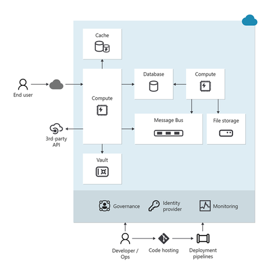

---

## Chris Ayers

_Principal Software Engineer_  
_Azure EngOps AzRel_  
_Microsoft_

<i class="fa-brands fa-bluesky"></i> BlueSky: [@chris-ayers.com](https://bsky.app/profile/chris-ayers.com)
<i class="fa-brands fa-linkedin"></i> LinkedIn: - [chris\-l\-ayers](https://linkedin.com/in/chris-l-ayers/)
<i class="fa fa-window-maximize"></i> Blog: [https://chris-ayers\.com/](https://chris-ayers.com/)
<i class="fa-brands fa-github"></i> GitHub: [Codebytes](https://github.com/codebytes)
<i class="fa-brands fa-mastodon"></i> Mastodon: [@Chrisayers@hachyderm.io](https://hachyderm.io/@Chrisayers)
~~<i class="fa-brands fa-twitter"></i> Twitter: @Chris_L_Ayers~~

---

# Reliability

---

# Why Reliability Matters

> A system is considered "reliable" if it can consistently serve users under normal or abnormal conditions.

- Reliability in distributed systems involves:
  - **Consistent performance** despite failures.
  - **Graceful degradation** when certain components become unavailable.
  - **Rapid recovery** within acceptable time limits.

---

# Understanding Reliability, Resiliency & Recoverability

- Failures are **inevitable** in distributed systems
- The WAF frames reliability as three distinct properties:
  - **Resilient** — detect and **withstand** faults, degrade gracefully
  - **Recoverable** — **restore** within agreed **RTO/RPO** when resiliency is exceeded
  - **Available** — users access the workload at the promised quality
- Failures impact _**revenue**_, _**reputation**_, and _**customer trust**_

---

# <!-- fit --> FAILURE IS ALWAYS AN OPTION

---

<!-- _footer: "" -->

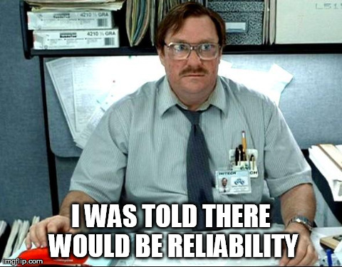

---

# Reliability Levels

| Level       | Monthly Downtime  | Annual Downtime | Cost  |
| ----------- | ----------------- | --------------- | ----- |
| **99.9%**   | 43.8 minutes      | 8.75 hours      | $     |
| **99.95%**  | 21.9 minutes      | 4.375 hours     | $$    |
| **99.99%**  | 4.38 minutes      | 52.6 minutes    | $$$   |
| **99.995%** | 2.19 minutes      | 26.3 minutes    | $$$$  |
| **99.999%** | 26 seconds        | 5.25 minutes    | $$$$$ |

>[https://uptime.is/five-nines](https://uptime.is/five-nines)

---

<!-- _footer: "" -->

---

# How Do We Measure Reliability?

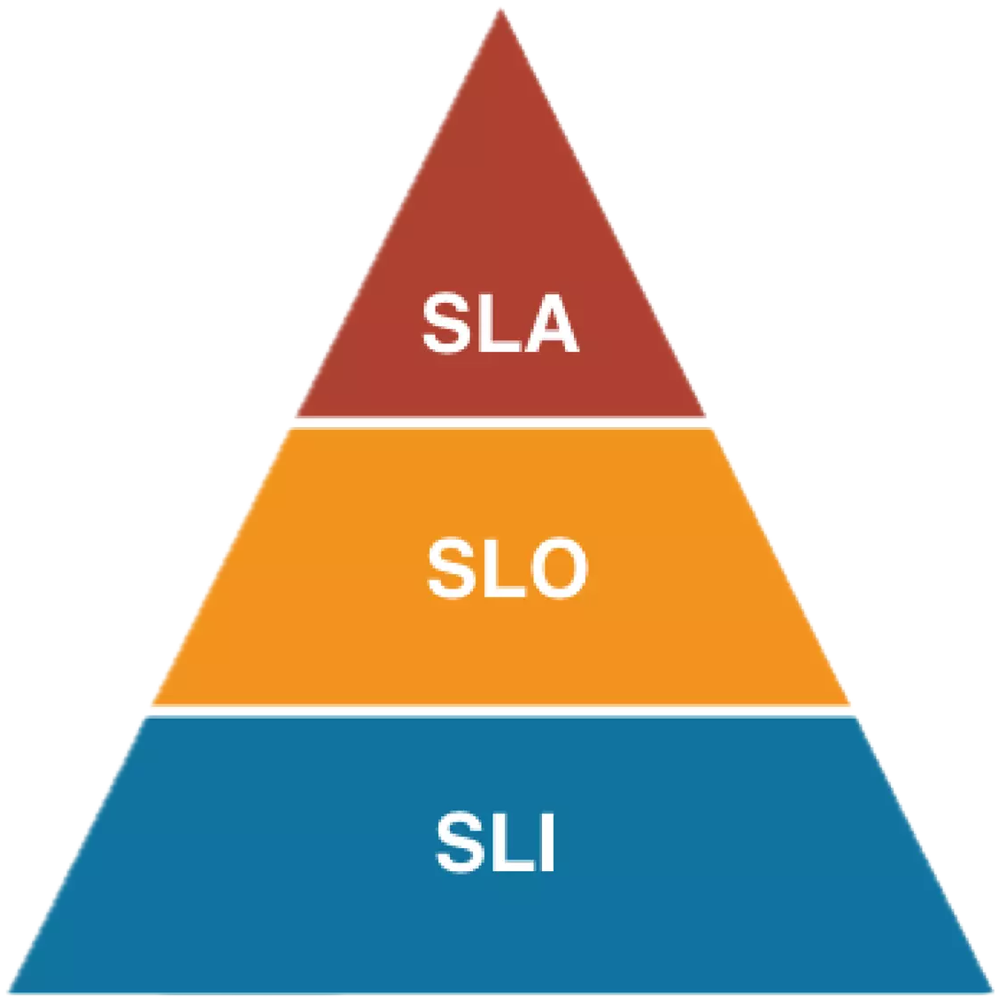

| | Definition | Example |
|-----|-----------|--------|
| **SLI** | Metric of user experience | API success rate per request |
| **SLO** | Reliability target over window | 99.95% successful responses (30d) |
| **Error Budget** | 1 − SLO (consumable failure) | 0.05% of eligible requests @ 99.95% |
| **SLA** | Contract with penalties | 99.9% monthly w/ credits |

<!--
Keep the budget in the SLI's units. A request-based SLO does not imply a
fixed number of downtime minutes. Count final logical operations, not each
internal retry, and agree on eligibility before measuring the denominator.
Source: https://learn.microsoft.com/en-us/azure/well-architected/reliability/metrics
-->

---

<!-- _footer: "" -->

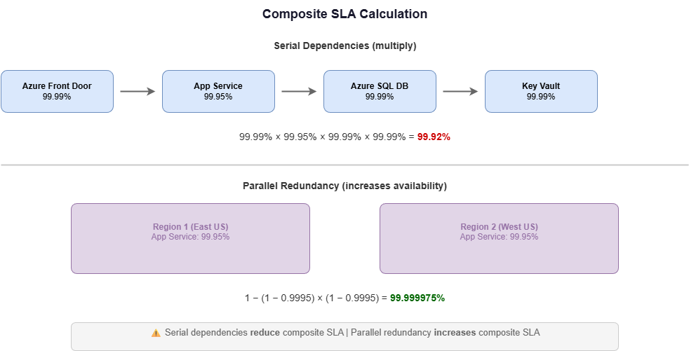

---

# Understanding RPOs and RTOs

- **RTO**: Max acceptable **downtime** before services must be restored
- **RPO**: Max acceptable **data loss** measured in time

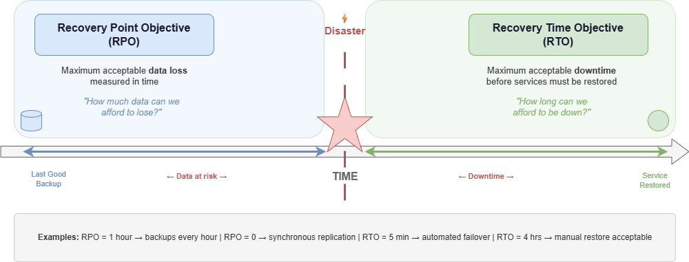

---

# Azure Well-Architected Framework

- Provides best practices and guidance for building high-quality Azure solutions.
- Ensures workloads are reliable, secure, efficient, and cost-effective.
- [Azure Well-Architected Framework](https://learn.microsoft.com/en-us/azure/well-architected/)
 
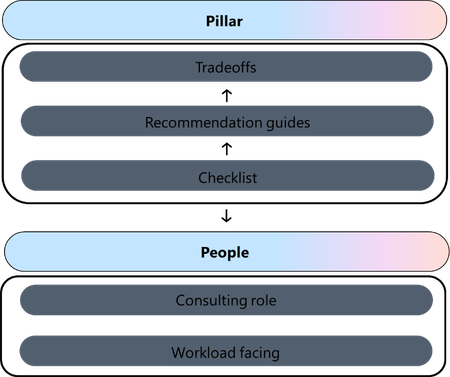

---

<!-- _footer: "" -->

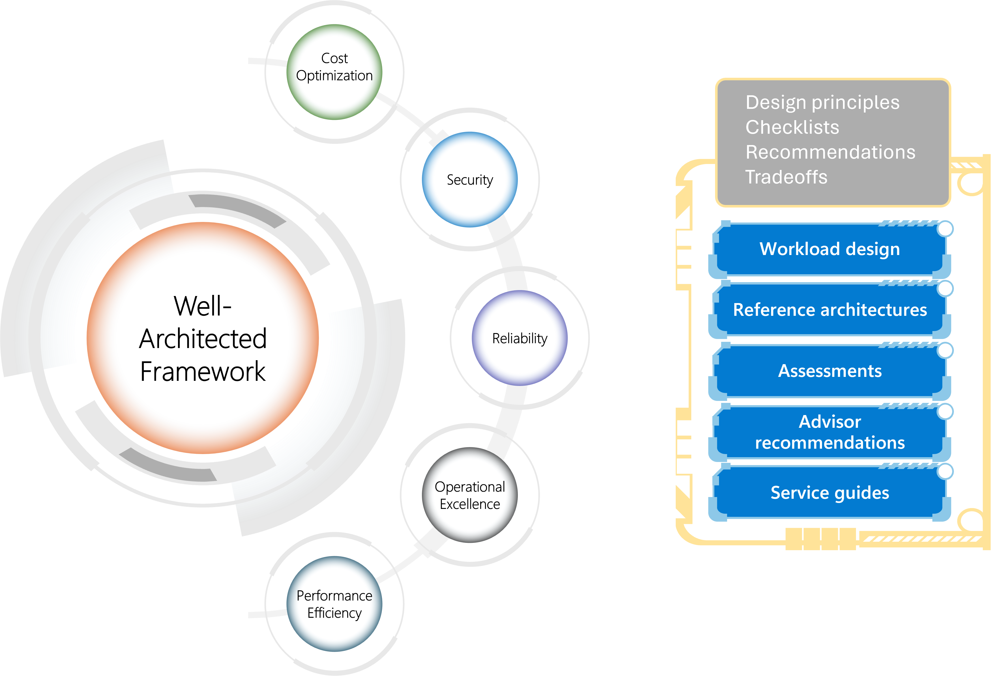

---

## Microsoft Azure Well-Architected Framework Pillars

| Reliability                        | Security                            | Cost Optimization                  | Operational Excellence                  | Performance Efficiency                  |
|------------------------------------|-------------------------------------|------------------------------------|-----------------------------------------|-----------------------------------------|
| Resiliency, availability, recovery | Protect data, detect threats, mitigate risks | Budgeting, reducing waste, efficiency | Observability, DevOps practices, safe deployments | Scalability, load testing, performance monitoring |

---

# The Reliability Journey

<!-- _footer: "" -->

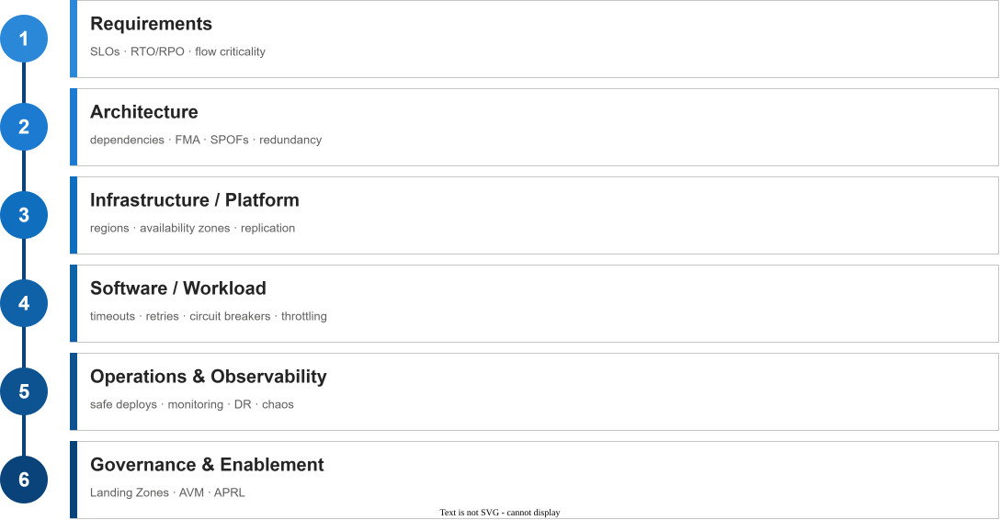

> We build reliability layer by layer — from requirements to scaling it across the org

---

# Business & Non-Functional Requirements Layer

## From Intent to Quantified Reliability

Establish resilience expectations before selecting technology:
- Define critical user journeys & classify components (critical vs. degradable)
- Quantify reliability targets (SLOs, error budgets, RTO/RPO)
- Align trade-offs early (cost, performance, security, operations)

---

# Requirements: Resilience & Recovery

<!-- _class: small -->

### Business

- Quantify success targets for flows
- Understand platform SLAs, limits, constraints

### Key Principle

> Design for **how you respond**, not just prevention

### Recovery
- Recovery plans with regular drills
- Trusted backups & immutable copies
- Automated detection & self-healing

### Resilience

- Classify **critical** vs. **degradable** components
- Design for fault isolation & graceful degradation
- Eliminate single points of failure

---

# Identify & Rate User and System Flows

## Flow Identification

- Map **critical user journeys** end-to-end
- Identify all **system flows** (background jobs, sync, integrations)
- Rate each flow on a **criticality scale** tied to business impact

## Criticality Classification

| Tier | Reliability Target |
|------|--------------------|
| **Critical** | 99.99%, RTO < 5 min |
| **Important** | 99.9%, RTO < 30 min |
| **Non-Critical** | 99.5%, RTO < 4 hours |

> Set SLOs and RTO/RPO **per flow**, not per system

---

<!-- _footer: "" -->

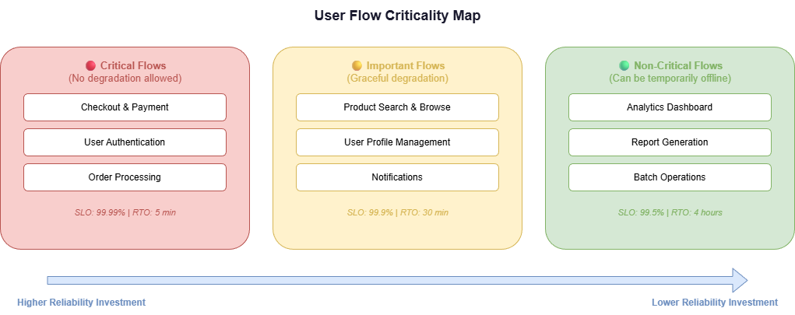

---

# Operational Readiness

<!-- _class: small -->

- Shift left to anticipate failures early
- Test failures in development
- Ensure cross-team visibility
- Use **health models** to track SLO attainment & workload health
- Use observability for rapid remediation

| Strategy | Implementation |
|----------|----------------|
| Observable Systems | Aggregate telemetry for holistic health views |
| Failure Simulation | Validate recovery metrics with realistic tests |
| Automation | Minimize human error and ensure consistency |
| Continuous Learning | Improve from real production incidents |
| Health Modeling | Map telemetry to SLO-based health state (Azure Monitor) |
| Proactive Monitoring | Prioritize alerts for active failures |

---

# Keep It Simple

- Avoid overengineering architecture, code, and operations
- Simplicity reduces inefficiencies and misconfigurations
- Maintain a balanced approach to avoid single points of failure

---

# Trade-Offs

- Align trade-offs with business priorities
- Use scenario planning to assess impacts
- Continuously iterate and monitor performance

---

<!-- _footer: "" -->

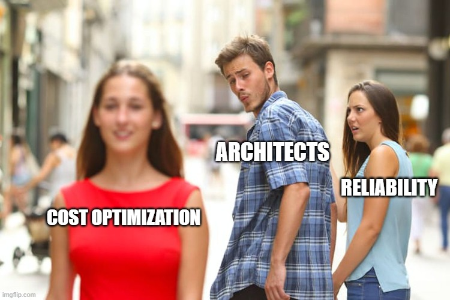

---

# Reliability Trade-Offs with Other Pillars

| Pillar | More Reliability Means... | Less Reliability Means... |
|--------|--------------------------|---------------------------|
| **Cost** | Redundancy, monitoring, over-provisioning | Right-sized, single-region, simpler ops |
| **Security** | Larger attack surface, may delay patches | Strict controls, frequent patching |
| **Ops Excellence** | Complex architecture, extensive DR testing | Simpler systems, less overhead |
| **Performance** | Replication latency, failover overhead | Lean deployments, speed-focused |

---

# Reliability Maturity Model

Assess your **current posture** and follow a staged path — five levels, each building on the previous.

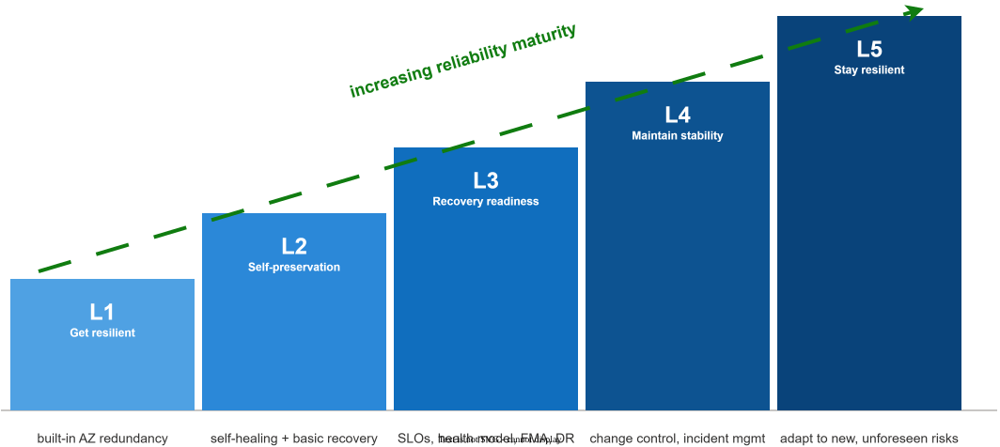

<a href="https://learn.microsoft.com/en-us/azure/well-architected/reliability/maturity-model">Reliability maturity model</a>

---

# Architecture Layer

## Structuring for Failure Containment

Focus on failure domains, redundancy strategy, and dependency design before implementation.

---

# Dependency Management

## Map Your Dependencies

- Identify all **upstream** and **downstream** dependencies
- Document each dependency's **SLA and failure modes**
- Classify: **strong** (required) vs. **weak** (degradable)

## Mitigation Strategies

| Strategy | When to Use |
|----------|-------------|
| **Caching** | Tolerate downtime for reads |
| **Async messaging** | Decouple from unreliable services |
| **Fallback values** | Defaults when dependency fails |
| **Circuit breaker** | Prevent cascading failures |
| **Timeout + retry** | Handle transient issues |

---

<!-- _footer: "" -->

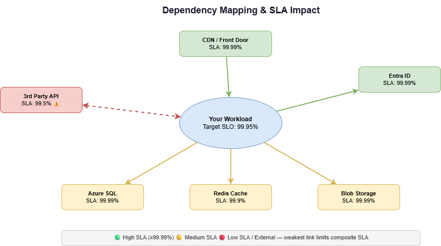

---

# Failure Mode Analysis (FMA)

<!-- _footer: "" -->
<!-- _class: small -->

## Proactive Identification

- Distinguish **failures** (unexpected, need intervention) from **errors** (expected in normal ops)
- Analyze **read** vs. **write** failures separately — impact & mitigation differ
- Prioritize by user impact & blast radius; use checklists, post-mortems, dependency maps

## Effective Mitigation

- Architect graceful degradation & fallbacks
- Instrument for fast anomaly detection
- Automate failover & data replication where feasible

> [Failure Examples](https://learn.microsoft.com/en-us/azure/well-architected/reliability/failure-mode-analysis#example)

---

# FMA: Failure vs. Error

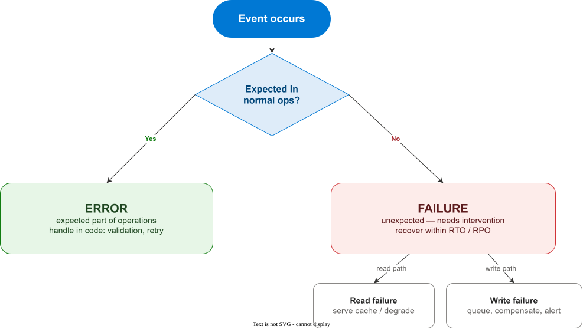

---

# Single Points of Failure (SPOFs)

## Understanding SPOFs

- Single component whose failure halts critical flow
- Occur in infra, data, code paths, people/process
- Early detection reduces mean time to mitigation

## Eliminating SPOFs

- Redundancy & diversity (multi-zone / multi-instance)
- Load balancing & partitioning
- Automated failover runbooks
- **Delete protection** via Azure resource locks on redundant components

---

# Active-Active vs. Active-Passive

**Active-Active**: Multiple instances process requests simultaneously.
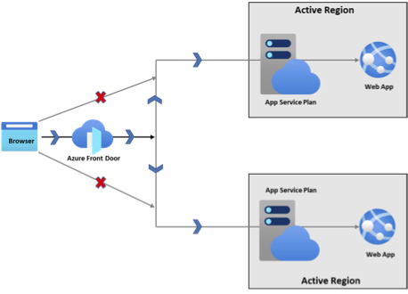

**Active-Passive**: Primary instance processes traffic; secondary is on standby.
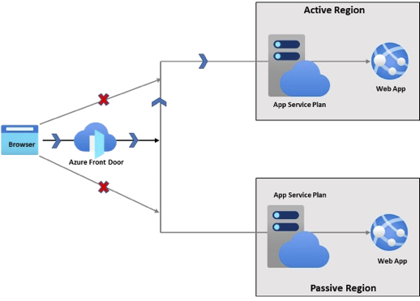

---

# Infrastructure / Platform Layer

## Foundation for Consistent Resilience

Automated, policy-driven environments (Landing Zones, AVM, APRL) reduce variance & misconfiguration risk.

---

# Azure-Customer Shared Responsibility Model

<!-- _class: small -->

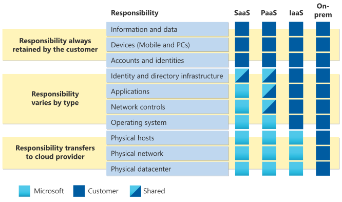

> Azure provides service SLAs; you own workload reliability

## Your Reliability Responsibilities

| Layer | Customer Owns |
|-------|---------------|
| **Data** | Backup strategy, replication, encryption |
| **Application** | Retry logic, circuit breakers, health probes |
| **Identity** | MFA, conditional access, break-glass accounts |
| **Network** | Redundant paths, ExpressRoute resilience |
| **Infra Config** | Zone/region selection, scaling rules |

---

# Azure Regions and Regional Strategy

<!-- _class: small -->

## Region Selection Criteria

- **Latency**: Proximity to users
- **Compliance**: Data residency, sovereignty
- **Service Availability**: Not all services in all regions
- **Cost**: Pricing varies by region

## Multi-Region Considerations

| Factor | Impact on Design |
|--------|------------------|
| Region Pairs | Sequential updates, prioritized recovery |
| Non-paired | Flexible, but plan your own DR |
| Sovereign Clouds | Isolated (Gov, China) |
| Distance | Affects replication lag & latency |

> Pairing ≠ automatic failover—you must design for it

---

# Azure Region Pairs

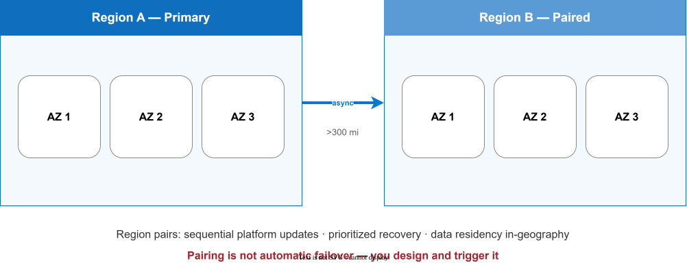

---

# Azure Availability Zones

- Physically separate datacenters within a region
- Independent power, cooling, and networking
- Low-latency connections; measure for your workload
- Maintenance and failover behavior vary by service
- [View Region Support](https://learn.microsoft.com/en-us/azure/reliability/availability-zones-region-support)

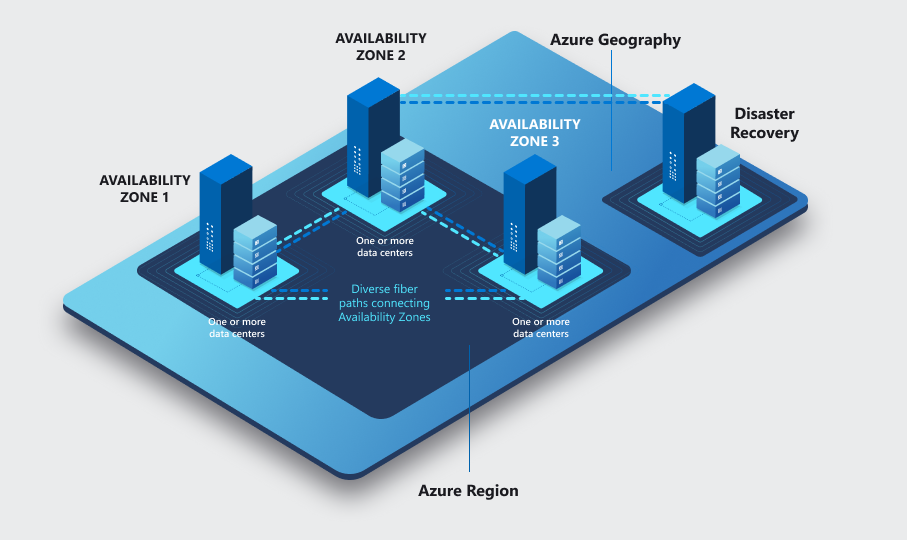

---

# Types of Availability Zone Support

| Type | Deployment | Failover | Who Manages |
|------|-----------|----------|-------------|
| **Zonal** | Pinned to one zone | You handle failover | Customer |
| **Zone-Redundant** | Spread across zones | Automatic | Microsoft |
| **Zone-Resilient** | Zonal or zone-redundant | Survives zone outage | Varies |
| **Non-Zonal (Regional)** | No zone affinity | Service-dependent | Service-dependent |

- [View Services Support](https://learn.microsoft.com/en-us/azure/reliability/availability-zones-service-support)

---

# Zonal Resources

- Pinned to a specific availability zone
- Combine multiple zonal deployments for high reliability
- **You** manage replication, load balancing, and failover
- Deploy across zones for zone-level protection

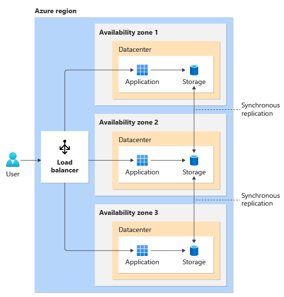

---

# Zone-Redundant Resources

- Spread automatically across multiple availability zones.
- Microsoft manages request distribution and data replication.
- Automatic failover if a zone goes down.

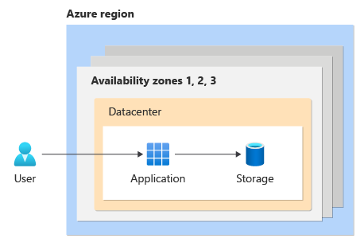

---

# Data Replication: Storage Options

<!-- _footer: "" -->
<!-- _class: small -->

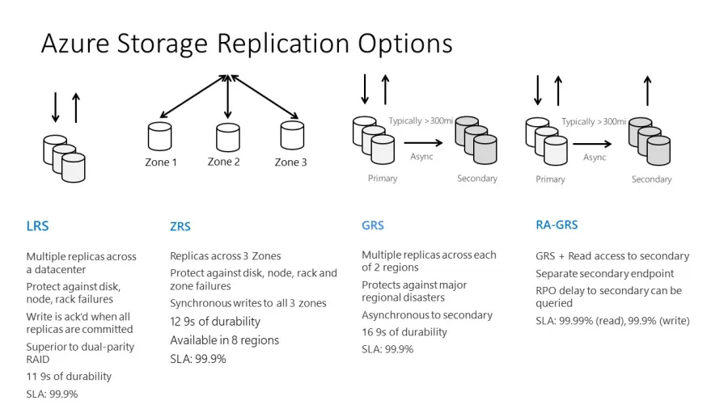

- **Replication:** LRS/ZRS synchronous; GRS/GZRS geo-replication asynchronous. Verify lag and recoverable state.
- **Recovery:** Hot/Cool/Archive tiering changes restore time; immutable storage protects against ransomware.

<!--
Generic geo-replication is not an unconditional 15-minute RPO guarantee.
Geo priority replication has a separate, eligibility-dependent SLA for block
blobs: Last Sync Time lag of at most 15 minutes for 99.0% of a billing month.
Synchronous replicas do not protect against every failure or accidental
deletion. Test restoration and data completeness as well as failover.
Sources:
https://learn.microsoft.com/en-us/azure/storage/common/storage-redundancy
https://learn.microsoft.com/en-us/azure/storage/common/storage-redundancy-priority-replication
-->

---

# Scaling Strategies

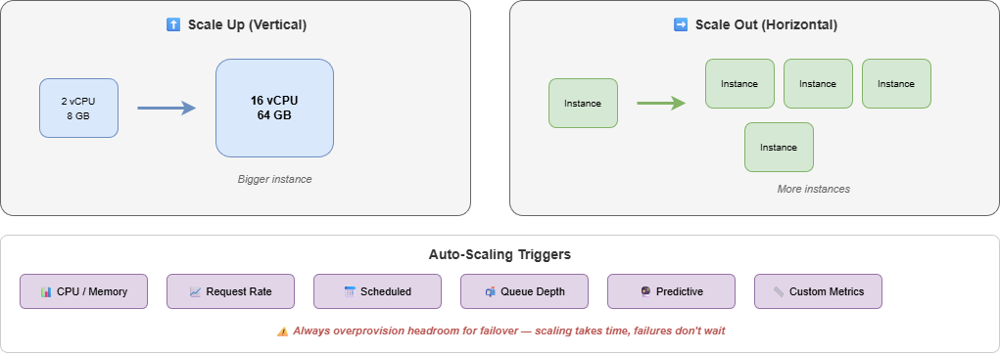

---

<!-- _footer: "" -->

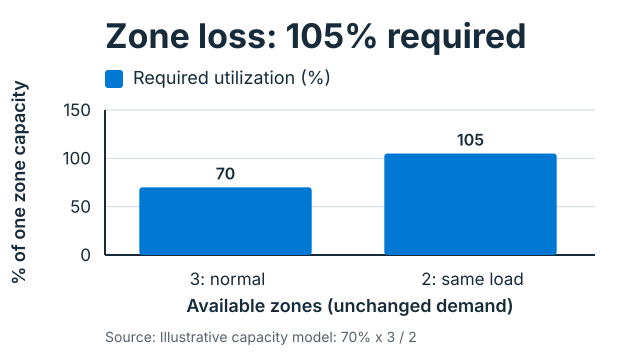

<!--
Capacity after a zone loss: 70% x 3 / 2 = 105% required capacity, before retries.
This is an illustrative equal-capacity, evenly distributed, linear-load model,
not a measurement or an Azure guarantee. 105% means demand exceeds capacity,
not that measured CPU exceeds 100%.
For N equal units losing f units, survivor utilization is baseline x N/(N-f).
Three zones at 50% would reach 75% on the two survivors under those assumptions.
Actual headroom must cover skew, scaling lag, connection setup, and cache warm-up.
This adds a failure-capacity example to the existing scaling discussion.
Source: https://learn.microsoft.com/en-us/azure/well-architected/reliability/scaling
-->

---

# Azure Reliability Services

## Traffic & Load Balancing

| Service | Purpose |
|---------|---------|
| **Azure Front Door** | Global HTTP LB, failover, WAF |
| **Traffic Manager** | DNS-based global routing |
| **Load Balancer** | Regional L4 LB |
| **Application Gateway** | Regional L7 LB, WAF |

## Backup & Recovery

| Service | Purpose |
|---------|---------|
| **Azure Site Recovery** | DR replication & failover |
| **Azure Backup** | Managed backup (VMs, SQL, files) |
| **Service Health** | Platform outage alerts |
| **Resource Health** | Individual resource status |
| **Azure Advisor** | Proactive recommendations |

---

# Software / Workload Layer

## Runtime Resilience Behaviors

Embed failure-aware logic: timeouts, retries, backoff, bulkheads, circuit breakers, idempotency, hedging.

---

# Resilience Patterns

<!-- _footer: "" -->

| Pattern | Problem Solved | Key Considerations |
|---------|----------------|--------------------|
| Timeout | Prevent hanging on slow dependency | Use measured latency and the end-to-end deadline |
| Retry + Backoff + Jitter | Transient faults (throttling, blips) | Cap attempts; honor server delays and idempotency |
| Circuit Breaker | Failing dependency cascading | Trip on error rate/latency; half-open probes |
| Bulkhead Isolation | One noisy component  | Resource partitioning |
| Dead Letter Queue | Bad messages blocking progress | Monitor & replay with alerting |
| Throttling / Rate Limiting | Protect service from overload & noisy neighbors | Bound load; give retry guidance when safe |
| Graceful Degradation | Maintain partial service | Feature flags, fallback data |

> [Throttling design guide](https://learn.microsoft.com/en-us/azure/well-architected/design-guides/throttling)

<!--
Do not default to a timeout below expected p95 latency: that can manufacture
failures and extra load. Choose a tolerated false-timeout rate from measured
latency, then budget all attempts and waits within the caller's deadline.
The June 2026 WAF guide organizes throttling into four boundary types and
14 practices. The patterns themselves, including jitter and bulkheads, are
established techniques rather than newly introduced Azure service features.
Sources:
https://learn.microsoft.com/en-us/azure/well-architected/whats-new
https://learn.microsoft.com/en-us/azure/well-architected/design-guides/handle-transient-faults
-->

---

# Throttling Belongs Along the Whole Path

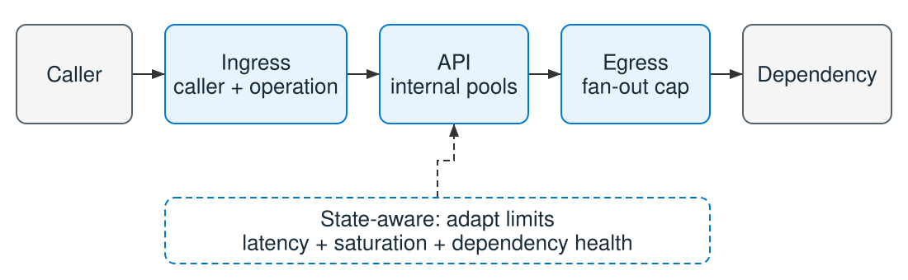

**Ingress → internal → egress**, with **state-aware** limits across boundaries.

<!--
The new WAF guide identifies these four types. Gateway-only throttling misses
internal callers, fan-out, shared pools, and outbound dependencies.
Define user limits for fairness and service limits for shared capacity.
Match the limiter to what saturates: request rate, concurrency, operation cost,
or queue depth. A per-replica limit is not an aggregate dependency budget:
50 calls/s on each of ten replicas can admit 500 calls/s.
Keep remote accounting off the critical path where possible, with bounded
last-known-good decisions, explicit fallback behavior, and alerts.
State-aware policies can protect in-flight transactions, degrade optional
features, and shed low-priority work before capacity collapses. Keep integrity
and authorization checks intact. Throttling does not replace DDoS protection.
The guide's four adoption levels group TP-1–4, TP-5–7, TP-8–11, and TP-12–14.
These are separate from the broader five-level Reliability maturity model.
Source: https://learn.microsoft.com/en-us/azure/well-architected/design-guides/throttling
-->

---

# Three Retry Layers Can Make 27 Attempts

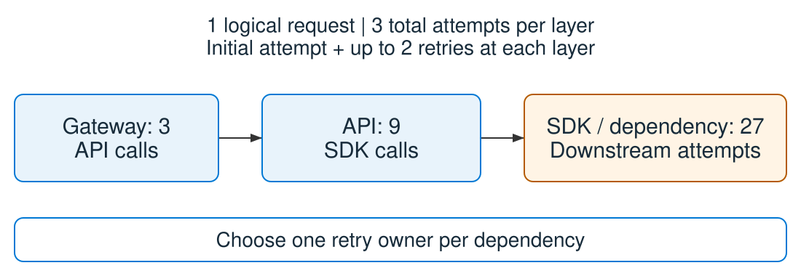

**3 × 3 × 3 = 27 downstream attempts** for one logical operation.

<!--
Each three includes the initial attempt plus two retries. This is the worst
case when nested attempts all exhaust, before any additional fan-out.
Choose one retry owner for each dependency interaction. Inspect SDK defaults
before adding a resilience library, service-mesh retry, or gateway retry.
If multiple layers retry, coordinate an aggregate attempt budget and propagate
the same deadline. An outer timeout alone does not cancel downstream work.
Source: https://learn.microsoft.com/en-us/azure/well-architected/design-guides/handle-transient-faults
-->

---

# Make Throttling a Retry Contract

| Before another attempt | Required decision |
|------------------------|-------------------|
| **Transient?** | Follow this dependency's error code and retry guidance |
| **Safe?** | Confirm idempotency, deduplication, or the previous outcome |
| **Attempts left?** | Count SDK and application attempts together |
| **Time left?** | Fit the server delay and next attempt inside the deadline |

**Retry-After: 2 s with 1.1 s left? Do not retry inside that request.**

<!--
Never retry earlier than the service's minimum delay. Use bounded backoff and
jitter when appropriate; do not shorten Retry-After to fit an expiring request.
Return an explicit failure or use an agreed durable asynchronous flow instead.
The WAF design guide recommends HTTP 429 for caller limits and HTTP 503 for
service limits. This is guidance for your API, not a universal Azure convention.
Preserve useful downstream backpressure instead of replacing it with generic
500s. Include retry guidance only when retry is safe and intended.
Service contracts differ: Cosmos DB can return 429, Blob Storage can return
503 Server Busy or 500 Operation Timeout, and Service Bus uses AMQP exceptions.
A timeout after a write does not prove it failed; reconcile before repeating
the side effect. Holding threads or unbounded queued retries can worsen overload.
Sources:
https://learn.microsoft.com/en-us/azure/well-architected/design-guides/throttling
https://learn.microsoft.com/en-us/azure/well-architected/design-guides/handle-transient-faults
-->

---

# Circuit Breaker — State Machine

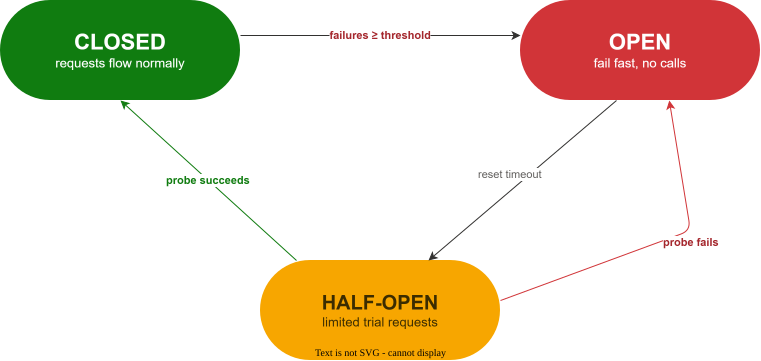

---

# Recovery Needs a Rate Limit Too

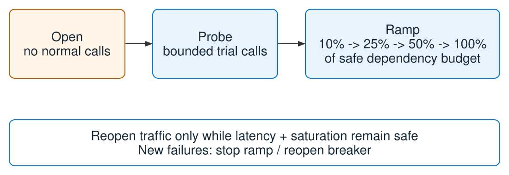

Do not release **new work + retries + backlog + cache fills** all at once.

<!--
Ramp percentages are illustrative shares of a measured safe dependency budget,
not WAF-prescribed thresholds. Advance only while latency, saturation, errors,
and queue age remain acceptable; pause or reopen the circuit on regression.
Scope the breaker to the affected dependency so healthy traffic can continue.
New work and queued retries must share the same safe concurrency/rate budget.
Cache hits are not spare capacity: a 99% to 0% hit-rate drop means 100 times as
many origin calls in a simple one-lookup-per-request model, before retries.
Recheck deadlines before dispatch. Drop only explicitly discardable,
recomputable work; do not discard accepted orders to make a queue look healthy.
Source: https://learn.microsoft.com/en-us/azure/well-architected/design-guides/throttling
Practices: TP-5, TP-7, TP-8, and TP-12.
-->

---

# Async & Event-Driven Patterns

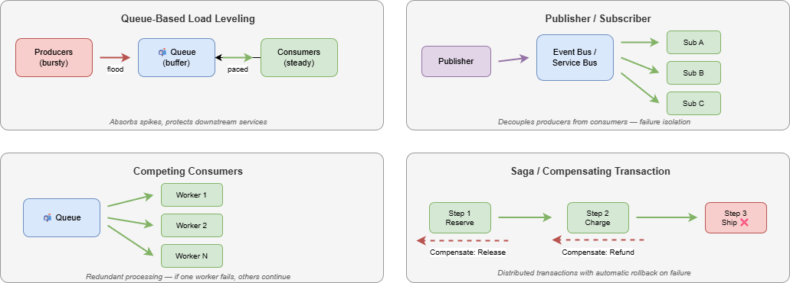

---

# Azure SDK Resiliency Best Practices

<!-- _class: small -->

## Built-in SDK Features
- **Retry** — Service-specific policies; inspect defaults
- **Timeouts** — Check each timeout's scope
- **Throttling** — Service-specific errors and delay hints
- **Idempotency** — Only where explicitly supported

## Your Responsibilities
- **Circuit Breaking** — Polly / resilience libs
- **Connection Reuse** — Reuse clients (thread-safe)
- **Backpressure** — Bounded channels, fail fast
- **Observability** — Correlate traces, log retries

<!--
An SDK is not a complete business-level resilience policy. You still own the
overall deadline, cancellation, idempotency, and aggregate concurrency budget.
For example, Blob .NET documents defaults of five retries and 100 seconds per
network operation. Neither value is an end-to-end latency guarantee.
Service Bus .NET may already have exhausted transient retries before surfacing
an exception. Inspect Reason and IsTransient rather than blindly retrying again.
Cosmos SDK retries can mask internal 429s: monitor final operation latency and
partition-level pressure as well as application exception counts.
Sources:
https://learn.microsoft.com/en-us/azure/storage/blobs/storage-retry-policy
https://learn.microsoft.com/en-us/azure/service-bus-messaging/service-bus-messaging-exceptions-latest
https://learn.microsoft.com/en-us/azure/cosmos-db/troubleshoot-request-rate-too-large
-->

---

# Operations & Observability Layer

## Detect, Respond, Learn

Emphasize fast detection, validated recovery paths, and continuous improvement through data & drills.

---

# Safe Deployment Practices

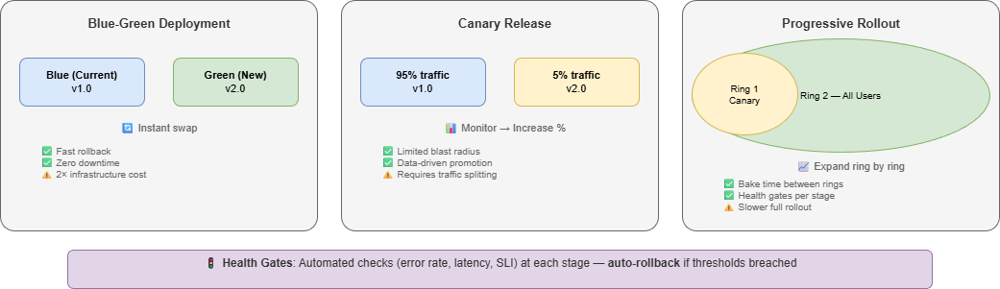

---

# OpenTelemetry

- Open standard for generating, collecting, and exporting telemetry data (traces, metrics, logs)
- Supported by major cloud providers, including Azure Monitor, AWS CloudWatch, and Google Cloud Operations
- Enables vendor-neutral instrumentation and observability across distributed systems

---

## [Azure Service Groups](https://learn.microsoft.com/en-us/azure/governance/service-groups/overview)

<!-- _class: small -->

### Health Metrics Aggregation

- **Cross-environment health**: Aggregate health metrics from multiple apps and environments
- **Resource type inventory**: Unified views across subscriptions
- **Unified monitoring**: Single Service Group provides health visibility across management groups

### Least-Privilege Access

- **Selective permissions**: Service Groups don't inherit member permissions
- **Role-based viewing**: Assign different users access to same Service Group with varying resource visibility
- **Monitoring metrics**: Apply minimal privileges for metrics access without resource management rights

---

# Metrics & Error Budgets

| Concept | Formula / Definition | Example |
|---------|----------------------|---------|
| Availability SLI | (Successful Requests) / (Total Requests) | 99,950 / 100,000 = 99.95% |
| Latency SLI | % of requests under threshold | 95% < 250ms (p95), 99% < 400ms |
| Error Budget  | 1 - SLO | SLO 99.9% => 0.1% budget |
| Burn Rate | Bad-request fraction / (1 - SLO) | 0.2% / 0.1% = 2× burn |
| MTTR | Avg restore time for incidents | Track trend downwards |

- Burn Rate **> 4×** for 1h: Freeze deploys; incident review
- Burn Rate **2×** sustained: Reduce change volume
- Burn Rate **< 1×**: Continue roadmap; schedule chaos tests

<!--
The listed alert thresholds/actions are illustrative, not universal WAF rules.
Calibrate observation windows and actions to the workload's SLO and risk.
Use consistent eligible logical operations for the bad-request fraction.
Correlate attempts, delays, and policy versions with final user outcomes:
successful retries can mask dependency pressure while increasing tail latency.
Source: https://learn.microsoft.com/en-us/azure/well-architected/reliability/monitoring
-->

---

# Error Budget Burn-Down

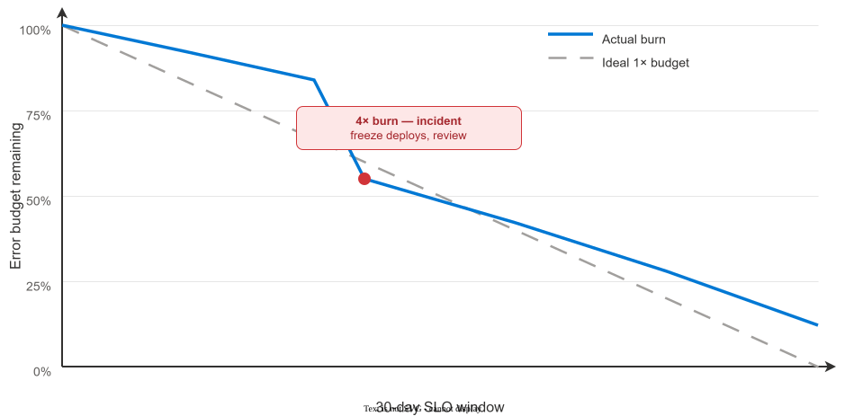

---

# Validating Resilience

<!-- _class: small -->

## Why Validate?

- **Early Issue Detection**: Find problems before customers do
- **Increased Confidence**: Better team preparedness for incidents
- **Reduced Recovery Time**: Faster MTTR during real outages
- **Trust Building**: Demonstrate resilience to stakeholders

## How to Validate

- **Start Simple**: Begin with critical paths and core functions
- **Game Days**: Schedule cross-team incident response exercises
- **Iterate**: Evolve tests as your architecture changes
- **Track**: Document findings and improvements

---

# Load Testing

## Key Benefits

- **Prevents Surprises**: Identify capacity issues before production
- **Validates Scaling**: Ensure your auto-scaling works properly
- **Finds Weaknesses**: Spot resource exhaustion and memory leaks

## Implementation

- **Cost-Effective**: Much cheaper than emergency scaling during incidents
- **Azure Tools**: Azure Load Testing service with JMeter support
- **Best Practice**: Test with realistic user patterns and data volumes

---

# Chaos Engineering

<!-- _class: small -->

## Core Principles

- **Controlled Failure**: Introduce failures in controlled environments
- **Best Practice**: Start small with clear abort conditions
- **Continuous Process**: Build complexity as confidence increases

## Key Azure Scenarios

- **Availability Zone Outages**: Test region resiliency
- **Network Latency**: Simulate connectivity issues
- **Service Throttling**: Test quota and limit handling
- **Identity Failures**: Test credential expiration response

---

# Combine Load and Failure Tests

| Experiment | Example setup or acceptance criterion |
|------------|---------------------------------------|
| **Baseline** | Three equal test instances near 50% capacity |
| **Inject** | Remove one instance; make a controlled dependency return 429 |
| **Bound work** | At most 2 total attempts; 2 s deadline; 80 in-flight calls across replicas |
| **Protect data** | No duplicate side effects or lost acknowledged operations |
| **Recover** | Remove the fault; regain the flow SLO without a second surge |

Illustrative test values—not Azure limits or measured results.

<!--
Use an isolated test environment, representative data, a known-safe rollback,
and explicit abort conditions. A stopped instance models capacity loss; it is
not a complete simulation of every effect of an availability-zone outage.
Do not overload shared Azure resources. Use a controlled stub/proxy or supported
fault injection that matches the real dependency's contract and SDK behavior.
Calibrate the aggregate 80-call ceiling and timings to the workload. Include
initial attempts and SDK retries in the count; verify cancellation and bounds
across replicas. Set a measurable recovery target before injecting.
Observe final outcomes, p95/p99 latency, retry amplification, current limit
utilization, top callers, in-flight work, and oldest queue age during the test.
The May 2026 testing refresh emphasizes exhausted built-in mechanisms, scaling
lag, and combined tests. TP-11 recommends low-limit exercises with outage drills.
Sources:
https://learn.microsoft.com/en-us/azure/well-architected/reliability/reliability-test
https://learn.microsoft.com/en-us/azure/well-architected/design-guides/testing
https://learn.microsoft.com/en-us/azure/well-architected/design-guides/throttling
-->

---

# Disaster Recovery Strategies

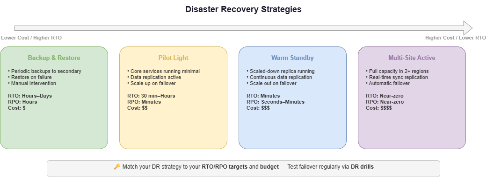

---

# Incident Response & Continuous Learning

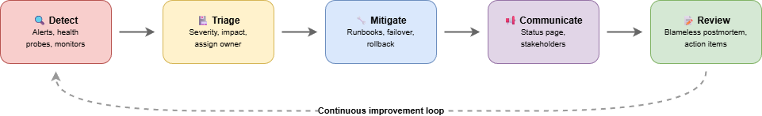

---

# Scale &amp; Acceleration Layer

## Making Reliability Repeatable

- Scale the reliability you designed across many workloads and teams
- Cut the effort with reusable modules (AVM), proactive assessment (APRL), and standardized landing zones

---

# [Azure Landing Zones](https://learn.microsoft.com/en-us/azure/cloud-adoption-framework/ready/landing-zone/)

## Secure Structure

- Azure Landing Zones create a secure, organized foundation for Azure environments.
- Enforce identity, network, and governance policies at scale.

## Reliable Implementation

- A standardized environment supports consistent deployments.
- Simplifies resource management and reduces misconfigurations.

---

<!-- _footer: "" -->

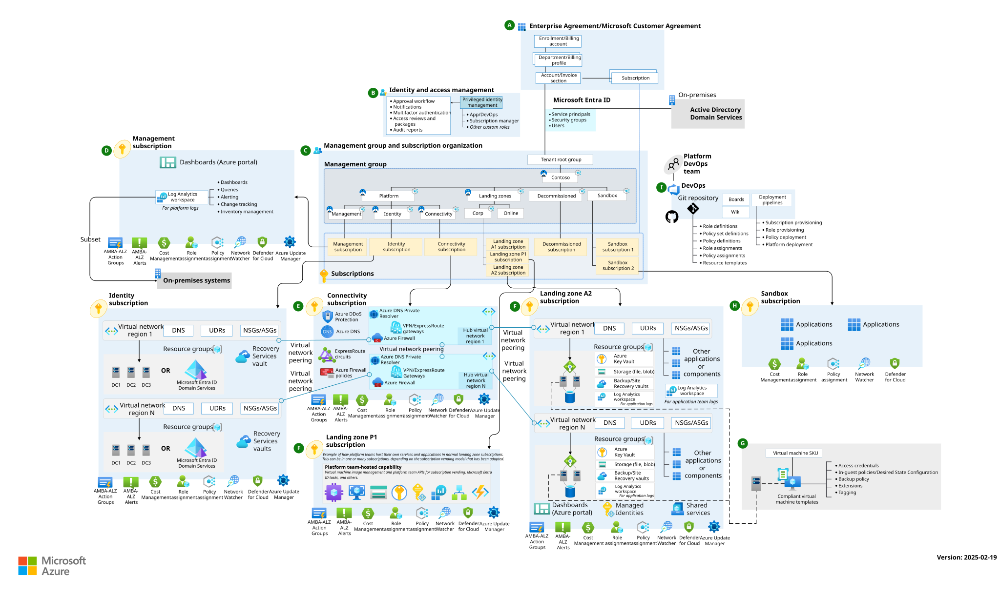

---

# Reference Architectures & Guidance

## [Azure Architecture Center](https://learn.microsoft.com/azure/architecture/)
- Best practices, reference architectures, design patterns

## [Well-Architected Workloads](https://learn.microsoft.com/en-us/azure/well-architected/workloads)
- Workload-specific WAF guidance & trade-offs

## [Mission-Critical Workloads](https://learn.microsoft.com/en-us/azure/well-architected/mission-critical/mission-critical-overview)
- Designing for max availability & performance

## [Enterprise Web App Patterns](https://learn.microsoft.com/en-us/azure/architecture/web-apps/guides/enterprise-app-patterns/overview)
- Prescriptive architecture, code, and configuration

---

# Web App Patterns

**Reliable Web App**
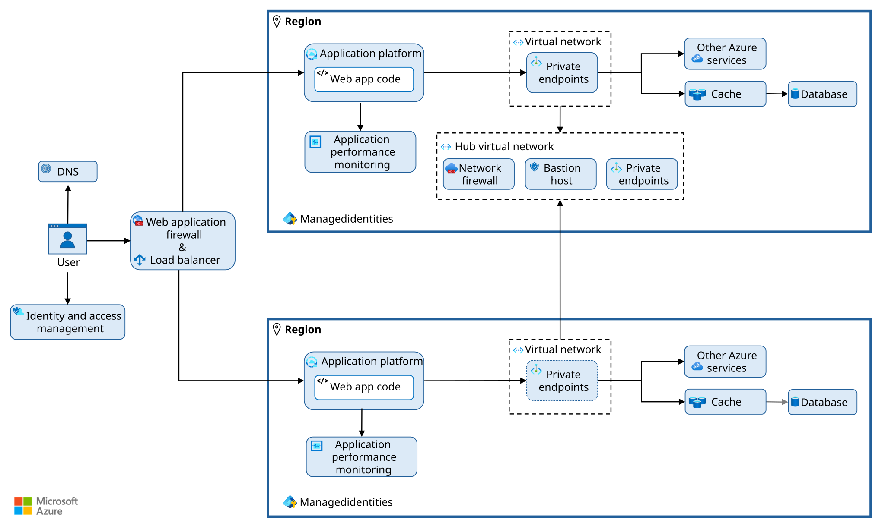

**Modern Web App**
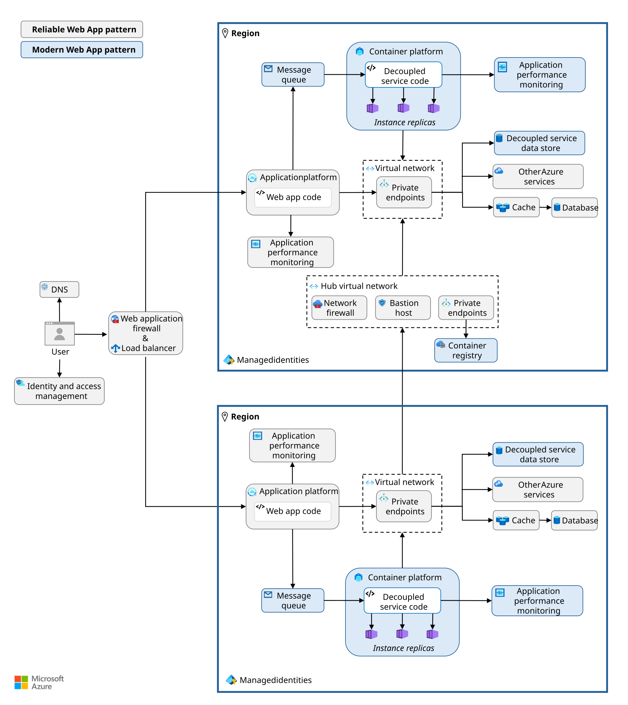

---

# Enterprise & Mission-Critical

**Enterprise App**
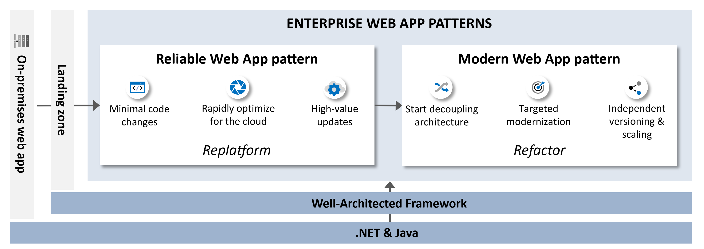

**Mission-Critical**
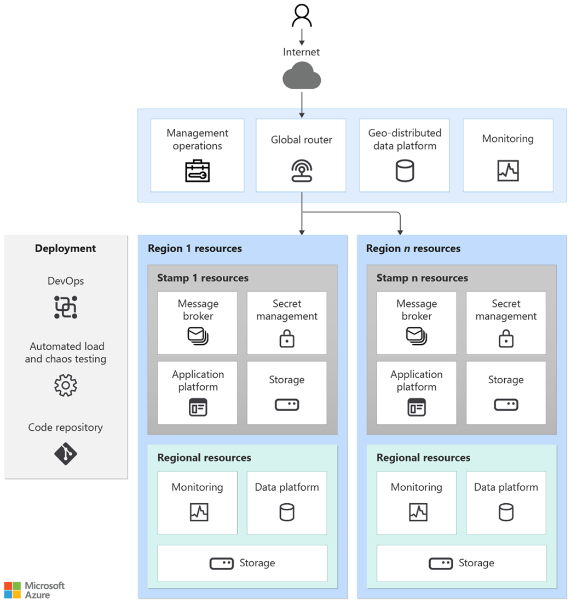

---

# WAF Design Guides (Design Essentials)

Prescriptive, **cross-pillar** guidance for specific practices — a newer addition to the framework.

- [Regions & availability zones](https://learn.microsoft.com/en-us/azure/well-architected/design-guides/regions-availability-zones)
- [Handle transient faults](https://learn.microsoft.com/en-us/azure/well-architected/design-guides/handle-transient-faults)
- [Throttling](https://learn.microsoft.com/en-us/azure/well-architected/design-guides/throttling)
- [Background jobs](https://learn.microsoft.com/en-us/azure/well-architected/design-guides/background-jobs)

- [Build a monitoring system](https://learn.microsoft.com/en-us/azure/well-architected/design-guides/monitoring)
- [Health modeling](https://learn.microsoft.com/en-us/azure/well-architected/design-guides/health-modeling)
- [Disaster recovery (multi-region)](https://learn.microsoft.com/en-us/azure/well-architected/design-guides/disaster-recovery)
- [Incident management](https://learn.microsoft.com/en-us/azure/well-architected/design-guides/incident-management)

> Bridge principles → implementation

---

# [Azure Verified Modules (AVM)](https://azure.github.io/Azure-Verified-Modules/)

<!-- _class: small -->

## What is AVM?

- **Official Microsoft IaC initiative** — Bicep, Terraform
- **WAF-aligned** — review module and version defaults
- Configure AZs, monitoring, and hardening for your workload

## Module Types

- **🏗️ Resource** — Single resource, secure defaults
- **🎯 Pattern** — Multi-resource proven architectures
- **⚙️ Utility** — Reusable helpers (Preview)

> Reduce misconfigurations with standardized, production-tested templates

---

# [APRL: Azure Proactive Resiliency Library](https://github.com/Azure/Azure-Proactive-Resiliency-Library-v2)

## What is APRL?

- **Curated catalog** of resiliency recommendations for 100+ Azure services
- **Azure Resource Graph queries** to find non-compliant resources
- **WAF-aligned** reliability best practices
- **Open source** — 75+ contributors

## What’s Inside

- 🏗️ **Resource-specific** configuration guidance
- 🔧 **Specialized workload** patterns
- 📊 **Ready-to-use ARG queries** for compliance
- 🛡️ **Assessment & review** tools

---

# [Azure Review Checklists](https://github.com/Azure/review-checklists)

## What They Are

- **Design validation tool** for Azure architectures
- **Community-driven** best practice checklists
- **Proactive issue detection** before deployment

## Coverage

- Landing Zones, AKS, App Service, SQL
- Networking, Cost Optimization, DevOps
- AI Landing Zone, Spring Apps, SAP
- Standardized reviews across teams & projects

---

# Conclusion

- **Design Principles**: Focus on resilience, recovery, operations, and simplicity
- **Know Your Flows**: Identify critical user journeys, set per-flow SLOs, and understand composite SLAs
- **Trade-offs**: Every decision impacts cost, security, operational excellence, and performance
- **Proactive Reliability**: Use FMA, dependency mapping, safe deployments, and tested DR plans
- **Continuous Improvement**: Chaos engineering, load testing, incident response, and blameless postmortems

---

# Questions?

---

# Thank You!

<!-- _class: small -->

## Links

- [Azure Well-Architected Framework](https://learn.microsoft.com/en-us/azure/well-architected/)
- [APRL](https://github.com/Azure/Azure-Proactive-Resiliency-Library-v2)
- [Azure Verified Modules](https://azure.github.io/Azure-Verified-Modules/)
- [Azure Review Checklists](https://github.com/Azure/review-checklists)
- [Enterprise Web Apps](https://learn.microsoft.com/en-us/azure/architecture/web-apps/guides/enterprise-app-patterns/overview)

## Chris Ayers

_Principal Software Engineer_
_Azure CXP AzRel_
_Microsoft_

<i class="fa-brands fa-bluesky"></i> BlueSky: [@chris-ayers.com](https://bsky.app/profile/chris-ayers.com)  
<i class="fa-brands fa-linkedin"></i> LinkedIn: - [chris\-l\-ayers](https://linkedin.com/in/chris-l-ayers/)  
<i class="fa fa-window-maximize"></i> Blog: [https://chris-ayers\.com/](https://chris-ayers.com/)  
<i class="fa-brands fa-github"></i> GitHub: [Codebytes](https://github.com/codebytes)  
<i class="fa-brands fa-mastodon"></i> Mastodon: [@Chrisayers@hachyderm.io](https://hachyderm.io/@Chrisayers)
~~<i class="fa-brands fa-twitter"></i> Twitter: [@Chris_L_Ayers](https://twitter.com/Chris_L_Ayers)~~  

