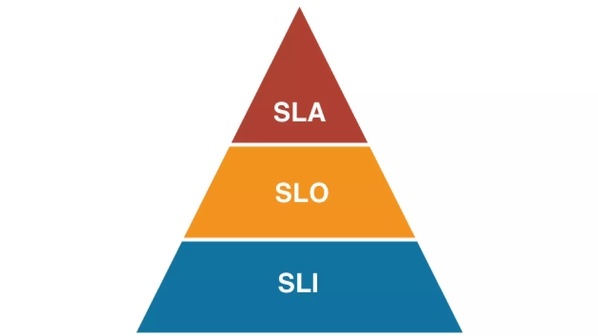
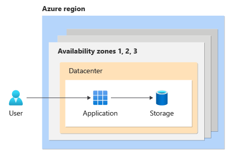

# Ensuring Azure Resiliency

## Chris Ayers

---

## Chris Ayers

_Senior Site Reliability Engineer_  
_Azure CXP AzRel_  
_Microsoft_

<i class="fa-brands fa-bluesky"></i> BlueSky: [@chris-ayers.com](https://bsky.app/profile/chris-ayers.com)
<i class="fa-brands fa-linkedin"></i> LinkedIn: - [chris\-l\-ayers](https://linkedin.com/in/chris-l-ayers/)
<i class="fa fa-window-maximize"></i> Blog: [https://chris-ayers\.com/](https://chris-ayers.com/)
<i class="fa-brands fa-github"></i> GitHub: [Codebytes](https://github.com/codebytes)
<i class="fa-brands fa-mastodon"></i> Mastodon: @Chrisayers@hachyderm.io
~~<i class="fa-brands fa-twitter"></i> Twitter: @Chris_L_Ayers~~

---

# Agenda Items

- Why Reliability Matters
- Core Reliability Concepts (Downtime Costs, SLA, SLO, RPO, RTO)
- Design Principles for Reliable Workloads
- Tradeoffs with Other Azure Pillars

- Failure Mode Analysis (FMA)
- Azure Availability Zones & Multi-Region Deployments
- Chaos & Load Testing
- Reference Architectures & Resources

---

# Reliability

---

# Introduction to Reliability

> A system is considered "reliable" if it can consistently serve users under normal or abnormal conditions.

- Reliability in distributed systems involves:
  - **Consistent performance** despite failures.
  - **Graceful degradation** when certain components become unavailable.
  - **Rapid recovery** within acceptable time limits.
- We'll look at how to ensure reliability in Azure workloads using proven design principles.

---

# Understanding Reliability and Resiliency

- Failures are ***inevitable*** in distributed systems.
- Workloads must **detect**, **withstand**, and **recover** from failures within ***acceptable*** timeframes.
- Ensuring availability for users to access workloads as promised.
- Failures have an impact on ***revenue***, ***reputation***, and ***customer trust***.

---

## Financial Impact of Downtime

- **Revenue Loss**: Downtime can cost businesses over $1 million per hour, especially for e-commerce and online services.
- **Increased Expenses**: Includes emergency maintenance, staff overtime, and potential penalties for SLA breaches.
- **Legal Liabilities**: Potential lawsuits from customers or clients affected by downtime.
- **Insurance Challenges**: Downtime can affect insurance coverage and premiums.
- **Operational Costs**: Additional costs for restoring systems, data recovery, and preventive measures to avoid future downtime.

---

# Reliability Levels

| Level       | Monthly Downtime  | Annual Downtime | Cost  |
| ----------- | ----------------- | --------------- | ----- |
| **99.9%**   | 43.8 minutes      | 8.75 hours      | $     |
| **99.95%**  | 21.9 minutes      | 4.375 hours     | $$    |
| **99.99%**  | 4.38 minutes      | 52.6 minutes    | $$$   |
| **99.995%** | 2.19 minutes      | 26.3 minutes    | $$$$  |
| **99.999%** | 26 seconds        | 5.25 minutes    | $$$$$ |

>[https://uptime.is/five-nines](https://uptime.is/five-nines)

---

# Service Level Objectives

| SLI | SLO | SLA |
|---|---|---|
| Service Level Indicator | Service Level Objective | Service Level Agreement |
| Metrics for service quality, e.g., error rate. | Targets, e.g., 99.9% uptime/month. | Contracts with set metrics and penalties. |
| Assess service quality. | Define service quality goals. | Formalize commitments and consequences. |

---

---

# Understanding RPOs and RTOs

- **Recovery Time Objectives (RTOs)**: The maximum acceptable downtime before services must be restored.
- **Recovery Point Objectives (RPOs)**: The amount of data that can be lost during a disruption.

---

# Azure-Customer Shared Responsibility Model

---

# Azure Well-Architected Framework

- Provides best practices and guidance for building high-quality Azure solutions.
- Ensures workloads are reliable, secure, efficient, and cost-effective.

---

## Microsoft Azure Well-Architected Framework Pillars

| Reliability                        | Security                            | Cost Optimization                  | Operational Excellence                  | Performance Efficiency                  |
|------------------------------------|-------------------------------------|------------------------------------|-----------------------------------------|-----------------------------------------|
| Resiliency, availability, recovery | Protect data, detect threats, mitigate risks | Budgeting, reducing waste, efficiency | Observability, DevOps practices, safe deployments | Scalability, load testing, performance monitoring |

---

# Design Principles for Reliable Workloads

> Next, let's explore fundamental design principles that drive reliability in Azure workloads.

---

# Design for Business Requirements

- Gather business requirements focusing on the workload's intended utility.
- Cover user experience, data, workflows, and unique constraints or sensitivities.
- Clearly state expectations and confirm goals are feasible and documented.

---

# Design for Business Requirements

| Approach           | Description                                                     |
|--------------------|-----------------------------------------------------------------|
| Quantify Success   | Set targets for components, flows, and the system.             |
| Compliance         | Ensure predictable outcomes for sensitive flows.               |
| Platform Commitments | Understand SLAs, limits, and regional constraints.           |
| Dependencies       | Track dependencies and implement resilient design patterns.    |

---

# Design for Resilience

- The workload must continue to operate (fully or partially) despite failures.
- Expect platform outages, resource shortages, and other faults.
- Build resiliency to ensure fault tolerance and graceful degradation.

---

# Design for Resilience

| Approach                                                  | Description                                                   |
|-----------------------------------------------------------|---------------------------------------------------------------|
| Distinguish critical vs. degradable components            | Design according to criticality, avoiding overengineering.    |
| Identify potential failure points                          | Analyze failure cases to influence error handling design.     |
| Build self-preservation capabilities                      | Isolate faults and mitigate failures.                         |
| Add scalability for critical components                   | Handle capacity spikes and regional issues.                   |
| Build redundancy in layers and tiers                      | Minimize single points of failure.                            |

---

# Design for Recovery

- The workload must recover gracefully from failures of any magnitude.
- Even highly resilient systems need disaster preparedness.
- On the data layer, plan to repair or restore state if corruption occurs.

---

# Design for Recovery

| Approach                   | Description                                                                                      |
|----------------------------|--------------------------------------------------------------------------------------------------|
| Structured recovery plans  | Cover all components. Regular drills test recovery processes.                                    |
| Data repair for stateful components | Use backups to restore to a trusted recovery point. Ensure data integrity with immutable backups. |
| Automated self-healing     | Reduce risks and shorten break-fix cycles.                                                      |
| Immutable ephemeral units  | Spin up/destroy on demand. Use side-by-side deployments to minimize disruptions.                |

---

# Design for Operations

- Shift left in operations to anticipate failures early.
- Test failures frequently in development.
- Ensure shared visibility across teams for dependency status.
- Use diagnostics and alerts from observable systems for rapid incident management.

---

# Design for Operations

| Approach                                                | Description                                                                                |
|---------------------------------------------------------|--------------------------------------------------------------------------------------------|
| Build observable systems                                | Aggregated telemetry provides a holistic view of health status.                            |
| Predict malfunctions and anomalies                      | Use prioritized, actionable alerts for active reliability failures.                        |
| Invest in reliable processes and infrastructure         | Enable quicker triage and proactive mitigation of potential failures.                      |

---

# Design for Operations

| Approach                                 | Description                                         |
|------------------------------------------|-----------------------------------------------------|
| Simulate failures and run tests          | Validate real recovery expectations and metrics.    |
| Automate components                      | Minimize human error and ensure consistency.        |
| Scrutinize routine operations            | Spot hidden risks, maintain system stability.       |
| Learn from production incidents          | Incorporate improvements from real incident data.   |

---

# Keep It Simple

- Avoid overengineering architecture, code, and ops.
- Simplicity reduces inefficiencies and misconfigurations.
- Maintain a balanced approach to avoid single points of failure.

---

# Tradeoffs with Other Azure WAF Pillars

> Once we've established design principles, we must also recognize how reliability can come into conflict with other priorities in the Well-Architected Framework.

---

# Reliability Tradeoffs with Security

## Tradeoff: Increased Workload Surface Area

- **Security**: Prefers a reduced, contained surface area to minimize attack vectors.
- **Reliability**: Often relies on replication, which increases surface area.
- **Disaster Recovery**: Backups and redundancy expand the environment.
- **Added Complexity**: Each new component requires security controls and oversight.

---

# Reliability Tradeoffs with Security

## Tradeoff: Security Control Bypass

- **Security**: All controls should remain active, even under stress.
- **Reliability Events**: Urgency might pressure teams to bypass controls.
- **Troubleshooting**: Temporarily disabling security can expose new risks.
- **Granular Controls**: Increases the complexity of configuration.

---

# Reliability Tradeoffs with Security

## Tradeoff: Old Software Versions

- **Security**: "Get current, stay current" for timely patches.
- **Reliability**: Patch processes can temporarily cause unavailability.
- **Delaying Patches**: Avoids disruption but leaves systems at risk.
- **Old Libraries**: Heighten vulnerability exposure.

---

# Reliability Tradeoffs with Cost Optimization

## Tradeoff: Increased Implementation Redundancy

- **Cost Optimization**: Minimize underutilized or over-provisioned resources.
- **Reliability**: Requires replication and failover capacity.
- **Disaster Recovery**: Additional solutions and resource duplication.
- **Blue/Green Deployments**: Extra overhead during rollout phases.

---

# Reliability Tradeoffs with Cost Optimization

## Tradeoff: Increased Investment in Operations

- **Observability**: Enhanced monitoring can raise storage and data transfer costs.
- **Testing and Drills**: Designing realistic tests involves added effort.
- **On-Call Rotation**: More robust coverage = more personnel/tooling expense.
- **Support Contracts**: Over-provisioning can lead to resource waste.

---

# Reliability Tradeoffs with Operational Excellence

## Tradeoff: Increased Operational Complexity

- **Operational Excellence**: Emphasizes simpler operations.
- **Reliability**: Often involves multiple regions, more components, and added complexity.
- **Monitoring**: Each additional component means more telemetry data.
- **Multi-Region**: Complexity in data replication and management across regions.

---

# Reliability Tradeoffs with Operational Excellence

## Tradeoff: More Team Knowledge & Awareness

- **Documentation**: Reliability components require extensive documentation.
- **Training**: Complex setups demand advanced staff skills.
- **Knowledge Maintenance**: Teams must track evolving service-level guidance.

---

# Reliability Tradeoffs with Performance Efficiency

## Tradeoff: Increased Latency

- **Performance Efficiency**: Aims for minimal latency, high throughput.
- **Reliability**: Data replication can slow write operations.
- **Resource Balancing**: Shifting load to healthy replicas can add overhead.
- **Geographical Distribution**: Network latency across regions or zones.

---

# Reliability Tradeoffs with Performance Efficiency

## Tradeoff: Over-Provisioning

- **Performance Efficiency**: Allocate just enough resources to meet demand.
- **Reliability**: Over-provisioning helps handle sudden spikes or failover needs.
- **Autoscaling Lag**: Demand signals may lag, necessitating a larger buffer.
- **Worst Case Sizing**: Using large instances for sporadic peaks can waste resources.

---

# Failure Mode Analysis (FMA)

> We've explored design principles and tradeoffs. Next, let's discuss a crucial activity: proactively identifying and mitigating possible failure modes.

---

# Identifying and Mitigating Failures

## Proactive Failure Identification
- Recognize potential weaknesses before they cause outages.
- Tools like checklists, incident post-mortems, and dependency mapping can help.

## Mitigating Strategies
- Architect for graceful degradation, fallback strategies, and clear failover mechanisms.
- Enhance observability to detect issues quickly.

---

# Prioritizing Risks and Impacts

## Risk Prioritization
- Identify high-impact risks and allocate resources efficiently.
- Distinguish between low-probability/high-impact events and daily minor failures.

## Impact Mitigation
- Implement strategies to minimize consequences (e.g., immediate failover, data replication).
- Document potential risks to guide quick resolution.

---

# Single Points of Failure (SPOFs)

- An SPOF is a system part that, if it fails, disrupts the entire workload.
- Identifying SPOFs is critical for improving reliability and availability.

## Mitigating SPOFs
- **Redundancy**: Duplicate components or services.
- **Failover Mechanisms**: Seamlessly switch to backups.
- **Load Balancing**: Distribute traffic across multiple instances.

---

# Failure Examples

[Failure Examples](https://learn.microsoft.com/en-us/azure/well-architected/reliability/failure-mode-analysis#example)

---

# Bridging to Azure-Specific Strategies

> Now that we've covered Failure Mode Analysis and reliability fundamentals, let's see how Azure Availability Zones and multi-region deployments reduce risk and enhance reliability at scale.

---

# Azure Availability Zones

- Availability Zones (AZs) are physically separate datacenters within an Azure region.
- They are connected by low-latency (<2ms) networks.
- AZs minimize simultaneous local outages by providing isolated power, cooling, and networking.

---

## Azure Availability Zones Infrastructure

- Each zone has independent power, cooling, and networking.
- Designed for high availability even if one zone experiences an outage.
- Helps keep data synchronized and accessible during failures.

---

# Zonal and Zone-Redundant Services

- Choose a region that supports availability zones.
- Use **zonal** deployments (resources pinned to specific AZs) or **zone-redundant** services (Microsoft automates replication across AZs).
- [Region Support](https://learn.microsoft.com/en-us/azure/reliability/availability-zones-region-support)  
- [Services Support](https://learn.microsoft.com/en-us/azure/reliability/availability-zones-service-support)

---

# Zonal Resources

- Pinned to a specific availability zone.
- Combine multiple zonal deployments for high reliability.

---

# Zonal Resources

**Customer Responsibilities**:
- Deploy and manage resources in each availability zone.
- Configure and manage data replication.
- Use a load balancer to distribute requests.
- Choose active-passive or active-active models.
- Handle failover when an AZ is unavailable.

---

# Zone-Redundant Resources

- Spread automatically across multiple availability zones.
- Microsoft manages request distribution and data replication.
- Automatic failover if a zone goes down.

---

# Availability Zones and Azure Updates

## Update Deployment

- Microsoft deploys updates to a single AZ at a time.
- Minimizes impact on active workloads.
- Running across multiple zones allows continuous service during updates.

---

# Paired and Unpaired Regions

## Overview

- Many Azure regions are paired for multi-region continuity.
- Some newer multi-AZ regions may not have a designated paired region.
- You can still design multi-region solutions using any region combination.

---

# Multi-Region Deployments

- Deploy workloads across multiple Azure regions for geo-redundancy.
- Consider **Active-Active** or **Active-Passive** topologies.

---

# Active-Active vs. Active-Passive

- **Active-Active**: Multiple instances process requests simultaneously.
- **Active-Passive**: Primary instance processes traffic; secondary is on standby.

---

# Data Replication: Storage Options

---

# Example Scenarios

## Line-of-Business Application
- **Requirements**: High reliability, minimal downtime, strong performance, cost efficiency.
- **Approach**: Zone-redundant deployment with regional backups.

## Internal Application
- **Requirements**: Cost sensitivity, acceptable downtime risk.
- **Approach**: Locally redundant deployment plus cross-region backups (or zone-redundant).

---

# Example Scenarios

## Legacy Application Migration
- **Requirements**: High performance, resiliency.
- **Approach**: Zone-redundant or zonal pinned deployments, possibly with passive failover.

## Healthcare Application
- **Requirements**: Data residency, regulatory compliance.
- **Approach**: Multi-zone, multi-region with strict compliance considerations.

---

# Example Scenarios

## Banking System
- **Requirements**: Mission-critical, extremely high reliability.
- **Approach**: Multi-zone and multi-region deployment (Active-Active).

## Software as a Service (SaaS)
- **Requirements**: Geographically distributed users, data residency constraints.
- **Approach**: Multi-zone, multi-region or zone-redundant single-region with global traffic distribution.

---

# Enhancing Resiliency with Fault Isolation

- Fault isolation prevents cascading failures and maintains availability.
- Azure Availability Zones distribute workloads across multiple data centers, reducing outage risks in a single location.

---

# Deploying Across Zones for Higher Availability

- Deploying workloads across multiple AZs strengthens availability.
- Provides built-in fault isolation to handle datacenter-specific failures.

---

# Architecting for Reliability

- Beyond AZs and multi-region approaches, landing zones, reference architectures, and best practices further ensure resilient workloads in Azure.

---

# Azure Landing Zones

## Secure Structure
- Azure Landing Zones create a secure, organized foundation for Azure environments.
- Enforce identity, network, and governance policies at scale.

## Reliable Implementation
- A standardized environment supports consistent deployments.
- Simplifies resource management and reduces misconfigurations.

---

# Reference Architectures

## Streamlining Workload Design
- Microsoft provides reference architectures to fast-track reliable, efficient, and scalable workloads.
- Examples:
  - Compute Architecture
  - Data and Analytics
  - AKS Architecture
  - Storage and Database Design

---

# Mission-Critical Workloads

Learn about designing mission-critical applications on Azure for high availability, reliability, and performance:

[Mission-Critical Workloads](https://learn.microsoft.com/en-us/azure/well-architected/mission-critical/mission-critical-overview)

---

# Enterprise Web App Patterns

Guidance for web apps on Azure, offering prescriptive architecture, code, and configuration aligned with the Well-Architected Framework:

[Enterprise Web App Patterns](https://learn.microsoft.com/en-us/azure/architecture/web-apps/guides/enterprise-app-patterns/overview)

---

# Reliable Web App Pattern

- Focused on migrating on-premises web apps to the cloud with minimal code changes.
- Emphasizes high-value, low-friction updates for quick adoption.
- Assumes an established landing zone.

[Reliable Web App Pattern](https://learn.microsoft.com/en-us/azure/architecture/web-apps/guides/enterprise-app-patterns/reliable-web-app/dotnet/guidance)

---

# Modern Web App Pattern

- For existing or new cloud-based web apps aiming for top performance and cost efficiency.
- Encourages refactoring critical areas into standalone services.
- Facilitates agile development and flexible deployments.

[Modern Web App Pattern](https://learn.microsoft.com/en-us/azure/architecture/web-apps/guides/enterprise-app-patterns/modern-web-app/dotnet/guidance)

---

# Azure Verified Modules

- Pre-built, tested, and Azure-verified modules that accelerate development.
- Ensures compliance with best practices and standards.

[Azure Verified Modules](https://azure.github.io/Azure-Verified-Modules/)

---

# APRL: Azure Platform Resiliency Library

- Curated catalog of resiliency recommendations, plus Azure Resource Graph queries for identifying non-compliant resources.
- Guidance by resource type, specialized workloads, WAF best practices, and automation scripts.

[APRL: Azure Platform Resiliency Library](https://github.com/Azure/Azure-Proactive-Resiliency-Library-v2)

---

# Azure Review Checklists

- Use these to ensure your architecture aligns with best practices.
- Covers diverse Azure services to catch issues before they become critical.

[Azure Review Checklists](https://github.com/Azure/review-checklists)

---

# Introduction to Load Testing

> Evaluating system performance under expected and extreme user loads.

- Identifies bottlenecks and capacity limits.
- Ensures systems maintain acceptable performance at peak usage.
- Guides scalability planning and proactive optimization.

---

# Benefits of Load Testing

- Improves application reliability and user experience.
- Validates scalability for future growth.
- Identifies issues that could degrade or break the system under load.

---

# Load Testing Strategies

- Determine KPIs (e.g., response times, throughput).
- Simulate realistic user patterns.
- Analyze results to fine-tune the application and infrastructure.

---

# Types of Load Tests

- **Soak**: Prolonged testing under steady load.  
- **Spike**: Rapid load increase to test burst resilience.  
- **Stress**: Exceed normal capacity to find breaking points.  
- **Load**: Typical peak user scenarios.

---

# Tools for Load Testing

- Popular choices: **JMeter**, **LoadRunner**, **Locust**, **Gatling**.
- Azure Load Testing leverages JMeter and Locust.
- Choose a tool based on your needs and budget.

---

# Chaos Engineering

> After validating performance, we can further strengthen resilience by deliberately introducing controlled failures.

- Chaos Engineering tests how systems behave under unexpected conditions.
- Identifies weak points in architecture and processes.
- Fosters a culture of experimentation and continuous improvement.

---

# Principles of Chaos Engineering

- Start small and gradually increase experiment scope.
- Minimize blast radius to reduce user impact.
- Testing in production yields the most realistic results (if safety and guardrails are in place).

---

# Benefits of Chaos Engineering

- Improves system resilience and reduces downtime.
- Encourages proactive identification of weaknesses.
- Strengthens cross-team collaboration and learning.

---

# Tools for Chaos Engineering

- Examples: **Gremlin**, **Chaos Monkey**, **LitmusChaos**.
- Automate chaos experiments and monitoring.
- Align tooling with your platform and org needs.

---

# Challenges in Chaos Engineering

- Cultural resistance to "breaking" things intentionally.
- Difficulty measuring chaos experiments' impact on real KPIs.
- Ensuring user impact is contained and minimal.

---

# Conclusion

1. **Design Principles**: Apply resilience, recovery, and simplicity when building workloads.  
2. **Tradeoffs**: Each design decision may conflict with cost, security, ops, or performance.  
3. **Failure Mode Analysis**: Proactively identify and mitigate potential failures.  
4. **Azure Solutions**: Use Availability Zones, multi-region deployments, and reference architectures to improve reliability.  

---

**Next Steps**  
- Review your current environment using [Azure Review Checklists](https://github.com/Azure/review-checklists).  
- Align critical workloads with proven [Reference Architectures](https://learn.microsoft.com/en-us/azure/architecture/).  
- Incorporate chaos engineering and load testing to detect and fix hidden weaknesses.

---

# Resources

## Links

- [APRL](https://github.com/Azure/Azure-Proactive-Resiliency-Library-v2)
- [Azure Verified Modules](https://azure.github.io/Azure-Verified-Modules/)
- [Azure Review Checklists](https://github.com/Azure/review-checklists)
- [Enterprise Web Apps](https://learn.microsoft.com/en-us/azure/architecture/web-apps/guides/enterprise-app-patterns/overview)

## Chris Ayers

_Senior Site Reliability Engineer_
_Azure CXP AzRel_
_Microsoft_

<i class="fa-brands fa-bluesky"></i> BlueSky: [@chris-ayers.com](https://bsky.app/profile/chris-ayers.com)  
<i class="fa-brands fa-linkedin"></i> LinkedIn: - [chris\-l\-ayers](https://linkedin.com/in/chris-l-ayers/)  
<i class="fa fa-window-maximize"></i> Blog: [https://chris-ayers\.com/](https://chris-ayers.com/)  
<i class="fa-brands fa-github"></i> GitHub: [Codebytes](https://github.com/codebytes)  
<i class="fa-brands fa-mastodon"></i> Mastodon: [@Chrisayers@hachyderm.io](https://hachyderm.io/@Chrisayers)
~~<i class="fa-brands fa-twitter"></i> Twitter: [@Chris_L_Ayers](https://twitter.com/Chris_L_Ayers)~~  

