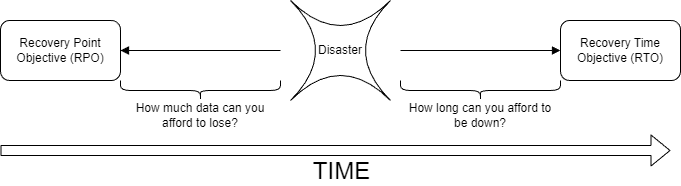

---

---

## Chris Ayers

### Senior Customer Engineer Microsoft

<i class="fa-brands fa-twitter"></i> Twitter: @Chris\_L\_Ayers
<i class="fa-brands fa-mastodon"></i> Mastodon: [@Chrisayers@hachyderm.io](https://hachyderm.io/@Chrisayers)
<i class="fa-brands fa-linkedin"></i> LinkedIn: - [chris\-l\-ayers](https://linkedin.com/in/chris-l-ayers/)
<i class="fa fa-window-maximize"></i> Blog: [https://chris-ayers\.com/](https://chris-ayers.com/)
<i class="fa-brands fa-github"></i> GitHub: [Codebytes](https://github.com/codebytes)

---
<!-- 
# Ensuring Azure Resiliency:
## Strategies and Best Practices
Chris Ayers

--- -->

# Agenda Items

- Why Reliability Matters in Azure
- Design Principles for Reliable Workloads
- Tradeoffs with Other Azure Pillars
- Failure Mode Analysis (FMA)
- Azure Availability Zones

- Architecting for Reliability
- Design Review Checklist
- Mission-Critical Reliability
- Azure Verified Modules
- Choosing the Right SKUs

---

# Why Reliability Matters

---

# Understanding Reliability and Resiliency
* Failures are ***inevitable*** in distributed systems.
* Workloads must **detect**, **withstand**, and **recover** from failures within ***acceptable*** timeframes.
* Ensuring availability for users to access workloads as promised.

---

# Impact on Business Goals and SLAs
- Outages can compromise user experience and business objectives.
- Meeting SLAs, RTOs, and RPOs is vital for reliability.
- Shared Responsibility Model ensures accountability and collaboration.

---

## Financial Impact of Downtime

- **Revenue Loss**: Downtime can cost businesses over $1 million per hour, especially for e-commerce and online services.
- **Increased Expenses**: Includes emergency maintenance, staff overtime, and potential penalties for SLA breaches.
- **Legal Liabilities**: Potential lawsuits from customers or clients affected by downtime, leading to legal fees and settlements.
- **Insurance Challenges**: Downtime can affect insurance coverage and premiums, especially if it leads to data breaches or other significant issues.
- **Operational Costs**: Additional costs for restoring systems, data recovery, and implementing preventive measures to avoid future downtime.

---

# Understanding RPOs and RTOs

- **Recovery Time Objectives (RTOs)**: RTOs specify the maximum acceptable downtime for restoring services after a disruption.

- **Recovery Point Objectives (RPOs)**: RPOs define the amount of data that can be lost during a disruption.

---

# Reliability

| Level       | Monthly Downtime  | Annual Downtime | Cost  |
| ----------- | ----------------- | --------------- | ----- |
| **99.9%**   | 43.8 minutes      | 8.75 hours      | $     |
| **99.95%**  | 21.9 minutes      | 4.375 hours     | $$    |
| **99.99%**  | 4.38 minutes      | 52.6 minutes    | $$$   |
| **99.995%** | 2.19 minutes      | 26.3 minutes    | $$$$  |
| **99.999%** | 26 seconds        | 5.25 minutes    | $$$$$ |

>https://uptime.is/five-nines

---

# Service Level Objectives
| SLI | SLO | SLA |
|---|---|---|
| Service Level Indicator | Service Level Objective | Service Level Agreement |
| Metrics for service quality, e.g., error rate. | Targets, e.g., 99.9% uptime/month. | Contracts with set metrics and penalties. |
| Assess service quality. | Define service quality goals. | Formalize commitments and consequences. |

---

---

# Azure-Customer Shared Responsibility Model

---

# Azure Well-Architected Framework

- Provides best practices and guidance for building high-quality Azure solutions.
- Ensure workloads are reliable, secure, efficient, and cost-effective.

---

## Microsoft Azure Well-Architected Framework Pillars

| Reliability                        | Security                            | Cost Optimization                  | Operational Excellence                  | Performance Efficiency                  |
|------------------------------------|-------------------------------------|------------------------------------|-----------------------------------------|-----------------------------------------|
| Resiliency, availability, recovery | Protect data, detect threats, mitigate risks | Budgeting, reducing waste, efficiency | Observability, DevOps practices, safe deployments | Scalability, load testing, performance monitoring |

---

# Design Principles for Reliable Workloads

---

# Design for Business Requirements

- Gather business requirements focusing on the workload's intended utility.
- Cover user experience, data, workflows, and unique characteristics.
- Clearly state expectations and ensure goals are achievable and documented.

---

# Design for Business Requirements

| Approach | Description |
| --- | --- |
| **Quantify Success** | Set targets for components, flows, and the system. |
| **Compliance** | Ensure predictable outcomes for sensitive flows. |
| **Platform Commitments** | Understand SLAs, limits, and regional constraints. |
| **Dependencies** | Track dependencies and implement resilient design patterns. |

---

# Design for Resilience

- The workload must continue to operate with full or reduced functionality.
- Expect component malfunctions, platform outages, performance degradations, limited resource availability, and other faults.
- Build resiliency to ensure fault tolerance and graceful degradation.

---

# Design for Resilience

| Approach | Description |
| --- | --- |
| Distinguish critical components from those that can degrade. | Design according to criticality, avoiding overengineering. |
| Identify potential failure points and their effects. | Analyze failure cases to influence error handling design. |
| Build self-preservation capabilities. | Isolate faults and mitigate failures. |
| Add scalability for critical components. | Handle capacity spikes and regional issues. |
| Build redundancy in layers and tiers. | Minimize single points of failure. |

---

# Design for Recovery

- The workload must be able to anticipate and recover from most failures, of all magnitudes, with minimal disruption to the user experience and business objectives.
- Even highly resilient systems need disaster preparedness approaches, in both architecture design and workload operations.
- On the data layer, you should have strategies that can repair workload state in case of corruption.

---

# Design for Recovery

| Approach | Description |
| --- | --- |
| Structured recovery plans | Cover all components and the system as a whole. Regular drills test recovery processes. |
| Data repair for stateful components | Use backups to restore to a trusted recovery point. Ensure data integrity with immutable, consistent backups. |
| Automated self-healing | Reduce risks and shorten the break-fix cycle. |
| Immutable ephemeral units | Spin up and destroy on demand for consistency. Use side-by-side deployment to minimize disruptions. |

---

# Design for Operations

- Shift left in operations to anticipate failure conditions.
- Test failures early and often in the development lifecycle.
- Ensure shared visibility across teams for dependency status and ongoing failures.
- Use insights, diagnostics, and alerts from observable systems for effective incident management and continuous improvement.

---

# Design for Operations

| Approach | Description |
| --- | --- |
| Build observable systems that can correlate telemetry. | Monitoring and diagnostics are crucial. Aggregated observability provides a holistic view of health status. |
| Predict potential malfunctions and anomalous behavior. | Use prioritized and actionable alerts for active reliability failures. |
| Invest in reliable processes and infrastructure. | Enable quicker triage and proactive mitigation of potential failures. |

---

# Design for Operations

| Approach | Description |
| --- | --- |
| Simulate failures and run tests. | Set realistic recovery expectations and test metrics. |
| Automate components. | Minimize human error and ensure consistency. |
| Scrutinize routine operations. | Ensure system stability. |
| Learn from production incidents. | Drive improvements based on real incidents. |

---

# Keep It Simple

- Avoid overengineering the architecture design, application code, and operations.
- Simplicity reduces inefficiencies and potential misconfigurations.
- Maintain a balanced approach to avoid single points of failure.

---

# Keep It Simple

| Approach | Benefit |
| --- | --- |
| Add components only if necessary. | Keep the critical path lean. |
| Establish and document standards. | Minimize errors and maintain quality. |
| Evaluate pragmatic design. | Avoid unnecessary interdependence. |
| Develop just enough code. | Ensure code resilience and efficiency. |
| Use platform features and prebuilt assets. | Save time and use tested practices. |

---

# Tradeoffs with Other Azure WAF Pillars

---

# Security
## Balancing Reliability and Security
Achieving a balance between reliability and security is essential to safeguard Azure workloads effectively. Understanding the tradeoffs and implementing best practices are key to ensuring data protection.

## Tradeoffs in Security Measures
Exploring the tradeoffs in security measures helps in making informed decisions to enhance data security and reliability in Azure workloads. Identifying the right balance is crucial for effective protection.

---

# Cost
The impact of cost considerations on the reliability of Azure workloads is crucial. Understanding how to manage tradeoffs between cost and reliability is key to optimizing performance.

---

# Operational Excellence
## Reliable Azure Workloads
Operational excellence is essential for maintaining reliable Azure workloads, ensuring consistent performance and availability for cloud-based services.

## Achieving Operational Excellence
Explore strategies and best practices to achieve operational excellence in managing Azure workloads while prioritizing reliability and efficiency.

---

# Performance Efficiency
## Optimal Azure Workloads
Balancing performance and reliability is crucial for achieving optimal Azure workloads. Learn how to maintain this delicate balance.

## Performance Efficiency Strategies
Discover effective strategies for enhancing performance efficiency in Azure workloads while ensuring reliability remains intact.

---

# Failure Mode Analysis (FMA)

---

# Identifying and Mitigating Failures
## Proactive Failure Identification
Proactive identification of potential failures is crucial for maintaining system reliability and preventing costly downtime.

## Mitigating Strategies
Implementing effective strategies to mitigate failures can enhance system performance and minimize operational risks.

---

# Prioritizing Risks and Impacts
## Risk Prioritization
Prioritizing risks is essential for effective reliability management. Identify high-impact risks and allocate resources efficiently to mitigate them.

## Impact Mitigation
Understanding and mitigating the potential impacts of risks is crucial for maintaining operational reliability. Implement strategies to minimize the consequences of identified risks.

---

# Using Azure Tools and Case Studies
## Failure Mode Analysis
Azure tools offer valuable insights into failure mode analysis, helping businesses identify and mitigate potential risks in their systems.

## Reliability Strategies
Learning from real-world case studies can help businesses develop effective reliability strategies using Azure tools, enhancing system performance and minimizing downtime.

---

# Azure Availability Zones

---

# Enhancing Resiliency with Fault Isolation
## Fault Isolation Importance
Fault isolation is crucial for maintaining resiliency in Azure workloads as it helps prevent cascading failures and ensures high availability of services.

## Azure Availability Zones
Azure Availability Zones provide geographic fault isolation within an Azure region, ensuring resiliency by distributing workloads across multiple data centers.

---

# Deploying Across Zones for Higher Availability
## Azure Availability Zones
Deploying across Azure Availability Zones can enhance availability and provide protection against failures by distributing workloads across multiple geographically isolated locations.

## Increased Availability
Deploying workloads across zones results in increased availability, ensuring that your services remain accessible even in the event of failures or outages in a single zone.

---

# Best Practices and Case Studies
## Leveraging Azure Availability Zones
Learning from best practices and real-world case studies can provide valuable insights into leveraging Azure Availability Zones effectively, ensuring high availability and fault tolerance for workloads.

## Deploying Workloads Across Zones
Explore best practices and case studies for deploying workloads across availability zones, optimizing performance and resiliency in cloud environments.

---

# Architecting for Reliability

---

# Azure Landing Zones
## Secure Structure
Azure Landing Zones offer a secure foundation for organizing your Azure environment, ensuring robust security measures are in place to protect your data and resources.

## Reliable Implementation
Implementing Azure Landing Zones effectively provides a reliable structure for your Azure environment, enabling smooth operations and better resource management.

---

# Reference Architectures for Compute, AKS, Storage, and Databases
## Streamlining Workload Design
Utilizing reference architectures can streamline the design and deployment of reliable workloads, ensuring efficiency and scalability in cloud computing environments.

## Compute Architecture
Explore reference architectures for compute in Azure to optimize performance and resource allocation for computational tasks in cloud environments.

## AKS Architecture
Discover reference architectures for Azure Kubernetes Service (AKS) to effectively manage containerized applications and microservices in the cloud.

## Storage and Databases Design
Learn about reference architectures for storage and databases in Azure to ensure data reliability, scalability, and performance in cloud-based applications.

---

# Network Topology, Resource Organization, Identity Management, and Governance
## Network Topology
Network topology design is crucial for ensuring efficient data flow and communication within Azure workloads. The right configuration can enhance performance and reliability.

## Resource Organization
Proper organization of resources in Azure workloads is key to optimizing performance and scalability. Effective resource allocation ensures efficient utilization and cost-effectiveness.

## Identity Management
Identity management protocols are essential for securing access and protecting sensitive data within Azure workloads. Implementing robust identity management practices enhances security and compliance.

## Governance
Governance frameworks establish policies and procedures for managing Azure workloads effectively. Strong governance practices ensure compliance, risk mitigation, and efficient operations.

---

# Design Review Checklist

---

# Key Considerations for Design Reviews
## Scalability
Scalability is a key consideration for design reviews to ensure that the system can handle increased workload and growth over time, allowing for flexibility and expansion.

## Security
Security is a critical aspect to address in design reviews to protect data, prevent unauthorized access, and ensure the confidentiality and integrity of information.

## Performance
Performance considerations are essential for design reviews to optimize the speed and efficiency of the system, ensuring smooth operation and user satisfaction.

---

# Ensuring Alignment with Reliability Principles
## Robust and Resilient Azure Workloads
Aligning design reviews with reliability principles is crucial for building robust and resilient Azure workloads that can withstand various challenges and ensure high availability.

## Strategies for Alignment with Reliability Principles
Discover effective strategies for ensuring alignment with reliability principles during design reviews to enhance the overall reliability and performance of Azure workloads.

---

# Mission-Critical Reliability

---

# Strategies for Mission-Critical Applications
## Reliability Strategies for Mission-Critical Apps
Mission-critical applications demand specialized strategies to guarantee maximum reliability and uptime, ensuring smooth operations and minimal downtime.

## Azure Best Practices
Discover key strategies and best practices in Azure to maintain mission-critical reliability, including redundancy, disaster recovery, and monitoring.

---

# Ensuring Continuous Operation and Minimal Downtime
## Importance of Continuous Operation
Continuous operation is crucial for mission-critical workloads to ensure that essential services are available 24/7 without interruption.

## Strategies for Minimal Downtime
Discover effective strategies for minimizing downtime, such as redundancy, failover systems, and proactive maintenance schedules.

---

# Azure Verified Modules

---

# Utilizing Azure Verified Modules for Reliability
## Enhancing Workload Reliability
Azure Verified Modules provide pre-built solutions to enhance the reliability of workloads, ensuring smoother operations and improved performance.

## Effective Module Utilization
Learn how to effectively leverage Azure Verified Modules to optimize the reliability of your cloud-based applications and services.

---

# Selecting the Right Modules for Your Needs
## Azure Verified Modules Selection
Choosing the right Azure Verified Modules is crucial to ensure reliability in your cloud computing setup. Select modules that align with your specific workload requirements.

## Best Practices for Module Selection
Explore best practices to select the most suitable modules for your cloud computing needs. Consider factors like compatibility, performance, and scalability.

---

# Choosing the Right SKUs

---

# Evaluating SKUs for Reliability and Performance
## Variability in Reliability and Performance
Different SKUs offer varying levels of reliability and performance, making it crucial to evaluate them effectively based on your workload requirements.

## Effective Evaluation Techniques
Learn how to effectively evaluate SKUs to ensure they meet the specific requirements of your workloads, balancing reliability and performance.

---

# Aligning SKU Choices with Workload Requirements
## Optimizing Reliability in Azure
Aligning SKU choices with workload requirements is crucial to optimizing reliability in Azure. Learn how to select the right SKUs for your specific workload needs.

## Matching SKUs with Workload Demands
Discover the importance of matching SKUs with the specific demands of your workloads to enhance reliability and performance in Azure.

---

# Load Testing

---

# Introduction to Load Testing
- Load testing assesses system performance under expected user loads.
- It helps identify bottlenecks and determine system behavior during peak usage.
- Load testing ensures systems can handle high traffic without degradation.

---

# Benefits of Load Testing
- Improves application reliability and user experience.
- Helps in determining scalability for future growth.
- Identifies issues that could lead to system failures.

---

# Load Testing Strategies
- Determine key performance indicators (KPIs) for testing.
- Use real-world scenarios to simulate user behavior.
- Analyze results to optimize application performance.

---

# Types of Load Tests
- Soak test
- Spike test
- Stress test
- Load test

---

# Tools for Load Testing
- Popular tools include JMeter, LoadRunner, Locust, and Gatling.
- Azure Load Testing Service uses Jmeter and Locust.
- These tools help simulate heavy loads and analyze performance.
- Choose a tool based on specific project needs and budget.

---

# Chaos Engineering

---

# Introduction to Chaos Engineering
- Chaos Engineering is the practice of experimenting on a system to build confidence.
- It helps identify weaknesses by introducing failures in a controlled environment.
- The goal is to improve system resilience and reliability.

---

# Principles of Chaos Engineering
- Start small and gradually increase the scope of experiments.
- Limit the blast radius to minimize impact on users.
- Run experiments in production to gain true insights.

---

# Benefits of Chaos Engineering
- Increases system resilience and reduces downtime.
- Enhances team collaboration and fosters a culture of experimentation.
- Encourages proactive identification of weaknesses.

---

# Tools for Chaos Engineering
- Popular tools include Gremlin, Chaos Monkey, and LitmusChaos.
- These tools help automate chaos experiments and monitor system behavior.
- Choose tools based on the specific needs of your organization.

---

# Challenges in Chaos Engineering
- Cultural resistance to introducing failures.
- Difficulty in measuring the impact of experiments.
- Ensuring safety and minimizing user disruption.

---

# Conclusion
## Strategic Approach for Reliability
Achieving reliability in Azure workloads necessitates a strategic approach that aligns with best practices to ensure consistency and dependability.

## Optimal Performance Enhancement
Enhancing the performance of Azure workloads requires adherence to best practices and efficient strategies to achieve optimal results in cloud computing.

---

