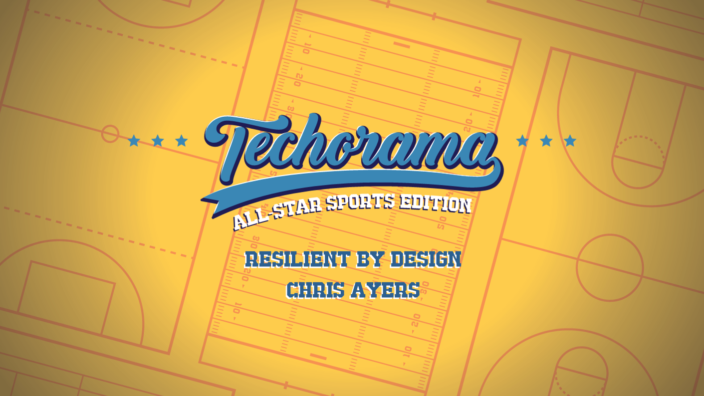
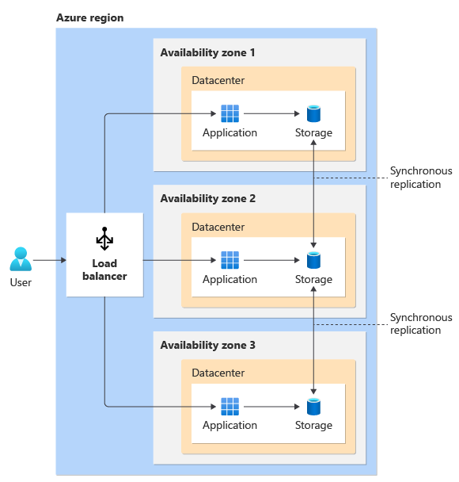
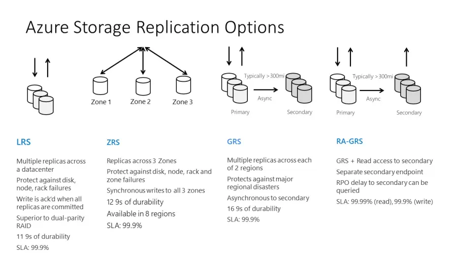

---

# Crafting Resilient and Unbreakable Azure Solutions

## Chris Ayers
Senior Software Engineer
Microsoft 

---

## Chris Ayers

_Senior Software Engineer_  
_Azure CXP AzRel_  
_Microsoft_

<i class="fa-brands fa-bluesky"></i> BlueSky: [@chris-ayers.com](https://bsky.app/profile/chris-ayers.com)
<i class="fa-brands fa-linkedin"></i> LinkedIn: - [chris\-l\-ayers](https://linkedin.com/in/chris-l-ayers/)
<i class="fa fa-window-maximize"></i> Blog: [https://chris-ayers\.com/](https://chris-ayers.com/)
<i class="fa-brands fa-github"></i> GitHub: [Codebytes](https://github.com/codebytes)
<i class="fa-brands fa-mastodon"></i> Mastodon: [@Chrisayers@hachyderm.io](https://hachyderm.io/@Chrisayers)
~~<i class="fa-brands fa-twitter"></i> Twitter: @Chris_L_Ayers~~

---

# Agenda

- **Context & Why Reliability Matters**
- **Business & Non-Functional Requirements** 
- **Architecture** 
- **Infrastructure / Platform** 

- **Software / Workload Resilience** 
- **Operations & Observability** 
- **Governance & Enablement** 
- **Conclusion & Q&A**

<!-- # Roles & Layer Alignment

| Role | Layer | Core Focus (Concise) |
|------|-------|----------------------|
| Product Owner | Business/NFR | Journeys, SLO/RTO/RPO, trade-offs |
| Architect | Architecture | Topology, SPOF removal, patterns |
| Platform Eng | Infra/Platform | Landing zones, policy, capacity, failover |
| Software Eng | Software | Resilience patterns, degradation, telemetry |
| SRE | Operations | SLIs/SLOs, error budget, failure drills |
| Security/Compliance | Governance | Guardrails, compliance, risk alignment |
| Data Eng / DBA | Arch & Infra | Replication, consistency, restore drills |

> Clear ownership → fewer gaps, faster decisions, measurable reliability. -->

---

# Reliability

---

# Why Reliability Matters

> A system is considered "reliable" if it can consistently serve users under normal or abnormal conditions.

- Reliability in distributed systems involves:
  - **Consistent performance** despite failures.
  - **Graceful degradation** when certain components become unavailable.
  - **Rapid recovery** within acceptable time limits.

---

# Understanding Reliability and Resiliency

- Failures are **inevitable** in distributed systems
- Workloads must **detect**, **withstand**, and **recover** from failures within _**acceptable**_ timeframes
- Ensuring availability for users to access workloads as promised
- Failures impact _**revenue**_, _**reputation**_, and _**customer trust**_

---

# <!-- fit --> FAILURE IS ALWAYS AN OPTION

---

## Financial Impact of Downtime

- **Revenue Loss**: Downtime can cost businesses over $1 million per hour, especially for e-commerce and online services.
- **Increased Expenses**: Includes emergency maintenance, staff overtime, and potential penalties for SLA breaches.
- **Legal Liabilities**: Potential lawsuits from customers or clients affected by downtime.
- **Insurance Challenges**: Downtime can affect insurance coverage and premiums.
- **Operational Costs**: Additional costs for restoring systems, data recovery, and preventive measures to avoid future downtime.

---

## Real-World Downtime Costs

- **77 hours** (≈3 days) median annual downtime for high-impact outages
- **$146 million** median annual cost of outages
- **30%** of engineering time spent addressing disruptions
  - Equals **12 hours** per engineer weekly (based on 40-hour week)

> Source: New Relic 2024 Observability Forecast

---

---

# Reliability Levels

| Level       | Monthly Downtime  | Annual Downtime | Cost  |
| ----------- | ----------------- | --------------- | ----- |
| **99.9%**   | 43.8 minutes      | 8.75 hours      | $     |
| **99.95%**  | 21.9 minutes      | 4.375 hours     | $$    |
| **99.99%**  | 4.38 minutes      | 52.6 minutes    | $$$   |
| **99.995%** | 2.19 minutes      | 26.3 minutes    | $$$$  |
| **99.999%** | 26 seconds        | 5.25 minutes    | $$$$$ |

>[https://uptime.is/five-nines](https://uptime.is/five-nines)

---

---

# How Do We Measure Reliability?

| SLI (Measure) | SLO (Target) | Error Budget (Allowable Failure) | SLA (External Commitment) |
|---------------|--------------|----------------------------------|----------------------------|
| Service Level Indicator | Service Level Objective | 1 - SLO (consumable failure/time) | Service Level Agreement |
| Metric of user experience (e.g., success %, p95 latency) | Reliability goal over window (e.g., 99.9% / 30d) | Remaining time/requests that may fail before action | Contract / credits / penalties |
| Assess actual service quality | Define acceptable reliability | Govern release pace & risk appetite | Formalize promises & remedies |
| API success rate per request | 99.95% successful responses (30d) | 0.05% errors ≈21.9 min @ 99.95% | 99.9% monthly availability w/ credits |

---

---

# Understanding RPOs and RTOs

- **Recovery Time Objective (RTO)**: Maximum acceptable downtime before services must be restored
- **Recovery Point Objective (RPO)**: Maximum acceptable data loss during a disruption

---

# Business & Non-Functional Requirements Layer

## From Intent to Quantified Reliability

Establish resilience expectations before selecting technology:
- Define critical user journeys & classify components (critical vs. degradable)
- Quantify reliability targets (SLOs, error budgets, RTO/RPO)
- Align trade-offs early (cost, performance, security, operations)

---

# Business Requirements

- Gather business requirements focusing on the workload's intended utility
- Cover user experience, data, workflows, and unique constraints or sensitivities
- Clearly state expectations and confirm goals are feasible and documented

| Approach           | Description                                                     |
|--------------------|-----------------------------------------------------------------|
| Quantify Success   | Set targets for components, flows, and the system              |
| Compliance         | Ensure predictable outcomes for sensitive flows                |
| Platform Commitments | Understand SLAs, limits, and regional constraints            |
| Dependencies       | Track dependencies and implement resilient design patterns     |

---

# Resilience Requirements

- Continue operating despite failures
- Prepare for outages and resource shortages
- Enable graceful degradation

| Strategy                | Implementation                     |
|-------------------------|-----------------------------------|
| Critical vs. Degradable | Prioritize by impact              |
| Failure Points          | Design for error handling         |
| Self-Preservation       | Isolate faults, mitigate failures |
| Scalability             | Handle spikes and regional issues |
| Redundancy              | Eliminate single points of failure|

---

# Recovery Requirement

- Recover gracefully from all failure types
- Plan for disaster even in resilient systems
- Prepare for data layer corruption

| Strategy | Implementation |
|----------|----------------|
| Recovery Plans | Component coverage with regular drills |
| Data Repair | Trusted backups with immutable copies |
| Self-Healing | Automated detection and remediation |
| Ephemeral Units | Side-by-side deployments with zero downtime |

---

# Operational Readiness

- Shift left to anticipate failures early
- Test failures in development
- Ensure cross-team visibility
- Use observability for rapid remediation

| Strategy | Implementation |
|----------|----------------|
| Observable Systems | Aggregate telemetry for holistic health views |
| Failure Simulation | Validate recovery metrics with realistic tests |
| Automation | Minimize human error and ensure consistency |
| Continuous Learning | Improve from real production incidents |
| Proactive Monitoring | Prioritize alerts for active failures |

---

# Keep It Simple

- Avoid overengineering architecture, code, and operations
- Simplicity reduces inefficiencies and misconfigurations
- Maintain a balanced approach to avoid single points of failure

---

# Trade-Offs

- Align trade-offs with business priorities
- Use scenario planning to assess impacts
- Continuously iterate and monitor performance

---

---

# Azure Well-Architected Framework

- Provides best practices and guidance for building high-quality Azure solutions.
- Ensures workloads are reliable, secure, efficient, and cost-effective.
- [Azure Well-Architected Framework](https://learn.microsoft.com/en-us/azure/well-architected/)
 

---

---

## Microsoft Azure Well-Architected Framework Pillars

| Reliability                        | Security                            | Cost Optimization                  | Operational Excellence                  | Performance Efficiency                  |
|------------------------------------|-------------------------------------|------------------------------------|-----------------------------------------|-----------------------------------------|
| Resiliency, availability, recovery | Protect data, detect threats, mitigate risks | Budgeting, reducing waste, efficiency | Observability, DevOps practices, safe deployments | Scalability, load testing, performance monitoring |

---

# Reliability Trade-Offs with Other Pillars

| Pillar | Prioritizing Reliability | Prioritizing Other Pillar |
|--------|--------------------------|---------------------------|
| **Cost Optimization** | • **Implement Redundancy** (multi-region) • **Extensive Monitoring & Drills** • **Over-Provision** for unexpected spikes | • **Single-Region** setups with minimal redundancy • **Reduce Operational Costs** (simpler monitoring) • **Right-Size** resources to save expenses |
| **Security** | • **Replication & Backups** expand attack surface • **Faster Recovery** may bypass security controls • **Delay Patches** to reduce downtime | • **Minimize Attack Surface** • **Strict Controls** remain active under stress • **Frequent Patching** even with disruptions |

---

# Reliability Trade-Offs with Other Pillars (Continued)

| Pillar | Prioritizing Reliability | Prioritizing Other Pillar |
|--------|--------------------------|---------------------------|
| **Operational Excellence** | • **Complex Architectures** (multi-region, failover) • **Extensive Documentation & Training** for DR • **Continuous Testing** adds overhead | • **Simple Architecture** • **Streamlined Knowledge Base** • **Less Overhead** in daily operations |
| **Performance Efficiency** | • **Redundant Writes & Replication** add latency • **Failover Logic** can slow requests • **Over-Provision** may reduce performance tuning | • **Lean Deployments** maximize throughput • **On-Demand Scaling** with minimal buffer • **Focus on Speed** over recovery measures |

---

# Architecture Layer

## Structuring for Failure Containment

Focus on failure domains, redundancy strategy, and dependency design before implementation.

---

# Failure Mode Analysis (FMA)

## Proactive Identification

- Recognize potential weaknesses before outages occur
- Use checklists, post-mortems, dependency mapping
- Prioritize by user impact & blast radius
- Separate rare/high-impact from frequent/low-impact

## Effective Mitigation

- Architect graceful degradation & fallbacks
- Instrument for fast anomaly detection
- Automate failover & data replication where feasible
- Document hypotheses & validate via game days

---

# Failure Examples

[Failure Examples](https://learn.microsoft.com/en-us/azure/well-architected/reliability/failure-mode-analysis#example)

---

# Single Points of Failure (SPOFs)

## Understanding SPOFs

- Single component whose failure halts critical flow
- Occur in infra, data, code paths, people/process
- Early detection reduces mean time to mitigation

## Mitigation Strategies

- Redundancy & diversity (multi-zone / multi-instance)
- Load balancing & partitioning
- Automated failover runbooks
- Regular design & dependency reviews

---

# Active-Active vs. Active-Passive

**Active-Active**: Multiple instances process requests simultaneously.

**Active-Passive**: Primary instance processes traffic; secondary is on standby.

---

# Enhancing Resiliency through Architecture

## Fault Isolation

- Prevents cascading failures and maintains availability
- Distributes workloads across multiple data centers
- Handles datacenter-specific failures with built-in mechanisms

## Reliability Best Practices

- Deploy across multiple Availability Zones
- Leverage multi-region approaches when necessary
- Use landing zones and reference architectures
- Apply design patterns appropriate to your workload

---

# Infrastructure / Platform Layer

## Foundation for Consistent Resilience

Automated, policy-driven environments (Landing Zones, AVM, APRL) reduce variance & misconfiguration risk.

---

# Azure-Customer Shared Responsibility Model

---

# Azure Regions and Regional Strategy

## Azure Regions

- 60+ regions worldwide with defined data residency boundaries
- Datacenters connected by low-latency, high-capacity networks
- Some regions are sovereign clouds (e.g., Azure Government)
- [Explore Regions](https://datacenters.microsoft.com/globe/explore/)

## Region Pairs & Alternatives

- **Region Pairs**: Built-in geo-redundancy (e.g., East US ⟷ West US)
  - Support **sequential updates** and **prioritized recovery**
  - Note: Pairing doesn't guarantee automatic failover
- **Non-paired Regions**: Rely on availability zones
  - Services can replicate across any region combination
  - Choose regions based on business needs and compliance

---

# Azure Availability Zones

---

# Azure Availability Zones Infrastructure

- AZs are physically separate datacenters within an Azure region
- Each zone has independent power, cooling, and networking
- Low-latency (<2ms) connections reduce local outage impact
- Not all regions have AZs; verify availability
- [View Region Support](https://learn.microsoft.com/en-us/azure/reliability/availability-zones-region-support)  

---

# Types of Availability Zone Support

- **Zone-Redundant**: Automatically distributed across zones
- **Zonal**: Pinned to a specific zone
- **Zone-Resilient**: Designed to survive zone failures
- **Non-Zonal (Regional)**: No zone-specific deployment
- [View Services Support](https://learn.microsoft.com/en-us/azure/reliability/availability-zones-service-support)

---

# Zonal Resources

- Pinned to a specific availability zone.
- Combine multiple zonal deployments for high reliability.

---

# Zonal Resources

**Customer Responsibilities**:

- Deploy and manage resources in each availability zone
- Configure and manage data replication
- Use a load balancer to distribute requests
- Choose active-passive or active-active models
- Handle failover when an AZ becomes unavailable

---

# Zone-Redundant Resources

- Spread automatically across multiple availability zones.
- Microsoft manages request distribution and data replication.
- Automatic failover if a zone goes down.

---

# Zone-Resilient vs. Non-Zonal (Regional)

## Zone-Resilient

- Created as **zone-redundant** or deployed **zonally** across multiple zones  
- Survives a single zone outage by design  
- Minimizes downtime as data and services continue in healthy zones  

## Non-Zonal (Regional)

- Not explicitly configured for zone redundancy  
- May be placed in any zone and moved automatically  
- Resources may go down if that zone experiences an outage  

---

# Availability Zones and Azure Updates

## Update Deployment Strategy

- Microsoft deploys updates to one AZ at a time
- Minimizes impact on active workloads
- Running across multiple zones ensures continuous service during updates

---

# Data Replication: Storage Options

---

# Software / Workload Layer

## Runtime Resilience Behaviors

Embed failure-aware logic: timeouts, retries, backoff, bulkheads, circuit breakers, idempotency, hedging.

---

# Load Testing

## Key Benefits

- **Prevents Surprises**: Identify capacity issues before production
- **Validates Scaling**: Ensure your auto-scaling works properly
- **Finds Weaknesses**: Spot resource exhaustion and memory leaks

## Implementation

- **Cost-Effective**: Much cheaper than emergency scaling during incidents
- **Azure Tools**: Azure Load Testing service with JMeter support
- **Best Practice**: Test with realistic user patterns and data volumes

---

# Chaos Engineering

## Core Principles

- **Controlled Failure**: Introduce failures in controlled environments
- **Best Practice**: Start small with clear abort conditions
- **Continuous Process**: Build complexity as confidence increases

## Key Azure Scenarios

- **Availability Zone Outages**: Test region resiliency
- **Network Latency**: Simulate connectivity issues
- **Service Throttling**: Test quota and limit handling
- **Identity Failures**: Test credential expiration response

---

# Resilience Patterns
| Pattern | Problem Solved | Key Considerations |
|---------|----------------|--------------------|
| Timeout | Prevent hanging on slow dependency | Set < expected p95 latency; combine with retries | HTTP client / SDK timeout settings |
| Retry + Exponential Backoff + Jitter | Transient faults (throttling, brief network blips) | Cap attempts; respect idempotency |
| Circuit Breaker | Failing dependency causing cascading latency | Trip on error rate/latency; half-open probes |
| Bulkhead Isolation | One noisy component  | Resource partitioning |
| Dead Letter Queue | Bad messages blocking progress | Monitor & replay with alerting |
| Graceful Degradation | Maintain partial service | Feature flags, fallback data |

> Select patterns based on observed failure modes; measure impact via SLIs & error budget consumption.

---

# Azure SDK Resiliency Best Practices

| Concern | Guidance | Notes / Azure SDK Features |
|---------|----------|-----------------------------|
| Retry Policy | Use built-in exponential backoff + jitter; cap total elapsed time | SDK defaults (3–5 retries). Tune max attempts & overall operation timeout |
| Idempotency | Make write & queue ops safely repeatable | Use idempotency keys / message IDs to dedupe |
| Timeouts | Combine per-attempt timeout + overall deadline | Use CancellationToken / request context to abort quickly |
| Throttling (429 / 503) | Honor Retry-After; escalate if sustained | Log retry reason & emit metric for throttled calls |
| Circuit Breaking | Wrap high-risk dependencies with Polly / resilience lib | Trip on error rate/latency. Half-open probes restore flow |

---

# Azure SDK Resiliency Best Practices Continued

| Concern | Guidance | Notes / Azure SDK Features |
|---------|----------|-----------------------------|
| Connection Reuse | Reuse client instances (thread-safe) | Avoid per-request instantiation to prevent socket exhaustion |
| Observability | Correlate Request-Id / Traceparent; record retry count | Enable SDK logging + OpenTelemetry exporters |
| Partial Failure | Process successes; isolate & retry failed items | Batch ops return per-item status; implement granular retry |
| Backpressure | Limit concurrency & queue length; shed excess | Use bounded channels / semaphores; fail fast when saturated |

> Engineer for transient failure as the norm: fast fail, bounded retries, measurable outcomes.

---

# Operations & Observability Layer

## Detect, Respond, Learn

Emphasize fast detection, validated recovery paths, and continuous improvement through data & drills.

---

# OpenTelemetry

- Open standard for generating, collecting, and exporting telemetry data (traces, metrics, logs)
- Supported by major cloud providers, including Azure Monitor, AWS CloudWatch, and Google Cloud Operations
- Enables vendor-neutral instrumentation and observability across distributed systems

---

# Metrics & Error Budgets

| Concept | Formula / Definition | Example |
|---------|----------------------|---------|
| Availability SLI | (Successful Requests) / (Total Requests) | 99,950 / 100,000 = 99.95% |
| Latency SLI | % of requests under threshold | 95% < 250ms (p95), 99% < 400ms |
| Error Budget  | 1 - SLO | SLO 99.9% => 0.1% budget |
| Burn Rate | Budget consumed / Time elapsed fraction | 2× burn -> intervene early |
| MTTR | Avg restore time for incidents | Track trend downwards |

Error Budget Response Guide:
- Burn Rate > 4× for 1h: Freeze risky deploys; incident review.
- Burn Rate 2× sustained: Reduce change volume; add mitigations.
- Burn Rate nominal (<1×): Continue roadmap; schedule chaos tests.

---

## [Azure Service Groups](https://learn.microsoft.com/en-us/azure/governance/service-groups/overview)

### Health Metrics Aggregation

- **Cross-environment health**: Aggregate health metrics from multiple apps and environments
- **Resource type inventory**: Unified views across subscriptions
- **Unified monitoring**: Single Service Group provides health visibility across management groups

### Least-Privilege Access

- **Selective permissions**: Service Groups don't inherit member permissions
- **Role-based viewing**: Assign different users access to same Service Group with varying resource visibility
- **Monitoring metrics**: Apply minimal privileges for metrics access without resource management rights

---

## [Mission-Critical Health Modeling](https://learn.microsoft.com/en-us/azure/well-architected/mission-critical/mission-critical-health-modeling)

### Core Concepts

- **Layered health model**: Define health from individual resources to user flows
- **Business-aligned scoring**: Health reflects business priorities with clear healthy/unhealthy states
- **Automated calculation**: Use metrics and thresholds for real-time health scores

### Implementation

- **Unified observability**: Aggregate logs, metrics, traces in Log Analytics workspaces
- **Visual dashboards**: Azure Monitor or Grafana for real-time insights
- **Proactive response**: Integrate with alerting and automated incident response

---

## Business Benefits

- **Early Issue Detection**: Find problems before customers do
- **Increased Confidence**: Better team preparedness for incidents
- **Reduced Recovery Time**: Faster MTTR during real outages
- **Trust Building**: Demonstrate resilience to stakeholders

## Practical Implementation

- **Start Simple**: Begin with critical paths and core functions
- **Game Days**: Schedule cross-team incident response exercises
- **Continuous Process**: Iterate on tests as your architecture evolves
- **Documentation**: Track findings and improvements

---

# Governance & Enablement Layer

## Guardrails, Standards, Acceleration

Tools & frameworks that reduce variance, enforce policy, and speed safe delivery.

- Utilize established Azure reference architectures for reliability.

- Leverage available documentation and best practices for consistency and effectiveness.

---

# [Azure Landing Zones](https://learn.microsoft.com/en-us/azure/cloud-adoption-framework/ready/landing-zone/)

## Secure Structure

- Azure Landing Zones create a secure, organized foundation for Azure environments.
- Enforce identity, network, and governance policies at scale.

## Reliable Implementation

- A standardized environment supports consistent deployments.
- Simplifies resource management and reduces misconfigurations.

---

---

# [Azure Architecture Center](https://learn.microsoft.com/azure/architecture/)

- Centralized repository of best practices, reference architectures, and design patterns for Azure solutions.
- Provides comprehensive guidance on building reliable, scalable, and secure cloud solutions.
- Offers scenario-specific architectures, recommended practices, and templates to accelerate your workload design.

---

# [Well-Architected Workloads](https://learn.microsoft.com/en-us/azure/well-architected/workloads)

- Align workloads with business outcomes using the Azure Well-Architected Framework  
- Balancing functional requirements and nonfunctional trade-offs  
- Integrate design fundamentals, trade-offs, and operational best practices

---

# [Mission-Critical Workloads](https://learn.microsoft.com/en-us/azure/well-architected/mission-critical/mission-critical-overview)

Learn about designing mission-critical applications on Azure for high availability, reliability, and performance:

---

# [Enterprise Web App Patterns](https://learn.microsoft.com/en-us/azure/architecture/web-apps/guides/enterprise-app-patterns/overview)

Guidance for web apps on Azure, offering prescriptive architecture, code, and configuration aligned with the Well-Architected Framework:

---

# [Azure Verified Modules (AVM)](https://azure.github.io/Azure-Verified-Modules/)

## What is AVM?

- **Official Microsoft initiative** to consolidate Infrastructure-as-Code standards
- **Multi-language support** - Bicep, Terraform, and more
- **WAF-aligned modules** with built-in best practices
- **Community-driven** with devolved ownership approach

## Core Value Proposition

- **Accelerate development** with pre-built, tested modules
- **Ensure compliance** with Azure best practices
- **Reduce misconfigurations** through standardized templates
- **Enhance security** with default secure configurations

---

# AVM Module Classifications

| Module Type | Purpose | Key Features |
|-------------|---------|--------------|
| **🏗️ Resource** | Single resource deployment | WAF best practices, secure defaults, shared interfaces |
| **🎯 Pattern** | Multi-resource architectures | Proven designs, composable blocks, enterprise-ready |
| **⚙️ Utility** (Preview) | Reusable functions | Common helpers, cross-module functionality |

---

# AVM and Reliability

## Built-in Resilience

- **Availability Zones** configured by default where supported
- **Disaster recovery** patterns in multi-region deployments
- **Monitoring integration** with Azure Monitor and Application Insights
- **Security hardening** with least-privilege access

## Enterprise Ready

- **Well-Architected Framework** alignment across all pillars
- **Production-tested** configurations and patterns
- **Automated compliance** checks and validation
- **Continuous updates** with latest Azure capabilities

---

# [APRL: Azure Proactive Resiliency Library](https://github.com/Azure/Azure-Proactive-Resiliency-Library-v2)

### What is APRL?

- **Curated catalog** of resiliency recommendations for Azure workloads
- **Azure Resource Graph (ARG) queries** for identifying non-compliant resources
- **Community-driven** with 75+ contributors and active maintenance
- **Open source** under MIT license

### Key Features

- **Resource-specific guidance** for 100+ Azure services
- **Automated compliance checks** with ready-to-use ARG queries
- **Well-Architected Framework alignment** with reliability best practices
- **Specialized workload patterns** for common scenarios

---

# APRL Library Structure

### 🏗️ **Azure Resources**
- Service-specific resiliency recommendations
- Individual Azure service best practices
- Resource configuration guidance

### 🔧 **Specialized Workloads**
- End-to-end workload patterns
- Industry-specific scenarios
- Multi-service architectures

### 📊 **Azure Resource Graph Queries**
- Automated compliance detection
- Resource inventory and assessment
- Policy enforcement support

### 🛡️ **WAF Integration**
- Well-Architected Framework alignment
- Reliability pillar implementation
- Assessment and review tools

---

# [Azure Review Checklists](https://github.com/Azure/review-checklists)

## What They Are

- **Design validation tool** for Azure architectures and workloads
- **Community-driven** checklists based on Microsoft best practices
- **Version-controlled** alternative to Excel spreadsheets
- **Collaborative** approach with GitHub integration

## Key Benefits

- **Proactive issue detection** before deployment
- **Standardized reviews** across teams and projects
- **Time-saving** with pre-built checklists
- **Continuous improvement** through community contributions

---

# Azure Review Checklists

## Supported Checklists & Services

| Service Category | Checklist | Status | Key Focus Areas |
|------------------|-----------|---------|-----------------|
| **Foundation** | Azure Landing Zone | GA | Governance, Security, Networking |
| **AI/ML** | AI Landing Zone | Preview | AI services, responsible AI,  governance |
| **Containers** | AKS, ARO | GA/Preview | Security, scalability, monitoring |
| **Applications** | App Service, Spring Apps | GA/Preview | Performance, security, DevOps |
| **Data** | SQL Migration, SAP | Preview/GA | Migration, performance, compliance |
| **Networking** | Application Delivery | GA | Load balancing, security, performance |
| **Cost Management** | Cost Optimization | GA | Resource optimization, monitoring |
| **DevOps** | Azure DevOps | Preview | Pipeline security, compliance |

---

# Conclusion

- **Design Principles**: Focus on resilience, recovery, and simplicity for robust workloads
- **Trade-offs**: Every decision impacts cost, security, operational excellence, and performance
- **Proactive Reliability**: Use Failure Mode Analysis to anticipate and mitigate failures
- **Continuous Improvement**: Leverage Availability Zones, multi-region deployments, chaos engineering, and load testing

---

# Thank You!

## Links

- [Azure Well-Architected Framework](https://learn.microsoft.com/en-us/azure/well-architected/)
- [APRL](https://github.com/Azure/Azure-Proactive-Resiliency-Library-v2)
- [Azure Verified Modules](https://azure.github.io/Azure-Verified-Modules/)
- [Azure Review Checklists](https://github.com/Azure/review-checklists)
- [Enterprise Web Apps](https://learn.microsoft.com/en-us/azure/architecture/web-apps/guides/enterprise-app-patterns/overview)

## Chris Ayers

_Senior Software Engineer_
_Azure CXP AzRel_
_Microsoft_

<i class="fa-brands fa-bluesky"></i> BlueSky: [@chris-ayers.com](https://bsky.app/profile/chris-ayers.com)  
<i class="fa-brands fa-linkedin"></i> LinkedIn: - [chris\-l\-ayers](https://linkedin.com/in/chris-l-ayers/)  
<i class="fa fa-window-maximize"></i> Blog: [https://chris-ayers\.com/](https://chris-ayers.com/)  
<i class="fa-brands fa-github"></i> GitHub: [Codebytes](https://github.com/codebytes)  
<i class="fa-brands fa-mastodon"></i> Mastodon: [@Chrisayers@hachyderm.io](https://hachyderm.io/@Chrisayers)
~~<i class="fa-brands fa-twitter"></i> Twitter: [@Chris_L_Ayers](https://twitter.com/Chris_L_Ayers)~~  

---

# Feedback

